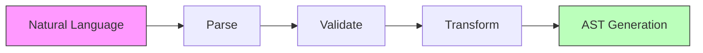
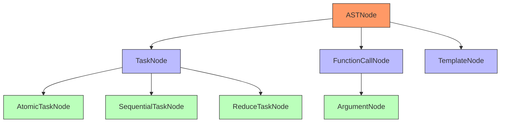

# Compiler Component [Component:Compiler:1.0]

## Overview

The Compiler handles AST generation and transformation for task execution. It provides the infrastructure for parsing and processing task specifications.

## Core Responsibilities

1. **AST Generation**
   - Parse XML task specifications
   - Generate abstract syntax trees
   - Validate syntax and structure

2. **Transformation**
   - Transform ASTs for execution
   - Apply optimizations
   - Handle error recovery

3. **Operator Management**
   - Register and manage operators
   - Handle operator dependencies
   - Provide operator documentation

## Compiler Visualization

### Compilation Pipeline
The following diagram shows the compilation process:

The Compiler translates natural language inputs into structured Abstract Syntax Trees (ASTs) that can be executed by the system.

### AST Structure
This diagram illustrates the relationship between different node types:

The AST provides a structured representation of tasks that can be processed and executed by the Evaluator component.

## Key Interfaces

For detailed interface specifications, see:
- [Interface:Compiler:1.0] in `/components/compiler/api/interfaces.md`

## Integration Points

- **Task System**: Uses Compiler for task parsing
- **Evaluator**: Uses Compiler for reparse operations
- **Handler**: Used for LLM translation

For system-wide contracts, see [Contract:Integration:CompilerTask:1.0] in `/system/contracts/interfaces.md`.
