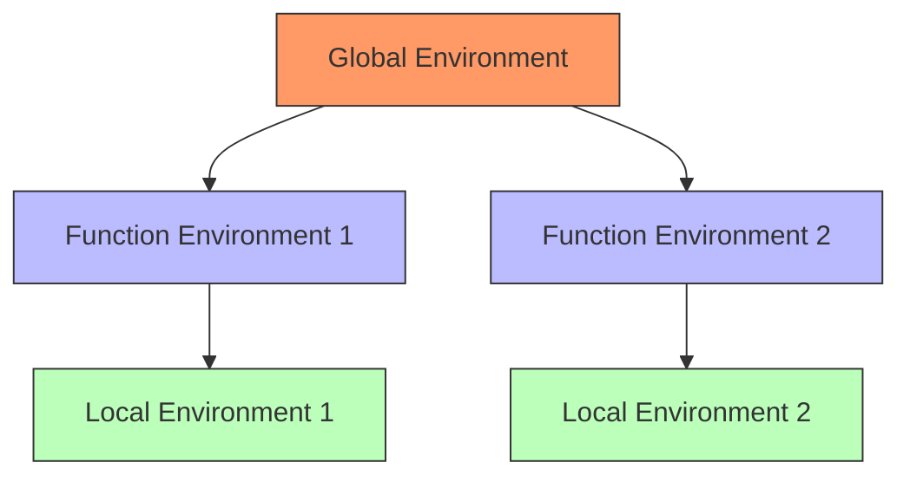

# Evaluator Component (S-expression) [Component:Evaluator:1.0]

## Overview

The Evaluator is responsible for parsing and executing workflows defined in the S-expression Domain Specific Language (DSL). It manages the DSL's execution environment, control flow, variable bindings, and coordinates the execution of atomic tasks defined in XML.

*(Note: The execution of the *body* of an atomic task, including LLM interaction and template variable substitution, is handled by the Task System and Handler components, invoked by this Evaluator.)*

## Core Responsibilities

1.  **S-expression Parsing & Execution**
    *   Parse S-expression code provided via commands (e.g., `/task`).
    *   Evaluate S-expression forms according to DSL semantics.
    *   Implement core DSL primitives (e.g., `bind`, `let`, `if`, `map`, function calls).
    *   Manage lexical environments and variable scoping for the S-expression DSL.

2.  **Atomic Task Invocation**
    *   Call `TaskSystem.execute_subtask_directly` to execute atomic tasks referenced within the S-expression workflow (e.g., via `call-atomic-task`).
    *   Pass the current S-expression environment for template variable substitution (`{{...}}`) within the atomic task.
    *   Handle results (`TaskResult`, `TaskError`) returned from atomic tasks.

3.  **Control Flow Management**
    *   Handle conditional execution (`if`).
    *   Implement looping or recursion mechanisms if defined in the DSL.
    *   Manage function calls and returns within the S-expression context.
    *   Handle `CONTINUATION` status returned from atomic tasks (for subtask spawning).

4.  **Error Handling & Recovery**
    *   Detect and handle errors during S-expression parsing and evaluation (e.g., syntax errors, unbound symbols, primitive errors).
    *   Propagate errors from failed atomic task calls.
    *   Potentially implement recovery logic within the S-expression framework or surface errors to the caller.

5.  **System Primitive Integration**
    *   Provide and execute built-in primitives for interacting with system components (e.g., `(system:run_script ...)`, `(get-context ...)`).

## Evaluator Visualization (Conceptual S-expression Flow)

### S-expression Workflow Execution
```mermaid
graph TD
    A[S-expression Input (e.g., from /task)] --> B(S-expression Parser)
    B --> C{Parse OK?}
    C -- No --> X1[Syntax Error]
    C -- Yes --> D[S-expression Evaluator]
    D -- Evaluate Form --> E{Form Type?}
    E -- Primitive (bind, if, etc.) --> F[Execute Primitive Logic]
    F -- Update Env --> D
    E -- Function Call --> G[Lookup Function/Template]
    G --> H[Create New Env & Bind Args]
    H --> I[Evaluate Function Body]
    I -- Result --> D
    E -- Atomic Task Call --> J[Call TaskSystem.execute_subtask_directly]
    J -- TaskResult/TaskError --> D
    D -- Final Result --> K[Workflow Output]
    D -- Evaluation Error --> X2[Runtime Error]

    subgraph Task System / Handler
        J --> L(Prepare Atomic Task Context)
        L --> M(Substitute {{...}} Vars)
        M --> N(Invoke Handler)
        N --> O(LLM Interaction / Tool Execution)
        O --> J
    end

    classDef error fill:#f99,stroke:#333
    class X1,X2 error
```
*This diagram shows the conceptual flow. The Evaluator manages the S-expression execution loop, calling out to the Task System for atomic task steps.*

### Template Substitution Process (within Atomic Tasks)
The following diagram illustrates how `{{variable_name}}` substitution works when an *atomic task* is invoked by the S-expression evaluator:

```mermaid
flowchart TD
    A[S-expression calls (call-atomic-task ...)] --> B(Task System: execute_subtask_directly)
    B --> C[Retrieve Atomic Task Template (XML)]
    C --> D{Template Type?}
    D -->|Function Template (XML <template>)| E[Create Isolated Env for Substitution (Params Only)]
    D -->|Standard Atomic Template| F[Use Caller's S-expression Env for Substitution]
    E --> G[Substitute {{params}} in Template Body]
    F --> H[Substitute {{vars}} in Template Body]
    G & H --> I[Pass Resolved Content to Handler]
    I --> J[Handler Executes LLM/Tool]

    classDef process fill:#bbf,stroke:#333
    classDef external fill:#bfb,stroke:#333
    classDef decision fill:#f9f,stroke:#333

    class B,C,E,F,G,H,I process
    class J external
    class D decision
```

The Task System (invoked by the S-expression Evaluator) handles the `{{...}}` substitution within the atomic task's definition using the appropriate environment before passing the resolved content to the Handler.

### S-expression Lexical Environment Hierarchy
The environment model for variable scoping within the S-expression DSL:



This hierarchical structure ensures proper lexical scoping for the S-expression DSL. Function calls (whether to S-expression functions or XML templates) create new environments with parameters bound, preventing unintended variable access from the caller's scope.

## Key Interfaces

For detailed interface specifications, see:
- [Interface:Evaluator:1.0] in `/components/evaluator/api/interfaces.md`
- [Type:Evaluator:1.0] in `/components/evaluator/spec/types.md`

## Integration Points

- **Task System**: Invoked by the Evaluator to execute atomic tasks (`execute_subtask_directly`). Provides atomic task template definitions.
- **S-expression Parser**: Provides the parsed S-expression structure to the Evaluator.
- **Memory System**: Used via primitives (`get-context`) or by the Task System during atomic task context preparation.
- **Handler**: Used by the Task System to execute the LLM/tool part of atomic tasks. Also used directly by primitives like `system:run_script`.

For system-wide contracts, see [Contract:Integration:EvaluatorTask:1.0] in `/system/contracts/interfaces.md`.
