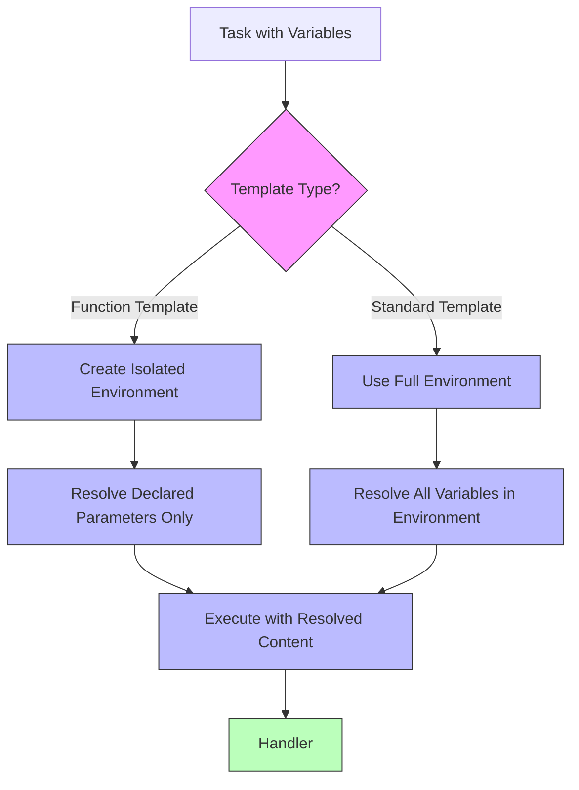
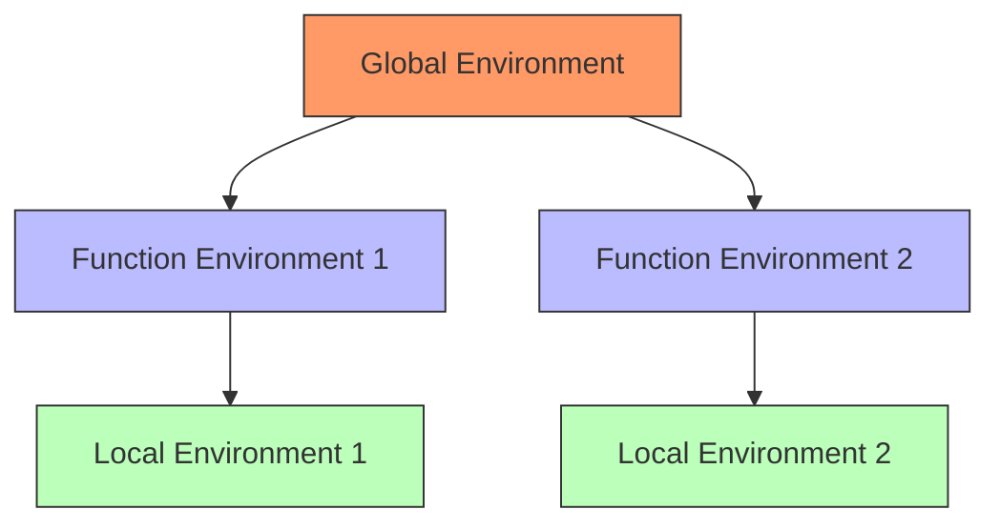

# Evaluator Component [Component:Evaluator:1.0]

## Overview

The Evaluator is the unified task-execution component of the system. It orchestrates the step-by-step execution of tasks, manages variable scoping through lexical environments, and handles error recovery.

## Core Responsibilities

1. **AST Execution**
   - Orchestrate step-by-step execution of tasks
   - Manage lexical environments for variable scoping
   - Handle template variable substitution

2. **Error Recovery**
   - Detect and handle execution errors
   - Initiate reparse operations for failed tasks
   - Manage partial results and continuation

3. **Context Management**
   - Coordinate with Memory System for context retrieval
   - Manage context inheritance between tasks
   - Handle explicit file inclusion

## Evaluator Visualization

### Template Substitution Process
The following diagram illustrates how variable substitution works:

The Evaluator is solely responsible for all template variable substitution, resolving all `{{variable_name}}` placeholders before passing tasks to the Handler.

### Lexical Environment Hierarchy
The environment model for variable scoping:

This hierarchical structure ensures proper variable scoping, with function templates having explicit parameters and isolated environments to prevent unintended variable access.

## Key Interfaces

For detailed interface specifications, see:
- [Interface:Evaluator:1.0] in `/components/evaluator/api/interfaces.md`
- [Type:Evaluator:1.0] in `/components/evaluator/spec/types.md`

## Integration Points

- **Task System**: Uses Evaluator for task execution
- **Compiler**: Provides AST nodes for evaluation
- **Memory System**: Used for context retrieval
- **Handler**: Used for LLM interactions

For system-wide contracts, see [Contract:Integration:EvaluatorTask:1.0] in `/system/contracts/interfaces.md`.
