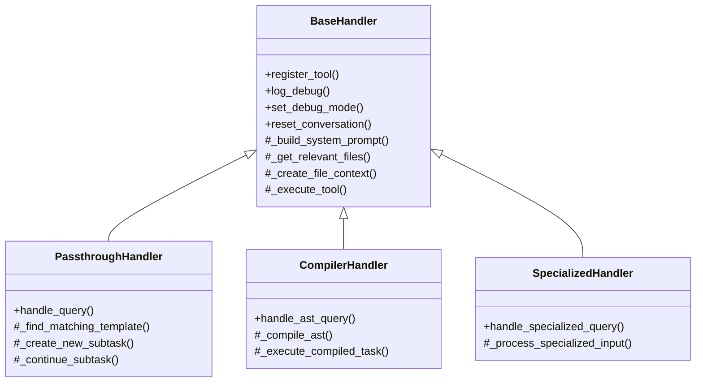
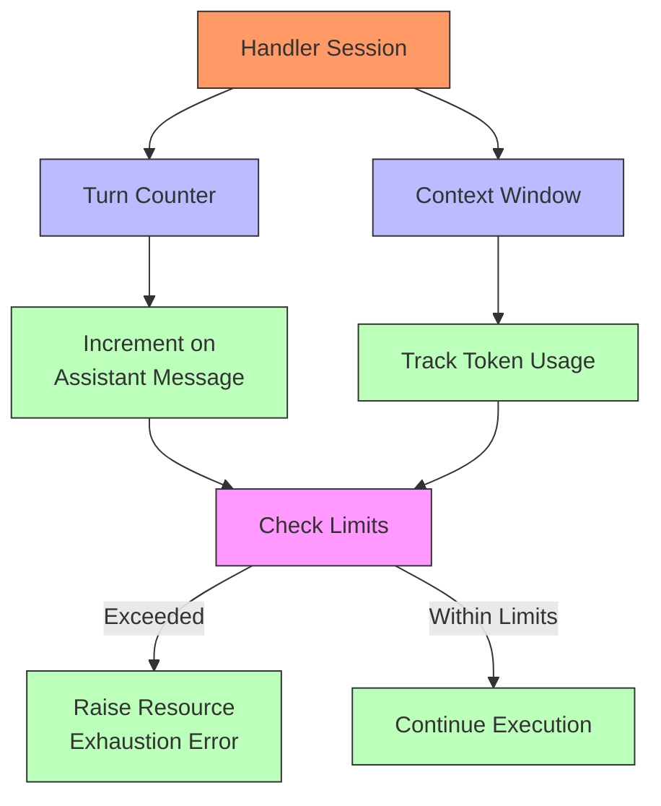
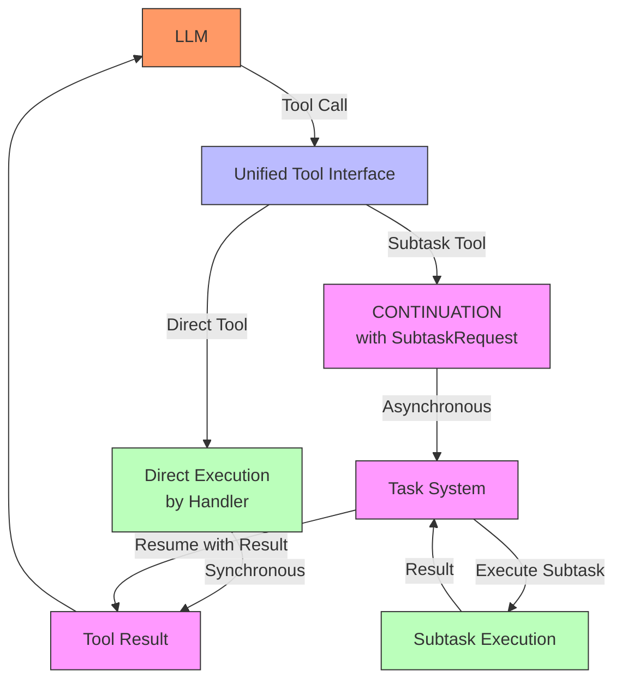

# Handler Component [Component:Handler:1.0]

## Overview

The Handler manages LLM interactions, resource tracking, and tool execution. It serves as the direct interface to LLM providers while enforcing system constraints.

## Core Responsibilities

1. **LLM Interaction Management**
   - Execute prompts through provider-specific adapters
   - Manage conversation history and message formatting
   - Track resource usage (turns, context window)

2. **Resource Enforcement**
   - Monitor turn counts and context window usage
   - Enforce limits with appropriate error handling
   - Generate warnings at specified thresholds (80%)

3. **Tool Execution**
   - Provide unified tool interface to LLMs
   - Execute direct tools synchronously
   - Transform subtask requests into CONTINUATION signals

4. **Passthrough Mode**
   - Process raw queries without AST compilation
   - Maintain conversation state within subtasks
   - Apply standard context management to non-AST queries
   - Detects the `/plan ` prefix in passthrough queries to guide the LLM towards generating structured, XML-tagged plans.

5. **Session Management**
   - Maintain isolated execution environments for tasks
   - Track conversation state and history
   - Ensure clean resource release after execution

## Component Structure

The Handler component follows an inheritance-based architecture to promote code reuse and separation of concerns:

### BaseHandler Responsibilities
- Common functionality shared across all handler types
- Tool registration and execution framework
- Debug logging and conversation management
- System prompt construction and file context creation
- Resource tracking and limit enforcement

### Specialized Handler Responsibilities
- **PassthroughHandler**: Raw text query processing without AST compilation
- **CompilerHandler**: AST-based query processing with compilation
- **SpecializedHandler**: Domain-specific handlers for particular use cases

This inheritance structure ensures that core functionality is implemented once in the BaseHandler while allowing specialized handlers to focus on their unique responsibilities.

## Handler Visualization

### Resource Tracking
The following diagram illustrates how the Handler tracks resources:

The Handler enforces strict resource limits for turns and context window usage to ensure tasks operate within defined constraints.

### Tool Interface Flow
This diagram shows how different types of tools are handled:

This visualization shows how the Handler provides a unified tool interface that hides implementation details from the LLM, while supporting both simple direct tools and complex LLM-to-LLM subtasks.

## Key Interfaces

- **executePrompt**: Submit prompts to the LLM and process responses
- **registerDirectTool**: Register synchronous tools for direct execution
- **registerSubtaskTool**: Register tools implemented via subtask continuation
- **addToolResponse**: Add tool responses to conversation history
- **handlePassthroughQuery**: Process raw text queries without AST compilation

For detailed specifications, see:
- [Interface:Handler:1.0] in `/components/handler/spec/interfaces.md`
- [Pattern:ResourceManagement:1.0] in `/system/architecture/patterns/resource-management.md`
- [Pattern:ToolInterface:1.0] in `/system/architecture/patterns/tool-interface.md`

For a comprehensive map of all system documentation, see [Documentation Guide](/system/docs-guide.md).
