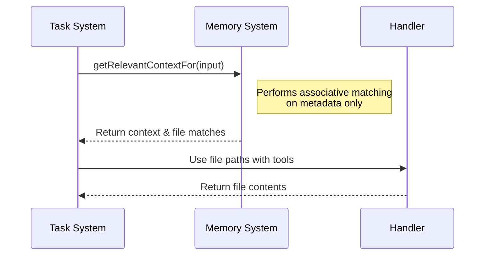
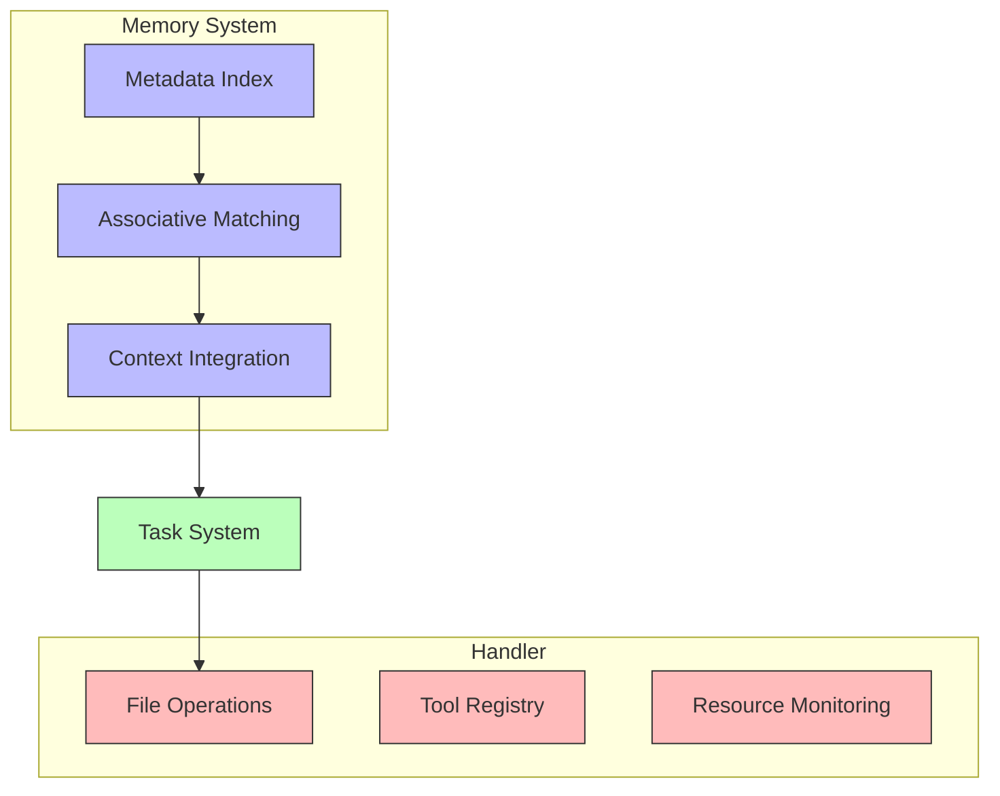

# Memory System Component [Component:Memory:3.0]

## Overview

The Memory System provides metadata management and associative matching services for task execution. It maintains a global metadata index to support context retrieval while delegating actual file operations to Handler tools.

## Core Responsibilities

1. **Metadata Management**
   - Maintain global file metadata index
   - Provide bulk index updates
   - Support associative matching

2. **Context Retrieval**
   - Retrieve relevant context for tasks
   - Support the three-dimensional context model
   - Provide file references for Handler tools

3. **Git Repository Indexing**
   - Index files from git repositories
   - Generate metadata for text files
   - Update global index with repository contents

4. **Boundary Enforcement**
   - Maintain clear separation from file I/O operations
   - Follow read-only context model
   - Delegate file operations to Handler tools

## Memory System Visualization

### Context Retrieval Flow
The following diagram shows how context flows through the system:

The Memory System provides context and file metadata but never performs file I/O operations - those are handled exclusively by the Handler tools.

### Component Boundaries
This diagram illustrates the clear separation of responsibilities:

This visualization emphasizes that the Memory System (v3.0) follows a read-only context model, managing only metadata while delegating all file operations to the Handler.

## Key Interfaces

For detailed interface specifications, see:
- [Interface:Memory:3.0] in `/components/memory/api/interfaces.md`
- [Type:Memory:3.0] in `/components/memory/spec/types.md`

## Integration Points

- **Task System**: Uses Memory System for context retrieval during task execution
- **Handler**: Performs file I/O operations based on file paths from Memory System
- **Evaluator**: Coordinates context retrieval for task execution

## Important Constraints

**IMPORTANT: The Memory System NEVER performs file I/O operations (reading, writing, deletion). All file operations are exclusively handled by Handler tools.**

**NOTE: As of version 3.0, the Memory System follows a read-only context model. The updateContext method has been removed, and all context must be managed through the appropriate context management mechanisms in the Task System.**

For system-wide contracts, see [Contract:Integration:TaskMemory:3.0] in `/system/contracts/interfaces.md`.
