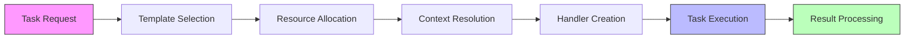
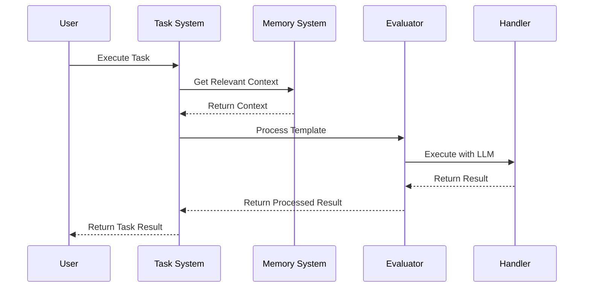

# Task System Component [Component:TaskSystem:1.0]

## Overview

The Task System orchestrates LLM task execution through structured XML templates and handlers. It provides template-based task definition, resource tracking, and an XML-based interface with the LLM.

## Core Responsibilities

1. **Task Execution**
   - Process task requests
   - Manage task execution flow
   - Handle task delegation and composition

2. **Template Management**
   - Register and validate templates
   - Support function-based templates
   - Enable template matching and selection

3. **Resource Coordination**
   - Coordinate resource tracking with Handler
   - Manage subtask spawning and nesting
   - Handle context management across tasks
   - Executes specific, registered template workflows programmatically when invoked directly (e.g., via `execute_subtask_directly`).

## Process Visualization

### Task Execution Workflow
The following diagram illustrates the typical task execution flow:

The Task System manages the complete lifecycle from initial request through template selection, resource allocation, and execution via the Handler. It also supports direct execution of registered workflows.

### Component Integration
The Task System interacts with other components during execution:

This sequence shows how the Task System coordinates between components to fulfill execution requests while maintaining clear responsibility boundaries.

## Key Interfaces

For detailed interface specifications, see:
- [Interface:TaskSystem:1.0] in `/components/task-system/api/interfaces.md`
- [Type:TaskSystem:1.0] in `/components/task-system/spec/types.md`

## Integration Points

- **Memory System**: Used for context retrieval via [Interface:Memory:3.0]
- **Handler**: Used for LLM interactions and resource enforcement
- **Evaluator**: Used for task execution and error recovery
- **Compiler**: Used for task parsing and transformation

## Architecture

The system manages task execution through isolated Handler instances, with one Handler per task to enforce resource limits and manage LLM interactions. Task definitions use an XML-based template system that supports both manual and LLM-generated structures.

For system-wide contracts, see [Contract:Integration:TaskSystem:1.0] in `/system/contracts/interfaces.md`.
