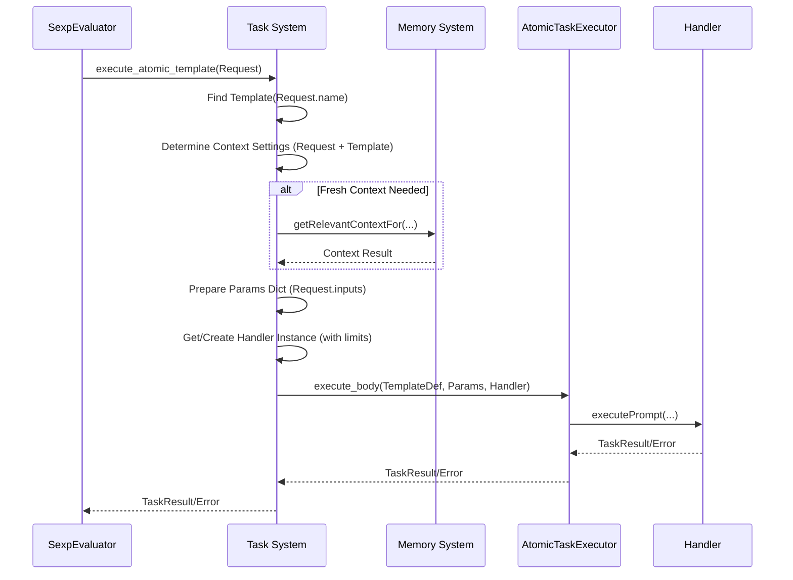

# Task System Component [Component:TaskSystem:1.0]

## Overview

The Task System manages *atomic* task definitions (XML templates) and orchestrates their execution setup. It acts as an intermediary between the `SexpEvaluator` (which handles workflows) and the `AtomicTaskExecutor` (which executes the core task body).

## Core Responsibilities

1.  **Atomic Template Management:**
    *   Register (`register_template`) and validate XML definitions for *atomic* tasks.
    *   Provide lookup (`find_template`) for atomic task templates by name or type/subtype.
    *   Support function-style templates with explicit parameter declarations.

2.  **Atomic Task Execution Orchestration:**
    *   Provide the `execute_atomic_template` interface for programmatic invocation (primarily by `SexpEvaluator`).
    *   Determine context settings (merging request/template definitions).
    *   Prepare input parameters dictionary for the `AtomicTaskExecutor`.
    *   Interface with the `MemorySystem` to fetch context if needed.
    *   Instantiate and configure `Handler` instances for atomic task execution.
    *   Instantiate and invoke the `AtomicTaskExecutor`.

3.  **Resource Coordination:**
    *   Configure Handlers with appropriate resource limits for atomic task execution.

*(Note: The Task System no longer directly executes composite tasks or manages complex execution flows like loops; this is handled by the SexpEvaluator.)*

## Process Visualization

### Atomic Task Execution Flow (TaskSystem Role)
The following diagram illustrates the Task System's role when executing an atomic task requested by the SexpEvaluator:



The Task System finds the template, prepares context and parameters, gets a Handler, and invokes the AtomicTaskExecutor to run the core task logic.

## Programmatic Atomic Task Execution

The TaskSystem provides the `execute_atomic_template` method for programmatic execution of *atomic* tasks:

```python
# Simplified signature - see IDL for full details
def execute_atomic_template(self, request: SubtaskRequest) -> TaskResult:
    """
    Executes a single atomic Task System template directly from a SubtaskRequest.
    The caller (e.g., SexpEvaluator) must provide resolved inputs in the request.

    Args:
        request: The SubtaskRequest defining the atomic task to run. Must have type='atomic'.

    Returns:
        The final TaskResult of the atomic task execution.
    """
    # 1. Find atomic template based on request.name/subtype
    # 2. Determine final context settings (merge request/template)
    # 3. Fetch context from MemorySystem if fresh_context enabled
    # 4. Prepare parameter dictionary from request.inputs
    # 5. Get Handler instance
    # 6. Instantiate AtomicTaskExecutor
    # 7. Call atomicTaskExecutor.execute_body(template_def, params, handler)
    # 8. Return result/error
    ...
```

This method is the primary way the `SexpEvaluator` invokes atomic steps within a larger workflow. It handles the setup and delegation to the `AtomicTaskExecutor`.

The context determination follows a precedence order:
1. Explicit `request.file_paths` override template `<file_paths>`.
2. Explicit `request.context_management` overrides template `<context_management>`.
3. Template settings are used if not overridden.
4. System defaults apply if no settings are specified.
5. Automatic context lookup via MemorySystem occurs if the final `fresh_context` setting is enabled.

## Key Interfaces

For detailed interface specifications, see:
- [Interface:TaskSystem:1.0] in `/components/task-system/api/interfaces.md`
- [Type:TaskSystem:1.0] in `/components/task-system/spec/types.md`

## Integration Points

- **SexpEvaluator**: Calls `execute_atomic_template` to run atomic steps.
- **AtomicTaskExecutor**: Invoked by TaskSystem (`execute_body`) to run the core atomic task logic.
- **Memory System**: Used for context retrieval (`getRelevantContextFor`) via [Interface:Memory:3.0].
- **Handler**: Instantiated and configured by TaskSystem for atomic task execution.
- **Compiler**: Used implicitly during template registration (`register_template`) for XML validation.

## Architecture

The Task System acts as the manager and orchestrator for *atomic* tasks. It holds the definitions and handles the setup (context, parameters, Handler) before delegating the core execution of the task body to the `AtomicTaskExecutor`. Workflow logic is handled externally by the `SexpEvaluator`.

For system-wide contracts potentially involving TaskSystem, see [Contract:Integration:TaskSystem:1.0] in `/system/contracts/interfaces.md` (Review needed).
