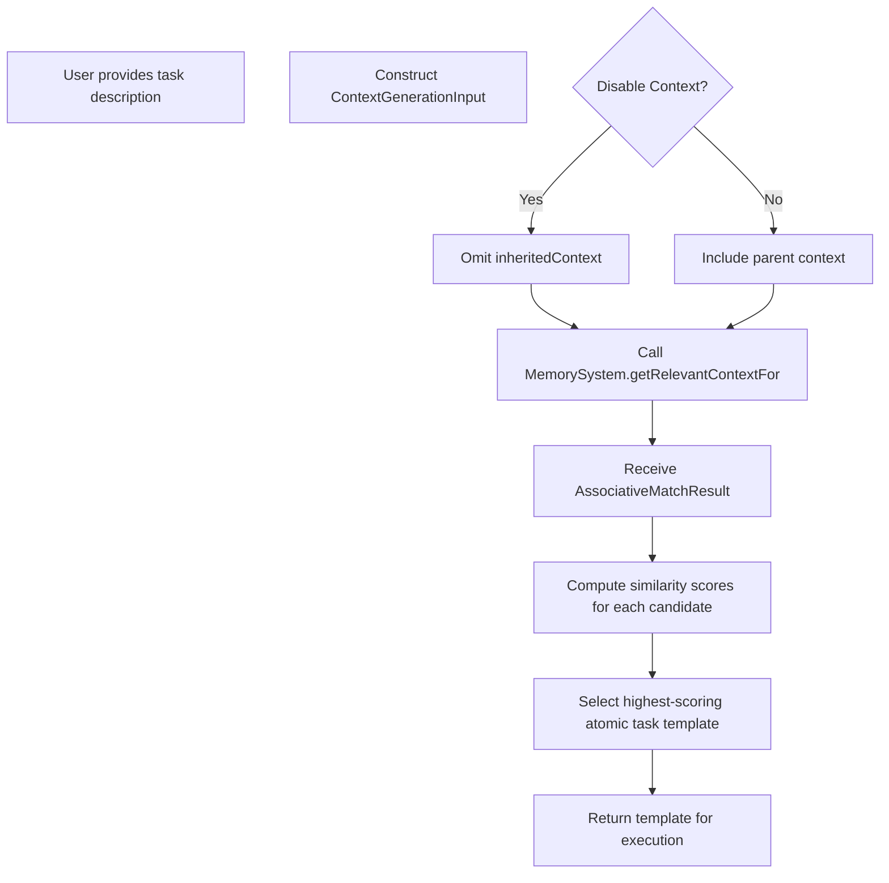

# Implementation Design

## Terminology and References

 - **Handler** and **Evaluator** definitions are standardized in [Type:TaskSystem:Types:1.0] (../spec/types.md).
 - XML schema definitions are available in [Contract:Tasks:TemplateSchema:1.0] (../../../system/contracts/protocols.md).
 - For detailed resource tracking implementation (including turn counter and context window monitoring), see [resource-management.md](./resource-management.md).
 - For XML processing details (parsing, validation, and fallback behavior), refer to [xml-processing.md](./xml-processing.md).
 - For implementation examples, see the [examples/](./examples/) directory.

## Handler Implementation

### Session Management Strategy
- Handler creates a HandlerSession for each task execution
- Session maintains complete conversation state and message history
- Provider-agnostic HandlerPayload structure for LLM interactions
- Clean session termination on completion
- Tool-based approach for user input requests
  
### Resource Tracking Implementation
- Turn counter integrated with HandlerSession
- Turns incremented only for assistant messages
- Context window tracks all messages and context
- Token usage monitored across full conversation
- Resource metrics available via session.getResourceMetrics()
- Limits enforced during session operations

### Payload Construction
- HandlerPayload provides unified structure for LLM requests
- Includes: systemPrompt, messages, context, tools, metadata
- Provider-specific adapters transform to appropriate format
- Session constructs payload via constructPayload() method
- Full conversation history included in structured format

## Task Template Matching

Template matching is a selection process that occurs before and separate from execution:

- **Selection Process**: Matches natural language task descriptions to appropriate atomic task templates
- **Scoring Mechanism**: Uses associative matching to compute similarity scores
- **Context Awareness**: May use task context to improve matching accuracy
- **No Execution Connection**: Completely separate from execution environment or variable binding
- **Scope Limitation**: Applies only to atomic task templates, not composite task templates

Template matching exclusively answers "which atomic task template should handle this task?" and has no role in variable resolution or execution. While the TaskLibrary can store templates for any task type (atomic, sequential, reduce, etc.), only atomic task templates participate in the template matching process.

**Template Substitution Process**

The Evaluator handles all template variable substitution before execution by the Handler. This process now exclusively follows the function-style model mandated by ADR 18:

1.  **Parameter Declaration:** Every template must declare its parameters (e.g., via `params` attribute in XML).
2.  **Isolated Environment:** When a template is called (e.g., via `<call>` or S-expression), the Task System (or SexpEvaluator) provides the core Template Evaluator with an environment containing *only* the declared parameters bound to the evaluated arguments from the call.
3.  **Strict Resolution:** Within the template's body, `{{parameter_name}}` placeholders are resolved *only* against the parameters present in this isolated environment.
4.  **Error on Missing:** If a placeholder `{{variable}}` references a name that is not a declared parameter for that template, an evaluation error is raised. Implicit lookup in the caller's environment is disabled.

## Context Management Implementation (for Atomic Tasks)

The Task System applies context management settings when preparing to execute an *atomic task* via `execute_atomic_template`. It uses a hybrid configuration approach:

1.  **Determine Subtype:** Identify the `subtype` of the atomic task (e.g., `standard`, `subtask`, `director`, `aider_interactive`) from the XML template or the `SubtaskRequest`.
2.  **Get Defaults:** Retrieve the default `ContextManagement` settings for that subtype (see table in `protocols.md`).
3.  **Apply Template Overrides:** Merge the defaults with any explicit `<context_management>` settings defined in the task's XML template.
4.  **Apply Request Overrides:** Further merge the result with any `context_management` overrides provided in the `SubtaskRequest` object passed to `execute_atomic_template`. **Request overrides take precedence over template overrides.**
5.  **Determine File Paths:** Resolve the final list of file paths using the precedence: `request.file_paths` > template `<file_paths>` > automatic lookup (if `fresh_context` enabled).
6.  **Enforce Constraints:** Validate the final effective settings (e.g., mutual exclusivity of `fresh_context` and `inherit_context`).
7.  **Prepare Context:** Use the final settings and file paths to assemble the context (fetch fresh, inherit, include files) before invoking the Handler/AtomicTaskExecutor.

```typescript
// Conceptual merging logic
function getEffectiveContextSettings(request: SubtaskRequest, template: TaskTemplate): ContextManagement {
  const subtype = request.subtype || template.subtype || 'standard';
  const defaults = DEFAULT_ATOMIC_CONTEXT_SETTINGS[subtype] || DEFAULT_ATOMIC_CONTEXT_SETTINGS.standard;
  const templateOverrides = template.context_management || {};
  const requestOverrides = request.context_management || {};

  const merged = { ...defaults, ...templateOverrides, ...requestOverrides };

  // TODO: Add validation for constraints like mutual exclusivity
  validateContextSettings(merged);

  return merged;
}
```

This ensures consistent application of defaults and overrides for every atomic task execution.

## Function Call Processing (within S-expression)

Function calls (invoking XML `<template>` definitions or potentially S-expression functions) are handled by the S-expression evaluator.

1.  **Template/Function Lookup**: The S-expression evaluator finds the definition (either an XML `<template>` registered in the Task System or an S-expression function definition) by name.
2.  **Argument Evaluation**: Arguments provided in the S-expression call (e.g., `(my-func arg1 arg2)`) are evaluated within the *caller's* S-expression environment.
3.  **Environment Creation**: A *new* lexical environment is created for the function's execution.
4.  **Parameter Binding**: The evaluated argument values are bound to the corresponding parameter names (defined in the `<template params="...">` or S-expression function definition) in the new environment.
5.  **Body Execution**: The function body (the atomic task defined in the XML `<template>` or the S-expression body) is executed within this new, isolated environment. It only has access to its bound parameters and any globally defined primitives/functions.
6.  **Return Value**: The result of the body execution is returned to the caller.

This ensures lexical scoping and prevents unintended access to the caller's variables.

## Subtask Spawning Implementation (via S-expression)

Subtask spawning (handling `CONTINUATION` from atomic tasks) is now primarily managed by the **S-expression Evaluator**, not the Task System itself. When `execute_atomic_template` returns a `CONTINUATION` result, it's passed back to the S-expression Evaluator, which then handles the validation and invocation of the requested subtask (likely by calling `execute_atomic_template` again with the new request).

Key responsibilities in this pattern:
- Handling CONTINUATION requests from subtask tool calls
- Managing context according to the specified configuration
- Coordinating script execution when required
- Passing evaluation results back to the Director

When creating subtasks with explicit file paths:
```typescript
// The file_paths field takes precedence over associative matching
subtask_request = {
  type: "atomic",
  description: "Analyze specific modules",
  inputs: { /* parameters */ },
  context_management: { inherit_context: "subset" },
  file_paths: ["/src/main.py", "/src/utils.py"]
}
```
The system ensures these files are fetched and included in the subtask's context before execution.

## Integration Points

### Memory System Integration
- Memory System provides metadata management and associative matching
- Task System delegates file operations to Handler
- Clear separation between metadata and file content
- Context retrieval through standard ContextGenerationInput interface
- When determining file context, the system checks the `file_paths_source.type`. If the type is `context_description`, the system retrieves the string value from the nested `<context_query>` element. Any `{{variable}}` placeholders within this string are resolved using the current task's `Environment`. This resolved string is then used as the primary query (`template_description`) when constructing the `ContextGenerationInput` object passed to `MemorySystem.get_relevant_context_for`. This allows the context search to be driven by a query different from the main task description used for LLM execution. This step takes precedence over the default behavior of using the main task description for context lookup when `fresh_context` is enabled but no specific `file_paths_source` is provided.

### Evaluator Integration (S-expression & Atomic Task Executor)
- **S-expression Evaluator**: Handles the execution of the S-expression DSL. It manages the DSL's environment, control flow, and calls primitives. When it needs to execute an atomic task defined in XML, it calls `TaskSystem.execute_atomic_template`.
- **Task System**: Manages atomic task templates (XML). Provides the `execute_atomic_template` interface. It finds the template, prepares context, resolves inputs, obtains a Handler, and then invokes the `AtomicTaskExecutor`.
- **AtomicTaskExecutor**: Executes the body of a single atomic task. It receives the parsed task definition and parameter values from the Task System. It performs the final `{{parameter}}` substitution using only the provided parameters and invokes the Handler.
- This creates a clear separation: S-expression evaluator handles the workflow logic and DSL environment; Task System orchestrates the setup for an atomic task; AtomicTaskExecutor executes the core atomic task logic and LLM interaction.

### Handler Integration
- Handler provides LLM interaction and resource tracking
- Task System delegates LLM calls to Handler
- Clear responsibility boundaries for resource management
- Standardized tool interface across components

## Task Template Matching

Template matching is a selection process that occurs before and separate from execution:

- **Selection Process**: Matches natural language task descriptions to appropriate atomic task templates
- **Scoring Mechanism**: Uses associative matching to compute similarity scores
- **Context Awareness**: May use task context to improve matching accuracy
- **No Execution Connection**: Completely separate from execution environment or variable binding
- **Scope Limitation**: Applies only to atomic task templates, not composite task templates

Template matching exclusively answers "which atomic task template should handle this task?" and has no role in variable resolution or execution. While the TaskLibrary can store templates for any task type (atomic, sequential, reduce, etc.), only atomic task templates participate in the template matching process.

For further details on context handling and related design decisions, see [ADR 002 - Context Management](../../system/architecture/decisions/002-context-management.md), [ADR 005 - Context Handling](../../system/architecture/decisions/005-context-handling.md), and [ADR 14 - Operator Context Configuration](../../system/architecture/decisions/14-operator-ctx-config.md).

#### Matching Call Chain



### Context Constraint Validation (Atomic Tasks)

The Task System enforces the mutual exclusivity constraint between `fresh_context` and `inherit_context` when determining the effective context settings for an atomic task execution:

```typescript
function validateContextSettings(settings) {
  // Check for mutual exclusivity violation
  if ((settings.inheritContext === 'full' || settings.inheritContext === 'subset') 
      && settings.freshContext === 'enabled') {
    return {
      valid: false,
      error: 'Context constraint violation: fresh_context="enabled" cannot be combined with inherit_context="full" or inherit_context="subset"'
    };
  }
  
  // Check for empty context warning
  if (settings.inheritContext === 'none' && !settings.accumulateData && settings.freshContext === 'disabled') {
    return {
      valid: true,
      warning: 'Warning: Task will execute with minimal context (no inheritance, no accumulation, no fresh context)'
    };
  }
  
  return { valid: true };
}
```

## Resource Management (via Handler)

Resource limits (turns, context window tokens, output size) are enforced by the **Handler** during the execution of each *atomic task*. The Task System configures the Handler with the appropriate limits when it's instantiated for an atomic task execution via `execute_subtask_directly`. The S-expression evaluator itself does not directly manage LLM resource limits, but failures (like `RESOURCE_EXHAUSTION`) from atomic tasks it calls will propagate back into the S-expression workflow. Overall workflow timeouts might be managed at a higher level. See [resource-management.md](./resource-management.md) for Handler implementation details.

## Variable and Parameter Management

The system maintains clear separation between two distinct mechanisms:

### 1. S-expression Lexical Environment
- **Purpose**: Manages variable bindings (`bind`, `let`), function definitions (`define`), and scoping rules for the S-expression DSL.
- **Managed By**: S-expression Evaluator.
- **Scope**: Follows standard lexical scoping rules (e.g., bindings within a `let` are local).

### 2. Atomic Task Template Substitution (`{{...}}`)
- **Purpose**: Resolves placeholders within the XML definition (e.g., `<instructions>`, `<system>`) of an *atomic task* before it's sent to the LLM.
- **Mechanism**: Uses values from the parameter dictionary provided by the Task System (derived from `SubtaskRequest.inputs`) to replace `{{parameter_name}}`.
- **Managed By**: AtomicTaskExecutor, using the parameters prepared by the Task System during the `execute_atomic_template` process.

### 3. Function Call Parameter Passing (S-expression -> Function/Template)
- **Purpose**: Passes data from an S-expression call site to the execution context of a function (defined in S-expression or via XML `<template>`).
- **Mechanism**: Arguments in the S-expression call are evaluated in the caller's S-expression environment. The resulting values are then bound to the function's/template's declared parameter names in a *new, isolated* environment for the function body's execution.
- **Managed By**: S-expression Evaluator.

This multi-layered approach keeps DSL execution separate from atomic task template resolution while enabling data flow between them.

## Template Substitution Process

The system implements a standardized template substitution process in the Evaluator component, which resolves `{{variable_name}}` placeholders before dispatching tasks to the Handler:

### 1. Function-Based Templates
- For templates with declared parameters (`<template name="example" params="param1,param2">`):
- Substitution is limited to only the declared parameters
- The template has no access to other variables in the parent scope
- Example: `<description>Process {{param1}} with {{param2}}</description>`

### 2. Standard Templates
- For templates without explicit parameter declarations:
- Substitution uses variables from the current lexical environment
- Variables are resolved through the Environment.find() method
- Example: `<description>Process {{data_file}} with {{options}}</description>`

### Implementation in Task System (Atomic Task Substitution)

The Task System (during `execute_subtask_directly`) performs template variable substitution (`{{...}}`) before invoking the Handler:

```typescript
```typescript
// In AtomicTaskExecutor.execute_body
function substituteAtomicTaskVariables(atomicTaskDef: ParsedAtomicTask, params: ParamsDict): ResolvedAtomicTask {
  const resolvedTask = { ...atomicTaskDef }; // Copy template definition

  // Use ONLY the provided params dictionary to resolve {{...}} placeholders
  resolvedTask.instructions = substitutePlaceholders(atomicTaskDef.instructions, params);
  resolvedTask.system = substitutePlaceholders(atomicTaskDef.system, params);
  // ... resolve other fields as needed ...

  // Error handling for missing variables during substitution
  // ...

  return resolvedTask;
}

// Placeholder substitution logic (simplified)
function substitutePlaceholders(text: string | undefined, params: ParamsDict): string | undefined {
  if (!text) return undefined;
  return text.replace(/\{\{([^}]+)\}\}/g, (match, paramName) => {
    const key = paramName.trim();
    if (key in params) {
      // Convert value to string appropriately
      return String(params[key]);
    } else {
      // Handle missing parameter error
      console.error(`Parameter substitution error: ${key} not found in provided parameters.`);
      throw new Error(`Parameter resolution error: ${key}`); // Or ParameterMismatch error
    }
  });
}

```
This ensures atomic task bodies are fully resolved using only the explicitly passed parameters before the Handler sees them. Director-Evaluator loops implemented in S-expression handle data passing between steps using `bind`/`let`, calling `execute_atomic_template` with the appropriate inputs for each atomic step.

## Subtask Spawning Implementation

The Task System implements a standardized subtask spawning mechanism that enables dynamic task creation and composition.

### Request Structure

```typescript
interface SubtaskRequest {
  // Required fields
  type: TaskType;                      // Type of subtask to spawn
  description: string;                 // Description of the subtask
  inputs: Record<string, any>;         // Input parameters for the subtask
  
  // Optional fields
  template_hints?: string[];           // Hints for template selection
  context_management?: {               // Override default context settings
    inherit_context?: 'full' | 'none' | 'subset';
    accumulate_data?: boolean;
    accumulation_format?: 'notes_only' | 'full_output';
    fresh_context?: 'enabled' | 'disabled';
  };
  max_depth?: number;                  // Override default max nesting depth
  subtype?: string;                    // Optional subtype for atomic tasks
}
```

### Execution Flow

The subtask spawning process follows four main steps:

1. **Validation**
   - Validates the SubtaskRequest structure
   - Checks nesting depth against maximum allowed
   - Performs cycle detection to prevent recursive spawning
   - Validates input parameters

2. **Template Matching**
   - Uses the description and template_hints for associative matching
   - Selects the highest-scoring template that matches the request
   - Falls back to default templates if no specific match is found

3. **Subtask Creation**
   - Creates a new execution environment with direct parameter passing
   - Applies context management settings (defaults or overrides)
   - Prepares resource tracking linked to the parent task

4. **Execution and Result Handling**
   - Executes the subtask with appropriate resource limits
   - Passes the complete TaskResult back to the parent task
   - Handles errors with standardized error structures
   - Ensures proper cleanup of resources

### Depth Control Implementation

To prevent infinite recursion and resource exhaustion, the system implements depth control:

```typescript
async function executeTaskWithDepthControl(
  request: SubtaskRequest, 
  parentContext: ExecutionContext,
  currentDepth: number = 0
): Promise<TaskResult> {
  // Check maximum nesting depth
  const maxDepth = request.max_depth ?? DEFAULT_MAX_NESTING_DEPTH;
  if (currentDepth >= maxDepth) {
    throw new Error({
      type: 'TASK_FAILURE',
      reason: 'execution_halted',
      message: `Maximum nesting depth (${maxDepth}) exceeded`
    });
  }
  
  // Perform cycle detection
  if (detectCycle(request, parentContext.executionPath)) {
    throw new Error({
      type: 'TASK_FAILURE',
      reason: 'execution_halted',
      message: 'Cycle detected in subtask spawning'
    });
  }
  
  // Get context based on settings, with support for explicit file paths
  const contextSettings = getContextSettings(request);
  if (contextSettings.inheritContext === 'subset' && 
      request.file_paths && request.file_paths.length > 0) {
    // Use explicit file paths when provided
    parentContext.context = await getContextForFiles(request.file_paths, parentContext);
  }
  
  // Execute subtask with incremented depth
  try {
    return await executeTask(request, {
      ...parentContext,
      nestingDepth: currentDepth + 1,
      executionPath: [...parentContext.executionPath, getTaskSignature(request)]
    });
  } catch (error) {
    // Wrap error in standardized subtask failure structure
    throw {
      type: 'TASK_FAILURE',
      reason: 'subtask_failure',
      message: `Subtask "${request.description}" failed`,
      details: {
        subtaskRequest: request,
        subtaskError: error,
        nestingDepth: currentDepth + 1,
        partialOutput: error.details?.partialOutput
      }
    };
  }
}
```

### Context Management Integration (Atomic Tasks)

Atomic tasks invoked as subtasks (e.g., via `CONTINUATION` or `call-atomic-task`) use the hybrid configuration approach for their context settings:

```typescript
// Default context management settings for atomic tasks invoked as subtasks
const DEFAULT_SUBTASK_CONTEXT_SETTINGS = {
  inheritContext: 'subset', // Default for subtype='subtask'
  accumulateData: false,
  accumulationFormat: 'notes_only',
  freshContext: 'enabled' // Default for subtype='subtask'
};

/**
 * Retrieves context for specific file paths
 * @param filePaths Array of file paths to include in context
 * @param parentContext Parent execution context
 * @returns Context containing only the specified files
 */
async function getContextForFiles(
  filePaths: string[], 
  parentContext: ExecutionContext
): Promise<ExecutionContext> {
  // Filter the parent context to only include the specified files
  // This implementation assumes the memory system can retrieve specific files
  const fileContexts = await Promise.all(
    filePaths.map(path => memorySystem.getFileContext(path))
  );
  
  // Combine the file contexts into a single context
  return {
    ...parentContext,
    files: fileContexts.filter(Boolean) // Remove any null/undefined entries
  };
}

function getContextSettings(request: SubtaskRequest): ContextSettings {
  // If context_management is provided in the request, merge with defaults
  if (request.context_management) {
    return {
      ...DEFAULT_SUBTASK_CONTEXT_SETTINGS,
      ...request.context_management
    };
  }
  
  // Otherwise use defaults for the determined subtype
  const subtype = request.subtype || template?.subtype || 'standard';
  return DEFAULT_ATOMIC_CONTEXT_SETTINGS[subtype] || DEFAULT_ATOMIC_CONTEXT_SETTINGS.standard;
}
```

### Parent-Child Communication (S-expression & Atomic Tasks)

Communication between S-expression forms and the atomic tasks they call occurs via:
1.  **Invocation**: The S-expression calls `TaskSystem.execute_atomic_template` with a `SubtaskRequest` (containing inputs, context/file overrides) and the current S-expression environment (primarily for resolving request details if needed, not for template substitution).
2.  **Parameter Passing**: Inputs for the atomic task are taken directly from `SubtaskRequest.inputs`. Substitution (`{{...}}`) within the atomic task body uses *only* these inputs, handled by the AtomicTaskExecutor.
3.  **Return Value**: The `TaskResult` or `TaskError` from the atomic task execution (via AtomicTaskExecutor and Handler) is returned by `execute_atomic_template` to the S-expression evaluator.
4.  **Binding**: The S-expression can bind this result to a variable using `bind` or `let` for use in subsequent steps.

If an atomic task itself returns `CONTINUATION` with a `subtask_request` (dynamic subtask spawning):
1.  `execute_atomic_template` returns this `CONTINUATION` result.
2.  The S-expression evaluator receives it and handles the subtask spawning logic (validating, calling `execute_atomic_template` again for the new request).
3.  The result of the *dynamically spawned* subtask is then returned to the S-expression context where the `CONTINUATION` was received.

### Script Execution Implementation (via S-expression Primitive)
Script execution is invoked via an S-expression primitive like `(system:run_script ...)`.
1.  The S-expression evaluator calls the primitive's implementation.
2.  The primitive likely uses the Handler's shell execution capability.
3.  Inputs are passed as arguments to the primitive from the S-expression environment.
4.  The primitive returns the script's results (stdout, stderr, exit code) packaged in a `TaskResult` or `TaskError`.
5.  The S-expression binds this result for further use.

## Integration Points
### Memory System Interaction

#### Clear Responsibility Boundaries
- **Memory System** (read-only metadata):
  - Maintains metadata index (file paths and descriptions)
  - Provides associative matching based on metadata
  - Never performs file I/O operations
  - Does not store or parse file contents
  - Follows read-only context model (no updateContext capability)

- **Handler** (all file operations):
  - Reads/writes files when needed
  - For Anthropic models: Configures computer use tools (optional)
  - For other models: Uses appropriate file access mechanisms
  - Handles all file system interaction
  
### Compiler Integration
- Task parsing services
- XML validation
- Schema conformance
- Error surfacing
- Validation feedback
  
### S-expression Evaluator Support
- Error surfacing from atomic tasks
- No retry management (handled by S-expression logic if needed)
- State preservation (via S-expression environment)
- Recovery guidance (via error details)
  
### LLM Session Management
- Handler encapsulation
- Resource tracking
- Model selection support
- Clean termination
- Session isolation
