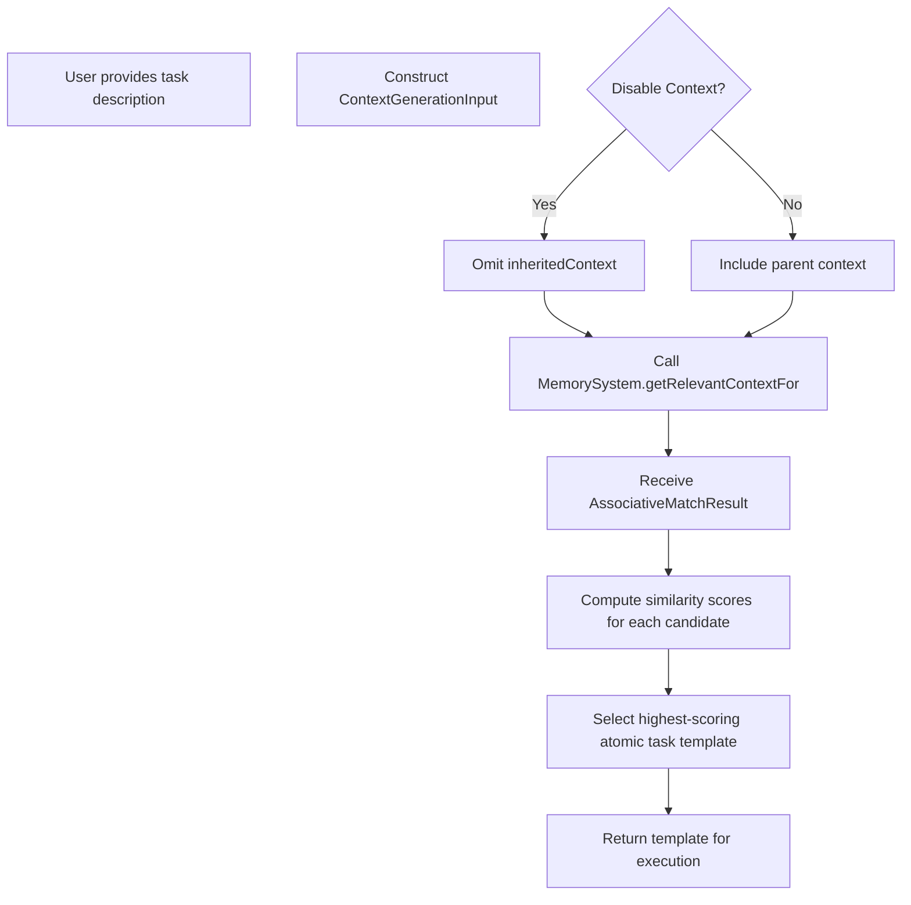

# Implementation Design

## Terminology and References

 - **Handler** and **Evaluator** definitions are standardized in [Type:TaskSystem:Types:1.0] (../spec/types.md).
 - XML schema definitions are available in [Contract:Tasks:TemplateSchema:1.0] (../../../system/contracts/protocols.md).
 - For detailed resource tracking implementation (including turn counter and context window monitoring), see [resource-management.md](./resource-management.md).
 - For XML processing details (parsing, validation, and fallback behavior), refer to [xml-processing.md](./xml-processing.md).
 - For implementation examples, see the [examples/](./examples/) directory.

## Handler Implementation

### Session Management Strategy
- Handler creates a HandlerSession for each task execution
- Session maintains complete conversation state and message history
- Provider-agnostic HandlerPayload structure for LLM interactions
- Clean session termination on completion
- Tool-based approach for user input requests
  
### Resource Tracking Implementation
- Turn counter integrated with HandlerSession
- Turns incremented only for assistant messages
- Context window tracks all messages and context
- Token usage monitored across full conversation
- Resource metrics available via session.getResourceMetrics()
- Limits enforced during session operations

### Payload Construction
- HandlerPayload provides unified structure for LLM requests
- Includes: systemPrompt, messages, context, tools, metadata
- Provider-specific adapters transform to appropriate format
- Session constructs payload via constructPayload() method
- Full conversation history included in structured format

## Task Template Matching

Template matching is a selection process that occurs before and separate from execution:

- **Selection Process**: Matches natural language task descriptions to appropriate atomic task templates
- **Scoring Mechanism**: Uses associative matching to compute similarity scores
- **Context Awareness**: May use task context to improve matching accuracy
- **No Execution Connection**: Completely separate from execution environment or variable binding
- **Scope Limitation**: Applies only to atomic task templates, not composite task templates

Template matching exclusively answers "which atomic task template should handle this task?" and has no role in variable resolution or execution. While the TaskLibrary can store templates for any task type (atomic, sequential, reduce, etc.), only atomic task templates participate in the template matching process.

### Template Substitution Process

The system implements a standardized template substitution process in the Evaluator component, which resolves `{{variable_name}}` placeholders before dispatching tasks to the Handler:

#### Function-Based Templates
- For templates with declared parameters (`<template name="example" params="param1,param2">`):
- Substitution is limited to only the declared parameters
- The template has no access to other variables in the parent scope
- Example: `<description>Process {{param1}} with {{param2}}</description>`

#### Standard Templates
- For templates without explicit parameter declarations:
- Substitution uses variables from the current lexical environment
- Variables are resolved through the Environment.find() method
- Example: `<description>Process {{data_file}} with {{options}}</description>`

## Context Management Implementation

The Task System implements a hybrid configuration approach with operator-specific defaults and explicit overrides:

```typescript
// Default context management settings by operator type and subtype
const DEFAULT_CONTEXT_SETTINGS = {
  atomic: {
    standard: {
      inheritContext: 'full',
      accumulateData: false,
      accumulationFormat: 'notes_only',
      freshContext: 'disabled'
    },
    subtask: {
      inheritContext: 'none',
      accumulateData: false,
      accumulationFormat: 'notes_only',
      freshContext: 'enabled'
    },
    // Default to standard if no subtype specified
    default: {
      inheritContext: 'full',
      accumulateData: false,
      accumulationFormat: 'notes_only',
      freshContext: 'disabled'
    }
  },
  sequential: {
    inheritContext: 'full',
    accumulateData: true,
    accumulationFormat: 'notes_only',
    freshContext: 'disabled'
  },
  reduce: {
    inheritContext: 'none',
    accumulateData: true,
    accumulationFormat: 'notes_only',
    freshContext: 'enabled'
  },
  script: {
    inheritContext: 'full',
    accumulateData: false,
    accumulationFormat: 'notes_only',
    freshContext: 'disabled'
  },
  director_evaluator_loop: {
    inheritContext: 'none',
    accumulateData: true,
    accumulationFormat: 'notes_only',
    freshContext: 'enabled'
  }
};

## Function Call Processing

Function calls use direct parameter passing with lexical isolation:

1. **Template Lookup**: Retrieve template by name from TaskLibrary
2. **Argument Resolution**: For each argument in the caller's environment:
   - For string values: Try variable lookup first, fallback to literal value
   - For AST nodes: Recursively evaluate in caller's environment
3. **Fresh Environment Creation**: Create new environment with parameter bindings
   - Parameters explicitly bound to evaluated argument values
   - No implicit access to caller's variables
4. **Isolated Execution**: Execute template in this clean environment

This process maintains clean scope boundaries, preventing unintended variable access.

## Subtask Spawning Implementation

The Task System implements the subtask tool mechanism as defined in [Pattern:ToolInterface:1.0], using the CONTINUATION status internally. From the LLM's perspective, these appear as tools but are implemented using the subtask spawning protocol.

Key responsibilities in this pattern:
- Handling CONTINUATION requests from subtask tool calls
- Managing context according to the specified configuration
- Coordinating script execution when required
- Passing evaluation results back to the Director

When creating subtasks with explicit file paths:
```typescript
// The file_paths field takes precedence over associative matching
subtask_request = {
  type: "atomic",
  description: "Analyze specific modules",
  inputs: { /* parameters */ },
  context_management: { inherit_context: "subset" },
  file_paths: ["/src/main.py", "/src/utils.py"]
}
```
The system ensures these files are fetched and included in the subtask's context before execution.

## Integration Points

### Memory System Integration
- Memory System provides metadata management and associative matching
- Task System delegates file operations to Handler
- Clear separation between metadata and file content
- Context retrieval through standard ContextGenerationInput interface

### Evaluator Integration
- Evaluator handles template substitution and function calls
- Task System provides templates and execution coordination
- Evaluator manages execution context and variable resolution
- Clear separation of concerns between components

### Handler Integration
- Handler provides LLM interaction and resource tracking
- Task System delegates LLM calls to Handler
- Clear responsibility boundaries for resource management
- Standardized tool interface across components

## Task Template Matching

Template matching is a selection process that occurs before and separate from execution:

- **Selection Process**: Matches natural language task descriptions to appropriate atomic task templates
- **Scoring Mechanism**: Uses associative matching to compute similarity scores
- **Context Awareness**: May use task context to improve matching accuracy
- **No Execution Connection**: Completely separate from execution environment or variable binding
- **Scope Limitation**: Applies only to atomic task templates, not composite task templates

Template matching exclusively answers "which atomic task template should handle this task?" and has no role in variable resolution or execution. While the TaskLibrary can store templates for any task type (atomic, sequential, reduce, etc.), only atomic task templates participate in the template matching process.

For further details on context handling and related design decisions, see [ADR 002 - Context Management](../../system/architecture/decisions/002-context-management.md), [ADR 005 - Context Handling](../../system/architecture/decisions/005-context-handling.md), and [ADR 14 - Operator Context Configuration](../../system/architecture/decisions/14-operator-ctx-config.md).

#### Matching Call Chain



### Context Constraint Validation

The system enforces a mutual exclusivity constraint between fresh context generation and context inheritance:

```typescript
function validateContextSettings(settings) {
  // Check for mutual exclusivity violation
  if ((settings.inheritContext === 'full' || settings.inheritContext === 'subset') 
      && settings.freshContext === 'enabled') {
    return {
      valid: false,
      error: 'Context constraint violation: fresh_context="enabled" cannot be combined with inherit_context="full" or inherit_context="subset"'
    };
  }
  
  // Check for empty context warning
  if (settings.inheritContext === 'none' && !settings.accumulateData && settings.freshContext === 'disabled') {
    return {
      valid: true,
      warning: 'Warning: Task will execute with minimal context (no inheritance, no accumulation, no fresh context)'
    };
  }
  
  return { valid: true };
}
```

## Resource Management

The Task System enforces resource limits via a per‑Handler turn counter and context window monitoring. For the complete low‑level implementation (including code examples and configuration details), please refer to [resource-management.md](./resource-management.md).
  
### Context Window Management
- Token counting approach
- Size limit enforcement
- No optimization strategy
- Window usage monitoring
- Clear limit boundaries
  
### Limit Enforcement Strategy
- Immediate termination on violation
- Resource exhaustion error generation
- Clean session cleanup
- Resource usage reporting
- Clear violation metrics
  
### Error Detection Mechanisms
- Resource limit monitoring, progress tracking, output and XML structure validation, and input validation.

## Variable and Parameter Management

The system maintains clear separation between two distinct mechanisms:

### 1. Lexical Environment
- **Purpose**: Maintains DSL variable bindings and scoping
- **Structure**: Chain of environments with parent references
- **Operations**: Variable lookups, environment extension
- **Scope**: Isolated between function calls

### 2. Direct Parameter Passing
- **Purpose**: Transfers data between caller and template
- **Mechanism**: Arguments evaluated in caller's scope, bound to parameters in template's scope
- **Execution**: Templates operate only on their parameters
- **Isolation**: No implicit access between scopes

This clean separation prevents unexpected variable leakage and ensures predictable execution.

## Template Substitution Process

The system implements a standardized template substitution process in the Evaluator component, which resolves `{{variable_name}}` placeholders before dispatching tasks to the Handler:

### 1. Function-Based Templates
- For templates with declared parameters (`<template name="example" params="param1,param2">`):
- Substitution is limited to only the declared parameters
- The template has no access to other variables in the parent scope
- Example: `<description>Process {{param1}} with {{param2}}</description>`

### 2. Standard Templates
- For templates without explicit parameter declarations:
- Substitution uses variables from the current lexical environment
- Variables are resolved through the Environment.find() method
- Example: `<description>Process {{data_file}} with {{options}}</description>`

### Implementation in Evaluator

The Evaluator has a formal substitution phase in its execution pipeline:

```typescript
// In Evaluator component
async function executeTask(task: Task, environment: Environment): Promise<TaskResult> {
  try {
    // Process and resolve all template variables
    const resolvedTask = resolveTemplateVariables(task, environment);
    
    // Execute task using Handler with fully resolved content
    const result = await handler.executePrompt(
      resolvedTask.systemPrompt,
      resolvedTask.taskPrompt
    );
    
    // Process and return results
    return processResult(result, task);
  } catch (error) {
    if (error.message.includes('Variable resolution error')) {
      return createTaskFailure(
        'template_resolution_failure',
        error.message,
        { task: task.description }
      );
    }
    throw error;
  }
}

// Template variable resolution
function resolveTemplateVariables(task: Task, env: Environment): Task {
  const resolvedTask = {...task};
  
  if (task.isFunctionTemplate && task.parameters) {
    // For function templates, create isolated environment with only parameters
    const funcEnv = new Environment({});
    for (const param of task.parameters) {
      funcEnv.bindings[param] = env.find(param);
    }
    resolvedTask.taskPrompt = substituteVariables(task.taskPrompt, funcEnv);
  } else {
    // For standard templates, use the full environment
    resolvedTask.taskPrompt = substituteVariables(task.taskPrompt, env);
  }
  
  return resolvedTask;
}
```

The Evaluator handles variable resolution before passing fully resolved content to the Handler. This ensures all placeholders are substituted prior to LLM execution, with appropriate error handling for missing variables.

For Director-Evaluator loops, parameters are passed explicitly:
```typescript
// Director-Evaluator Loop with Evaluator handling template substitution
async function executeDirectorEvaluatorLoop(task, inputs) {
  // In the Evaluator component:
  
  // 1. Prepare director inputs
  const directorInputs = {
    ...inputs,
    feedback: previousEvaluation?.feedback,
    current_iteration: currentIteration
  };
  
  // 2. Resolve all template variables in the director task
  const resolvedDirectorTask = resolveTemplateVariables(task.director, directorInputs);
  
  // 3. Execute director with fully resolved content
  const directorOutput = await handler.executePrompt(
    resolvedDirectorTask.systemPrompt,
    resolvedDirectorTask.taskPrompt
  );
  
  // 4. Prepare evaluator inputs
  const evaluatorInputs = {
    solution: directorOutput.content,
    original_prompt: inputs.original_prompt
  };
  
  // 5. Resolve all template variables in the evaluator task
  const resolvedEvaluatorTask = resolveTemplateVariables(task.evaluator, evaluatorInputs);
  
  // 6. Execute evaluator with fully resolved content
  const evaluationResult = await handler.executePrompt(
    resolvedEvaluatorTask.systemPrompt,
    resolvedEvaluatorTask.taskPrompt
  );
  
  // Resume loop with new parameters
  return continueExecution(task, {
    ...inputs,
    director_result: directorOutput,
    evaluation_result: evaluationResult
  });
}
```

## Subtask Spawning Implementation

The Task System implements a standardized subtask spawning mechanism that enables dynamic task creation and composition.

### Request Structure

```typescript
interface SubtaskRequest {
  // Required fields
  type: TaskType;                      // Type of subtask to spawn
  description: string;                 // Description of the subtask
  inputs: Record<string, any>;         // Input parameters for the subtask
  
  // Optional fields
  template_hints?: string[];           // Hints for template selection
  context_management?: {               // Override default context settings
    inherit_context?: 'full' | 'none' | 'subset';
    accumulate_data?: boolean;
    accumulation_format?: 'notes_only' | 'full_output';
    fresh_context?: 'enabled' | 'disabled';
  };
  max_depth?: number;                  // Override default max nesting depth
  subtype?: string;                    // Optional subtype for atomic tasks
}
```

### Execution Flow

The subtask spawning process follows four main steps:

1. **Validation**
   - Validates the SubtaskRequest structure
   - Checks nesting depth against maximum allowed
   - Performs cycle detection to prevent recursive spawning
   - Validates input parameters

2. **Template Matching**
   - Uses the description and template_hints for associative matching
   - Selects the highest-scoring template that matches the request
   - Falls back to default templates if no specific match is found

3. **Subtask Creation**
   - Creates a new execution environment with direct parameter passing
   - Applies context management settings (defaults or overrides)
   - Prepares resource tracking linked to the parent task

4. **Execution and Result Handling**
   - Executes the subtask with appropriate resource limits
   - Passes the complete TaskResult back to the parent task
   - Handles errors with standardized error structures
   - Ensures proper cleanup of resources

### Depth Control Implementation

To prevent infinite recursion and resource exhaustion, the system implements depth control:

```typescript
async function executeTaskWithDepthControl(
  request: SubtaskRequest, 
  parentContext: ExecutionContext,
  currentDepth: number = 0
): Promise<TaskResult> {
  // Check maximum nesting depth
  const maxDepth = request.max_depth ?? DEFAULT_MAX_NESTING_DEPTH;
  if (currentDepth >= maxDepth) {
    throw new Error({
      type: 'TASK_FAILURE',
      reason: 'execution_halted',
      message: `Maximum nesting depth (${maxDepth}) exceeded`
    });
  }
  
  // Perform cycle detection
  if (detectCycle(request, parentContext.executionPath)) {
    throw new Error({
      type: 'TASK_FAILURE',
      reason: 'execution_halted',
      message: 'Cycle detected in subtask spawning'
    });
  }
  
  // Get context based on settings, with support for explicit file paths
  const contextSettings = getContextSettings(request);
  if (contextSettings.inheritContext === 'subset' && 
      request.file_paths && request.file_paths.length > 0) {
    // Use explicit file paths when provided
    parentContext.context = await getContextForFiles(request.file_paths, parentContext);
  }
  
  // Execute subtask with incremented depth
  try {
    return await executeTask(request, {
      ...parentContext,
      nestingDepth: currentDepth + 1,
      executionPath: [...parentContext.executionPath, getTaskSignature(request)]
    });
  } catch (error) {
    // Wrap error in standardized subtask failure structure
    throw {
      type: 'TASK_FAILURE',
      reason: 'subtask_failure',
      message: `Subtask "${request.description}" failed`,
      details: {
        subtaskRequest: request,
        subtaskError: error,
        nestingDepth: currentDepth + 1,
        partialOutput: error.details?.partialOutput
      }
    };
  }
}
```

### Context Management Integration

Subtasks use a hybrid configuration approach with default settings that can be overridden:

```typescript
// Default context management settings for subtasks
const DEFAULT_SUBTASK_CONTEXT_SETTINGS = {
  inherit_context: 'subset',
  accumulate_data: false,
  accumulation_format: 'notes_only',
  fresh_context: 'enabled'
};

/**
 * Retrieves context for specific file paths
 * @param filePaths Array of file paths to include in context
 * @param parentContext Parent execution context
 * @returns Context containing only the specified files
 */
async function getContextForFiles(
  filePaths: string[], 
  parentContext: ExecutionContext
): Promise<ExecutionContext> {
  // Filter the parent context to only include the specified files
  // This implementation assumes the memory system can retrieve specific files
  const fileContexts = await Promise.all(
    filePaths.map(path => memorySystem.getFileContext(path))
  );
  
  // Combine the file contexts into a single context
  return {
    ...parentContext,
    files: fileContexts.filter(Boolean) // Remove any null/undefined entries
  };
}

function getContextSettings(request: SubtaskRequest): ContextSettings {
  // If context_management is provided in the request, merge with defaults
  if (request.context_management) {
    return {
      ...DEFAULT_SUBTASK_CONTEXT_SETTINGS,
      ...request.context_management
    };
  }
  
  // Otherwise use defaults
  return DEFAULT_SUBTASK_CONTEXT_SETTINGS;
}
```

### Parent-Child Communication

When a parent task spawns a subtask, the communication follows this pattern:

1. Parent task returns a CONTINUATION status with subtask_request in notes
2. Task System validates the request and spawns the subtask
3. Subtask executes with its own resource tracking
4. Subtask result is passed back to the parent task when it resumes
5. Parent task continues execution with the subtask result available as a parameter

This approach ensures clear data flow and explicit dependencies between parent and child tasks.

For historical context and decision rationale behind this implementation approach, see [ADR 11: Subtask Spawning Mechanism].

### Script Execution Implementation
The system now supports executing external scripts as part of a static director-evaluator workflow. When a script_execution element is specified:

1. The script receives the Director's output as direct input
2. Script execution captures stdout, stderr, and exit code
3. These outputs are passed as direct parameters to the Evaluator
4. No environment variables are used in this data flow

This design ensures that the director's output flows seamlessly through the script execution step before final evaluation, using explicit parameter passing throughout.

## Integration Points
### Memory System Interaction

#### Clear Responsibility Boundaries
- **Memory System** (read-only metadata):
  - Maintains metadata index (file paths and descriptions)
  - Provides associative matching based on metadata
  - Never performs file I/O operations
  - Does not store or parse file contents
  - Follows read-only context model (no updateContext capability)

- **Handler** (all file operations):
  - Reads/writes files when needed
  - For Anthropic models: Configures computer use tools (optional)
  - For other models: Uses appropriate file access mechanisms
  - Handles all file system interaction
  
### Compiler Integration
- Task parsing services
- XML validation
- Schema conformance
- Error surfacing
- Validation feedback
  
### Evaluator Support
- Error surfacing
- Reparse template support
- No retry management
- State preservation
- Recovery guidance
  
### LLM Session Management
- Handler encapsulation
- Resource tracking
- Model selection support
- Clean termination
- Session isolation
