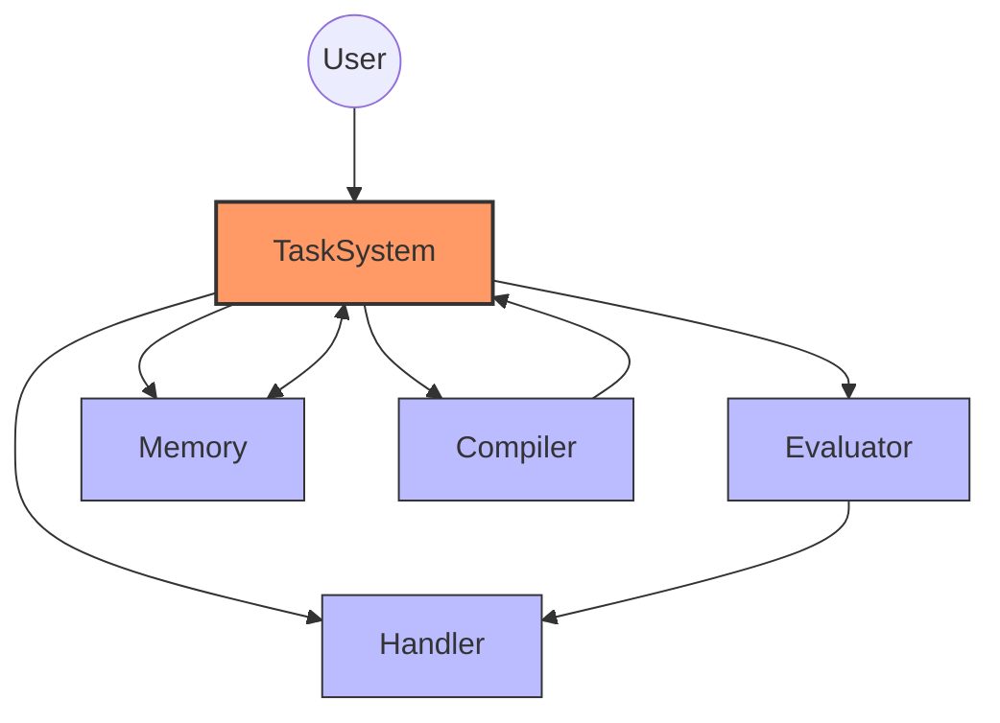

# System Overview

## Architecture

This system implements a modular architecture for AI-assisted task execution with the following key components:

- **Task System**: Manages task execution, delegation, and resource tracking
- **Handler**: Provides LLM provider integration and resource enforcement
- **Memory**: Manages context and persistent storage
- **Evaluator**: Evaluates task results and provides feedback
- **Compiler**: Handles AST generation and transformation

## System Architecture Visualization

### Component Relationship Diagram
The following diagram illustrates the high-level architecture and interaction between the key components:

This visualization shows how the Task System acts as the central orchestrator, coordinating between the other components: the Evaluator for template processing, the Memory System for context management, the Handler for LLM interactions, and the Compiler for task parsing.

### Component Responsibility Matrix

| Component   | Primary Responsibility        | Resource Ownership          | Key Integration Points       |
|-------------|------------------------------|----------------------------|------------------------------|
| Task System | Task orchestration           | Template management        | All other components         |
| Evaluator   | Template variable resolution | Variable scoping           | Handler, Memory System       |
| Memory      | Context and metadata         | Global index               | Task System                  |
| Handler     | LLM interaction              | Turns, context window      | Evaluator                    |
| Compiler    | Natural language to XML      | AST generation             | Task System                  |

Each component has distinct responsibilities and ownership boundaries, ensuring clean separation of concerns while enabling effective coordination through well-defined interfaces.

## Documentation Map

### Authoritative Sources

#### Interfaces
- [Interface:TaskSystem:1.0] in `/components/task-system/api/interfaces.md`
- [Interface:Memory:3.0] in `/components/memory/api/interfaces.md`
- [Interface:Evaluator:1.0] in `/components/evaluator/api/interfaces.md`
- [Interface:Compiler:1.0] in `/components/compiler/api/interfaces.md`

#### Types
- [Type:System:1.0] in `/system/contracts/types.md`
- [Type:TaskSystem:1.0] in `/components/task-system/spec/types.md`
- [Type:Memory:3.0] in `/components/memory/spec/types.md`
- [Type:Evaluator:1.0] in `/components/evaluator/spec/types.md`

#### Contracts
- [Contract:Integration:TaskSystem:1.0] in `/system/contracts/interfaces.md`
- [Contract:Integration:TaskMemory:3.0] in `/system/contracts/interfaces.md`
- [Contract:Tasks:TemplateSchema:1.0] in `/system/contracts/protocols.md`
- [Contract:Resources:1.0] in `/system/contracts/resources.md`

#### Patterns
- [Pattern:Error:1.0] in `/system/architecture/patterns/errors.md`
- [Pattern:ContextFrame:1.0] in `/system/architecture/patterns/context-frames.md`
- [Pattern:DirectorEvaluator:1.0] in `/system/architecture/patterns/director-evaluator.md`
- [Pattern:ResourceManagement:1.0] in `/system/architecture/patterns/resource-management.md`

## Component Responsibilities

Each component has well-defined responsibilities and interfaces documented in their respective README files:

- [Task System](/components/task-system/README.md)
- [Handler](/components/handler/README.md)
- [Memory](/components/memory/README.md)
- [Evaluator](/components/evaluator/README.md)
- [Compiler](/components/compiler/README.md)

For a comprehensive documentation map with navigation paths and references, see [Documentation Guide](/system/docs-guide.md).
