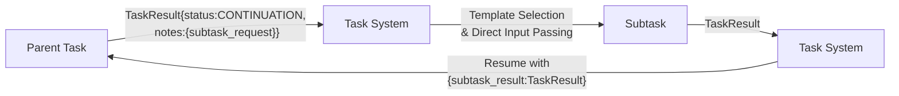

# Architecture Decision Record: Subtask Spawning Mechanism

## Status
Accepted

## Context
The system needs a standardized mechanism for LLM-to-LLM delegation (subtasks). This differs from tool calls, which are Handler-managed deterministic operations with rigid APIs. The subtask mechanism is essential for adaptive task decomposition, dependency discovery, verification through testing, and dynamic workflow execution.

Current inconsistencies exist in how we handle context management for subtasks, data passing between parent and child tasks, and the relationship between subtasks and other patterns like Director-Evaluator.

## Decision
We will implement a standardized subtask spawning mechanism based on structured continuation requests that fully integrates with our three-dimensional context management model and uses direct parameter passing rather than environment variables.

## Specification

### 1. Subtask Request Structure

Tasks request subtask spawning by returning a result with:

```typescript
interface TaskResult {
    content: string;
    status: "CONTINUATION";
    notes: {
        subtask_request: SubtaskRequest;
        [key: string]: any;
    };
}

interface SubtaskRequest {
    type: string;           // Type of subtask (e.g., "verification")
    description: string;    // Human-readable description
    inputs: {               // Inputs to provide to the subtask
        [key: string]: any;
    };
    template_hints?: string[]; // Optional hints for template matching
    return_expectations?: string; // Expected output format
    max_depth?: number;     // Optional depth override
    subtype?: string;       // Optional subtype for atomic tasks (defaults to "subtask")
    file_paths?: string[];  // Optional list of specific files to include in context
}
```

### 2. Context Management Integration

Subtasks fully integrate with our three-dimensional context management model:

```xml
<task>
    <context_management>
        <inherit_context>full|none|subset</inherit_context>
        <accumulate_data>true|false</accumulate_data>
        <accumulation_format>notes_only|full_output</accumulation_format>
        <fresh_context>enabled|disabled</fresh_context>
    </context_management>
</task>
```

Default settings for subtasks:
- `inherit_context`: "none"
- `accumulate_data`: "false" 
- `fresh_context`: "enabled"

These defaults follow the mutual exclusivity constraint: When `fresh_context` is "enabled", `inherit_context` must be "none".

These defaults can be overridden in subtask templates.

### Explicit File Selection

When creating subtasks, parent tasks can explicitly specify which files to include:

```typescript
// The file_paths field takes precedence over associative matching
subtask_request = {
  type: "atomic",
  description: "Analyze specific modules",
  inputs: { /* parameters */ },
  context_management: { inherit_context: "subset" },
  file_paths: ["/src/main.py", "/src/utils.py"]
}
```

This feature:
- Creates a special file-specific context mode outside the standard three-dimensional model
- Always includes specified files in the context, regardless of other settings
- Takes precedence over associative matching when determining context subset

### Subtask Context Management

When creating a subtask request:

1. The `subtype` field defaults to "subtask" for atomic tasks created via CONTINUATION
2. Default context settings for subtasks are:
   - `inherit_context`: "none"
   - `accumulate_data`: "false"
   - `fresh_context`: "enabled"

3. These defaults can be overridden by explicitly specifying context_management settings
4. All context settings must follow the mutual exclusivity constraint:
   - If `inherit_context` is "full" or "subset", then `fresh_context` must be "disabled"
   - If `fresh_context` is "enabled", then `inherit_context` must be "none"

5. For atomic tasks with `subtype="subtask"`, context settings automatically follow subtask defaults
   unless explicitly overridden

### 3. Data Flow Between Tasks

Subtasks use direct parameter passing rather than environment variables:



### 4. Execution Flow

When a task returns with CONTINUATION status and a subtask_request:

```typescript
// Simplified execution flow
async function executeTask(task, inputs, depth = 0) {
    // Check depth limits
    if (depth >= (task.maxDepth || systemConfig.maxTaskDepth)) {
        return createMaxDepthError();
    }
    
    // Get or create Handler for this task
    const handler = getHandlerForTask(task);
    
    // Execute initial prompt
    const result = await handler.executePrompt(task, inputs);
    
    if (result.status === "CONTINUATION" && result.notes?.subtask_request) {
        const subtaskRequest = result.notes.subtask_request;
        const subtaskTemplate = await findMatchingTemplate(subtaskRequest);
        
        // Execute subtask with incremented depth
        const subtaskResult = await executeTask(subtaskTemplate, subtaskRequest.inputs, depth + 1);
        
        // Add subtask result as a tool response to parent's Handler session
        handler.addToolResponse(
            getToolNameFromRequest(subtaskRequest),
            subtaskResult.content
        );
        
        // Continue parent task execution with the tool response in its history
        return handler.executePrompt(
            task,
            "Continue based on the tool results."
        );
    }
    
    return result;
}
```

### 5. Result Structure Standardization

All task results follow a consistent base structure:

```typescript
interface TaskResult {
    content: string;        // Main output content
    status: ReturnStatus;   // COMPLETE, CONTINUATION, FAILED
    notes: {                // Additional metadata
        [key: string]: any;
    };
}
```

Specialized subtasks may use consistent extensions of this structure for specific needs (evaluation, script execution, etc.).

### 6. Depth Control

To prevent infinite recursion:

- System maintains a depth counter for each task chain
- Default maximum depth: 10 levels (configurable via `maxTaskDepth`)
- Subtasks may specify an override via `max_depth` parameter
- Cycle detection uses hash-based subtask signature tracking
- When max depth is reached, system returns appropriate error

### 7. Error Handling & Partial Results

Subtask failures are passed to the parent task with:
- Full error classification (reason, details)
- Any partial results, when available
- Parent tasks can implement specific recovery strategies based on error type

```typescript
{
  type: 'TASK_FAILURE',
  reason: 'subtask_failure', // Or other specific reason
  message: 'Subtask execution failed',
  details: {
    subtaskType: string,
    partialResults?: any,
    originalError: TaskError
  }
}
```

## Context Combinations Reference

| inherit_context | accumulate_data | fresh_context | Result |
|-----------------|-----------------|---------------|--------|
| full | false | disabled | Subtask has only parent context (DEFAULT) |
| full | false | enabled | Parent context + additional context |
| full | true | disabled | Parent context + accumulated data |
| full | true | enabled | Parent context + accumulated data + additional context |
| none | false | disabled | Minimal context (inputs only) |
| none | false | enabled | Fresh context only |
| none | true | disabled | Accumulated data only |
| none | true | enabled | Accumulated data + fresh context |
| subset | false | disabled | Relevant parent context only |
| subset | false | enabled | Relevant parent context + additional context |
| subset | true | disabled | Relevant parent context + accumulated data |
| subset | true | enabled | Relevant parent context + accumulated data + additional context |

## Relationship to Director-Evaluator Pattern

The Subtask Spawning mechanism and Director-Evaluator Loop are complementary features:

| Director-Evaluator Loop | Subtask Spawning Mechanism |
|-------------------------|----------------------------|
| Specialized higher-level pattern | General-purpose primitive |
| Built for iterative refinement | Ad-hoc dynamic task creation |
| Predefined iteration structure | Flexible composition pattern |
| Built-in termination conditions | Manual continuation control |

**When to use Director-Evaluator Loop:**
- Iterative refinement processes
- Create-evaluate feedback cycles
- Multiple potential iterations
- External validation via scripts

**When to use Subtask Spawning:**
- One-off subtask creation
- Dynamic task composition
- Task flows that aren't primarily iterative
- Complex task trees with varying subtypes

## Implementation Requirements

1. **Task System Enhancements**
   - Add CONTINUATION status processing
   - Implement template matching for subtasks
   - Add depth tracking and enforcement
   - Provide direct input/output mapping

2. **Testing Requirements**
   - Unit tests for depth control mechanisms
   - Integration tests for context inheritance
   - Verification of proper result passing
   - Error propagation tests
   - Resource usage monitoring tests
   - Cycle detection tests

## Migration Guidance

1. Replace environment variable usage with direct parameter passing:
   ```typescript
   // Old approach - using environment variables
   env.set('subtask_result', subtaskResult);
   
   // New approach - direct parameter passing
   return executeTask(task, { 
     ...inputs, 
     subtask_result: subtaskResult 
   });
   ```

2. Update subtask generation to use standardized SubtaskRequest format:
   ```typescript
   // Old approach - varied formats
   return {
     status: "CONTINUATION",
     notes: { task: "verify_code", code: generatedCode }
   };
   
   // New approach - standardized format
   return {
     content: "Generated code",
     status: "CONTINUATION",
     notes: {
       subtask_request: {
         type: "verification",
         description: "Verify generated code",
         inputs: { code: generatedCode },
         template_hints: ["code_verification", "testing"]
       }
     }
   };
   ```

3. Add explicit context_management blocks to templates:
   ```xml
   <!-- Old version - implicit context -->
   <task>
     <description>Subtask description</description>
   </task>
   
   <!-- New version - explicit context management -->
   <task>
     <description>Subtask description</description>
     <context_management>
       <inherit_context>full</inherit_context>
       <accumulate_data>false</accumulate_data>
       <fresh_context>disabled</fresh_context>
     </context_management>
   </task>
   ```

4. Implement depth tracking if not already present:
   ```typescript
   // Add depth parameter to executeTask
   function executeTask(task, inputs, depth = 0) {
     if (depth >= maxTaskDepth) {
       return { 
         status: "FAILED", 
         type: "TASK_FAILURE",
         reason: "max_depth_exceeded" 
       };
     }
     
     // Execute subtasks with incremented depth
     const subtaskResult = await executeTask(
       subtask, 
       subtaskInputs, 
       depth + 1
     );
   }
   ```

## Performance Considerations

- Monitor context size in deep subtask chains
- Cache frequently used subtask templates
- Ensure proper cleanup after subtask completion
- Set appropriate depth limits based on performance testing
- Consider implementing selective context preservation to reduce token usage
- Implement subtask signature tracking to prevent cycles
- Optimize template matching for commonly used subtask types
- Consider adding timeouts for long-running subtask chains

## Related ADRs
- **Depends on**: [ADR 7: Context Management Standardization], [ADR 8: Error Taxonomy]
- **Extends**: [ADR 9: Partial Results Policy]
- **Related to**: [ADR 10: Evaluator-to-Director Feedback Flow]

## Consequences

### Positive
- Standardized mechanism for dynamic task composition
- Clear data flow between parent and subtasks
- Consistent context management across all task types
- Explicit depth control prevents runaway execution
- Direct parameter passing improves clarity and debugging
- Template hints enable flexible subtask selection
- Structured error handling improves recovery options
- The simplified tool-response based approach offers several advantages:
  - No special resumption methods required
  - Parent Handler session preserved throughout execution
  - From the LLM's perspective, subtask results appear as regular tool responses
  - Cleaner error handling with standard patterns
  - More intuitive control flow with clearer component boundaries

### Negative
- Increased implementation complexity
- Additional depth tracking overhead
- More complex debugging for deep task chains
- Potential performance impact with deeply nested subtasks
- Learning curve for understanding context combinations
- Requires careful management of template libraries
