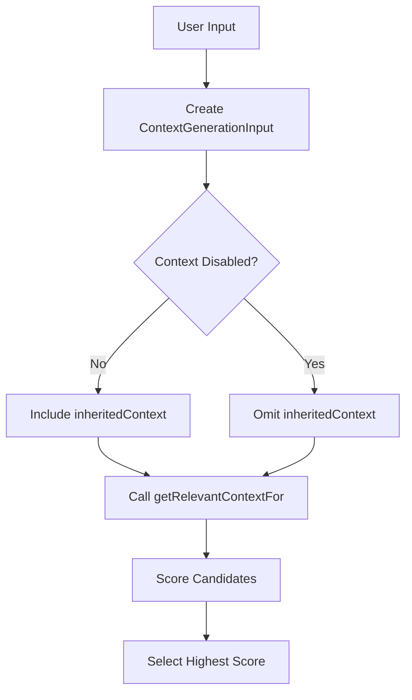

# Architecture Overview

## Problem Statement and Goals

### Atomic Task Matching

The system uses a uniform, heuristic approach for template matching:

- Only atomic tasks have templates; composite tasks are created by combining atomic tasks
- Template matching is performed heuristically by user-defined associative matching tasks with fixed I/O signatures
- Matching logic is uniform for MVP (no operator-specific differences or versioning)
- System always selects the highest-scoring candidate template
- Optional "disable context" flag allows tasks to run without inherited context
- Task results may include optional success score in "notes" field for future adaptive scoring



This document provides a high‑level overview of the system architecture. Detailed technical discussions have been moved into canonical files in the sub‑folders:

- **Patterns:** Core patterns such as Director‑Evaluator (implemented via S-expressions), Error Handling, and Resource Management (see files under `system/architecture/patterns/`).
– **Decisions (ADRs):** Architecture Decision Records on topics such as context management and memory system design (see `system/architecture/decisions/`).
– **Q&A and Open Questions:** Clarifications and unresolved issues (see `system/architecture/qa/` and `system/architecture/questions.md`).

## Document Map

**This folder contains:**
 - `overview.md`: This high‑level summary and navigation index.
 - `patterns/`: Detailed technical descriptions of core patterns.
 - `decisions/`: Architecture Decision Records (ADRs) with rationale and scope.
 - `qa/`: Frequently asked questions and clarifications.
 - `questions.md`: A list of open and unresolved architecture questions.

For full technical details on any topic, please refer to the canonical file listed above.

### System Goals
1. Primary Goals
- Provide reliable task automation through structured decomposition and execution
- Ensure consistent task processing despite resource constraints
- Enable robust error recovery without human intervention
- Maintain system coherence across task boundaries

2. Quality Goals
- Predictable resource usage through explicit tracking and limits
- Consistent behavior through standardized protocols and interfaces
- Extensible task handling via template-based architecture
- Maintainable system through clear component boundaries

3. Operational Goals
- Handle varying task complexities through dynamic decomposition
- Support diverse task types through flexible template system
- Preserve critical context across task boundaries
- Manage resources efficiently within defined constraints

### System Constraints

#### Resource Constraints
- Fixed context window size
- Limited turn counts
- Synchronous operation only
- File access via Handler tools only

#### Operational Constraints  
- One Handler per task execution
- Immutable Handler configuration
- No persistent state maintenance
- Template immutability during execution

## Core Patterns

### Director-Evaluator Pattern [Pattern:DirectorEvaluator:1.1]

The system implements a standardized mechanism for iterative refinement, primarily achieved using S-expression DSL primitives (like `bind`, `if`, potentially loops or recursion) to structure the flow between generation (Director) and evaluation (Evaluator) steps executed as atomic tasks called from the S-expression. This pattern enables:

- Iterative improvement through feedback loops
- Optional integration with script execution (called via S-expression primitives)
- Explicit termination conditions managed within the S-expression logic

For the complete specification, including implementation details using S-expressions, integration points, and context management integration, see [Pattern:DirectorEvaluator:1.1] in `system/architecture/patterns/director-evaluator.md`.

Task execution relies on function-style templates. All templates must explicitly declare the parameters they accept. During execution, template variable placeholders (`{{parameter_name}}`) are resolved strictly against these declared parameters within an isolated scope created for the template call. Templates cannot implicitly access variables from their calling environment. Data flow between steps in an S-expression workflow is managed via explicit binding primitives (e.g., `bind`, `let`).

Context is managed via a single `<context_management>` block that distinguishes between:
 - **Inheritance:** (using the new `inherit_context` enumeration)
 - **Accumulation:** (using the boolean `accumulate_data` and the `accumulation_format` setting)

### Error Handling [Pattern:Error:1.0]
Defines how errors propagate and recover across component boundaries.

See [Interface:ErrorHandling:1.0] in system/contracts/interfaces.md for complete specification.

### Resource Management [Pattern:ResourceManagement:1.0]
Defines resource usage tracking and lifecycle across components.

#### Core Principles
- Handler-based resource isolation
- Per-task resource tracking
- Context window management
- Memory system integration
- No cross-Handler resource sharing
- Read-only memory access

#### Component Responsibilities

##### Handler
- Owns turn counting per task execution
- Manages context window size
- Tracks token usage
- Enforces resource limits
- Ensures session termination

##### Task System
- Creates Handler instances
- Configures immutable resource limits
- Delegates resource tracking to Handler
- Manages template persistence

##### Memory System
- Maintains task context data
- Provides context management interface
- Maintains global file metadata index
- No file content storage

#### Resource Types and Protocols
- Turn Counter: Per-Handler atomic tracking with strict limits
- Context Window: Token-based size monitoring and enforcement
- Memory Resources: Short-term task context with clear boundaries
- Resource Release: Coordinated cleanup and state invalidation
- Error Handling: Resource exhaustion detection and preservation

See [Contract:Resources:1.0] in system/contracts/resources.md for complete specification.

### Task Execution [Pattern:TaskExecution:2.0]
Defines how tasks are structured, executed, and managed.

Key concepts:
- Template-based definition
- Handler-managed execution
- Resource-aware processing
- XML-based protocols

See [Contract:Tasks:2.0] in system/contracts/protocols.md for complete specification.

## Delegation Mechanisms

The system provides a unified tool interface with distinct implementation mechanisms:

### Template Substitution Delegation
- The Evaluator is solely responsible for all template variable substitution
- Handlers receive fully resolved content with no remaining template variables
- This separation ensures clean component boundaries and single responsibility

### Tool Interface
What the LLM sees and interacts with:
- Consistent tool-based invocation pattern for all operations
- Unified parameter schemas and error handling
- Standardized result format regardless of implementation

### Implementation Mechanisms

1. **Direct Tool Implementation**
   - Used for external interactions (files, APIs, scripts).
   - No continuation mechanism or complex context management.
   - Executed directly by the Handler component when invoked via Dispatcher.

2. **Subtask Tool Implementation (via S-expression)**
   - Atomic tasks called from S-expressions can return `CONTINUATION`.
   - The `SexpEvaluator` handles the `CONTINUATION` status, validating the `SubtaskRequest` and calling `TaskSystem.execute_atomic_template` for the subtask.
   - Context management follows standard rules for the spawned atomic task.

See [Pattern:ToolInterface:1.0] for a detailed explanation of this unified approach.

## Component Architecture

The system consists of several core components working together:

### Dispatcher (Conceptual / Part of `main.py` or similar)
- Routes incoming requests (e.g., from REPL `/task` command).
- If input starts with `(`, routes to `SexpEvaluator`.
- Otherwise, looks up identifier in Handler direct tools.

### SexpEvaluator [Component:SexpEvaluator:1.0]
S-expression workflow execution component.
- Parses and executes S-expression strings.
- Manages control flow (conditionals, binding, function calls) within the DSL.
- Manages lexical environments (`SexpEnvironment`) for the S-expression DSL.
- Calls `TaskSystem.execute_atomic_template` to run atomic task steps.
- Calls Handler direct tools via primitives like `(system:run_script ...)`.
- Handles `CONTINUATION` results from atomic tasks to implement subtask spawning.

### Task System [Component:TaskSystem:1.0]
Atomic task management and orchestration component.
- Manages atomic task template definitions (loading, validation, lookup via `find_template`).
- Provides the `execute_atomic_template` interface for invoking atomic tasks programmatically (called by `SexpEvaluator`).
- Determines context and prepares parameters for atomic tasks based on `SubtaskRequest` and template definitions.
- Instantiates/configures Handlers for atomic task execution.
- Instantiates and calls the `AtomicTaskExecutor`.
- Interfaces with Memory System for context retrieval.

### AtomicTaskExecutor [Component:AtomicExecutor:1.0]
Atomic task body execution component.
- Receives parsed atomic task definition and resolved parameters from Task System.
- Performs final `{{parameter}}` substitution using **only** the provided parameters.
- Constructs `HandlerPayload` and calls the Handler.
- Returns the Handler's `TaskResult` to the Task System.

### Handler [Component:Handler:1.0]
LLM interface, resource tracking, and external interaction component.
- Performs ALL file I/O operations.
- Executes external commands (shell scripts).
- Interacts with LLM providers.
- Manages resource usage tracking (turns, tokens) **per atomic task execution**.
- Executes "Direct Tools" when called by Dispatcher or SexpEvaluator primitives.

### Memory System [Component:Memory:3.0]
Metadata management and context retrieval component.
- Maintains global file metadata index (paths and descriptive strings)
- Provides metadata for associative matching without ranking or prioritization
- Supplies metadata for file-based lookup and partial matching
- Does NOT store file content, perform file operations, track resources, or rank matches
- NEVER performs file I/O operations - all file access is handled by Handler
- Follows read-only context model (no updateContext capability)

See [Contract:Integration:TaskMemory:3.0] for integration specification.

## Component Integration

### Core Integration Patterns

#### SexpEvaluator ↔ TaskSystem
- SexpEvaluator calls `TaskSystem.find_template` to check if an identifier is an atomic task.
- SexpEvaluator calls `TaskSystem.execute_atomic_template` to run atomic steps.

#### TaskSystem ↔ AtomicTaskExecutor
- TaskSystem instantiates AtomicTaskExecutor.
- TaskSystem calls `AtomicTaskExecutor.execute_body`, providing the parsed template, resolved parameters, and a Handler instance.

#### AtomicTaskExecutor ↔ Handler
- AtomicTaskExecutor calls `Handler.executePrompt` (or similar) with the fully resolved payload.

#### TaskSystem ↔ MemorySystem
- TaskSystem calls `MemorySystem.getRelevantContextFor` when preparing context for atomic tasks requiring fresh context.

#### SexpEvaluator ↔ Handler
- SexpEvaluator primitives (e.g., `system:run_script`) may directly invoke Handler's direct tool executors.

See system/contracts/interfaces.md for detailed contract specifications.

### Resource Ownership
- **Handler**: Owns resource tracking (turns, tokens) for the duration of a single atomic task execution it handles.
- **SexpEvaluator**: Manages the `SexpEnvironment` (DSL variable scope). May track overall workflow execution time or steps.
- **Memory system**: Owns context metadata storage.
- **Task system**: Coordinates Handler instantiation and configuration with limits for atomic tasks.

See system/contracts/resources.md for the resource model.

### System-Wide Protocols
- XML-based task definitions and protocols
- Standard error propagation
- Resource usage tracking
- Context management

---

### Function-Based Template Pattern [Pattern:FunctionTemplate:1.0]

The system implements a function-based template pattern that enforces clear boundaries between caller and callee contexts:

1. **Template Definition**
   - Templates explicitly declare their parameters using a `params` attribute
   - Each template has its own lexical scope containing only its parameters
   - Templates are registered in a central TaskLibrary during parsing

2. **Function Calling**
   - Function calls use positional arguments evaluated in the caller's context
   - Arguments can be literals, variable references, or nested expressions
   - A new environment is created for each function call with bindings for parameters
   - No implicit access to the caller's environment is allowed

3. **AST Representation**
   - TemplateNode represents function definitions
   - FunctionCallNode represents function invocations
   - ArgumentNode represents argument values

This pattern enables:
 - Clear data dependencies between components
 - Improved reasoning about variable scope
 - Better encapsulation of implementation details
 - Foundations for more advanced functional patterns

When a function-style template is executed, a new, isolated environment scope is created. This scope's bindings contain *only* the template's declared parameters mapped to the evaluated arguments provided in the call. There is no link back to the caller's environment bindings, ensuring strict encapsulation.

### Sequential Task Management [Pattern:SequentialTask:2.0]

Sequential workflows are now defined using the S-expression DSL. State and data flow between steps are managed explicitly using binding primitives like `bind` or `let` within the S-expression evaluator's environment.

1. **Output Tracking & State Management**
   - The S-expression evaluator manages the lexical environment. Results from one step are explicitly bound to variables using `bind` or `let`, making them available to subsequent steps within the same scope.
   - There is no automatic history tracking as previously defined for XML sequences. State persistence relies on the S-expression environment's scope rules.
   - Resource awareness for large intermediate results needs to be handled within the S-expression logic or by the primitives themselves (e.g., ensuring results passed between steps don't exceed limits).

### Subtask Spawning Mechanism [Pattern:SubtaskSpawning:1.0]

The system implements a standardized subtask spawning mechanism that enables dynamic task creation and composition:

1. **Continuation Protocol**
   - A parent task returns with `status: "CONTINUATION"` and a `subtask_request` in its notes
   - The subtask_request contains type, description, inputs, and optional template_hints
   - The system validates the request structure before processing
   - Depth control prevents infinite recursion and detects cycles

2. **Request Structure**
   ```typescript
   interface SubtaskRequest {
     // Required fields
     type: TaskType;                      // Type of subtask to spawn
     description: string;                 // Description of the subtask
     inputs: Record<string, any>;         // Input parameters for the subtask
     
     // Optional fields
     template_hints?: string[];           // Hints for template selection
     context_management?: {               // Override default context settings
       inherit_context?: 'full' | 'none' | 'subset';
       accumulate_data?: boolean;
       accumulation_format?: 'notes_only' | 'full_output';
       fresh_context?: 'enabled' | 'disabled';
     };
     max_depth?: number;                  // Override default max nesting depth
     subtype?: string;                    // Optional subtype for atomic tasks
   }
   ```

3. **Data Flow**
   ```mermaid
   flowchart LR
       A[Parent LLM] -->|"tools.analyzeData({...})"| B[Handler]
       B -->|CONTINUATION with subtask_request| C[Task System]
       C -->|Execute subtask| D[Subtask LLM]
       D -->|Result| C
       C -->|Add as tool response| B
       B -->|Continue with tool result| A
   ```
   - Parent tasks make tool calls that require complex processing
   - Handler returns CONTINUATION status with subtask_request
   - Task System executes subtask independently
   - Subtask result is added as a tool response to parent's session
   - Parent continues execution with the tool result in conversation history
   - From the LLM's perspective, this appears as a normal tool call and response
   - No special resumption methods or complex continuation mechanisms required

4. **Context Integration**
   - Subtasks have default context management settings:
     | inherit_context | accumulate_data | accumulation_format | fresh_context |
     |-----------------|-----------------|---------------------|---------------|
     | subset          | false           | notes_only          | enabled       |
   - These defaults can be overridden through explicit configuration in the subtask_request
   - Context management follows the hybrid configuration approach with operator-specific defaults and explicit overrides

5. **Resource Protection**
   - Maximum nesting depth prevents infinite recursion (default: 5 levels)
   - Cycle detection prevents tasks from spawning themselves
   - Resource usage is tracked across the entire subtask chain
   - Partial results are preserved when subtasks fail

6. **Error Handling**
   - Subtask failures are wrapped in standardized error structures
   - Parent tasks receive detailed error information including:
     - Original subtask request
     - Specific error details from the subtask
     - Current nesting depth
     - Any partial results that were generated before failure
   - This enables robust recovery strategies at the parent task level

For historical context and decision rationale, see [ADR 11: Subtask Spawning Mechanism].

2. **Context Management**
   - The system implements a hybrid configuration approach with operator-specific defaults and explicit overrides:
     - **inherit_context**: Controls whether a subtask inherits "full" parent context, "none", or a "subset" based on relevance.
     - **accumulate_data**: Controls whether outputs from prior steps are accumulated.
     - **accumulation_format**: Specifies whether to store "notes_only" or "full_output" when accumulating data.
     - **fresh_context**: Controls whether new context is generated via associative matching.
   
   - **Constraint**: Fresh context generation (`fresh_context="enabled"`) is mutually exclusive with context inheritance (`inherit_context="full"` or `inherit_context="subset"`):
     - If a task inherits context (full or subset), it must not generate fresh context
     - If a task generates fresh context, it must not inherit context from its parent
     - This simplifies the system by preventing potential context duplication

   - **Subtype-Based Defaults**: Default context settings are determined by both operator type and subtype:
     - For atomic tasks with "standard" subtype: inherit_context="full", fresh_context="disabled"
     - For atomic tasks with "subtask" subtype: inherit_context="none", fresh_context="enabled"
     - This distinction allows different behavior for regular tasks vs. subtasks
   
   - Default settings for sequential tasks:
     | inherit_context | accumulate_data | accumulation_format | fresh_context |
     |-----------------|-----------------|---------------------|---------------|
     | full            | true            | notes_only          | disabled      |
   
   - These defaults can be overridden through an explicit XML structure:
   ```xml
   <context_management>
       <inherit_context>full|none|subset</inherit_context>
       <accumulate_data>true|false</accumulate_data>
       <accumulation_format>notes_only|full_output</accumulation_format>
       <fresh_context>enabled|disabled</fresh_context>
   </context_management>
   ```
   
   - When the context_management block is omitted, operator-specific defaults apply
   - When present, explicit settings override the defaults
   - This hybrid approach provides both consistency and flexibility

3. **Partial Failures**
   - If a step fails, all previous step outputs remain available in the final (error) output.
   - The final error output includes which step number or ID caused the failure.

4. **Resource Handling**
   - Maximum stored-history size is enforced by the system to prevent out-of-memory or context window exhaustion.
   - The evaluator must handle large output storage carefully, possibly discarding or summarizing to keep track usage in check.
   - Clear cleanup protocols ensure that once the sequence completes (successfully or in error), the stored step outputs are removed.

In summary, **SequentialTask** pattern addresses multi-step tasks with optional or partial data inheritance across steps, ensuring that both resource usage and error behavior remain consistent and predictable.

See system/contracts/protocols.md for protocol specifications.
