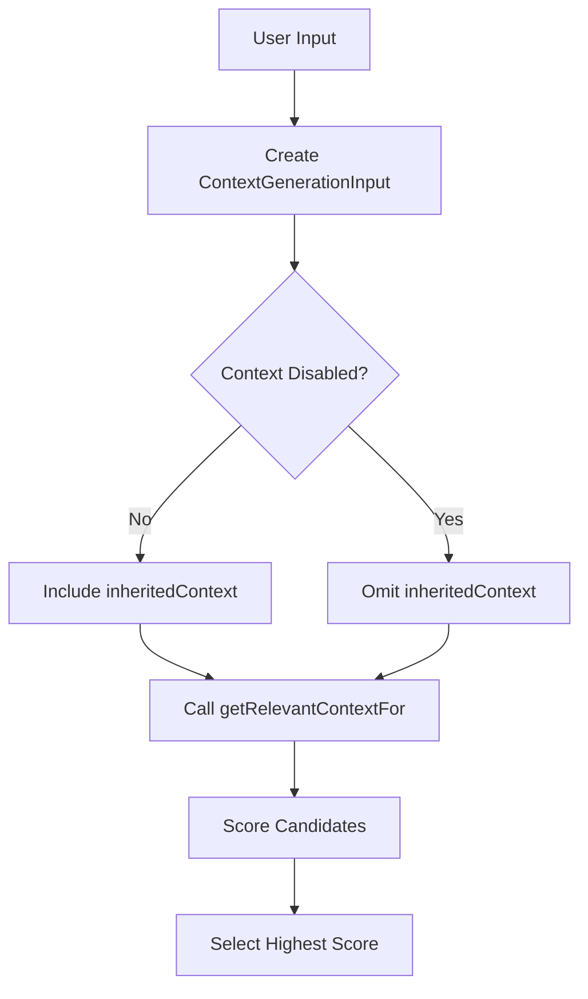

# Architecture Overview

## Problem Statement and Goals

### Atomic Task Matching

The system uses a uniform, heuristic approach for template matching:

- Only atomic tasks have templates; composite tasks are created by combining atomic tasks
- Template matching is performed heuristically by user-defined associative matching tasks with fixed I/O signatures
- Matching logic is uniform for MVP (no operator-specific differences or versioning)
- System always selects the highest-scoring candidate template
- Optional "disable context" flag allows tasks to run without inherited context
- Task results may include optional success score in "notes" field for future adaptive scoring

This document provides a high‑level overview of the system architecture. Detailed technical discussions have been moved into canonical files in the sub‑folders:

- **Patterns:** Core patterns such as Director‑Evaluator (implemented via S-expressions), Error Handling, and Resource Management (see files under `system/architecture/patterns/`).
– **Decisions (ADRs):** Architecture Decision Records on topics such as context management and memory system design (see `system/architecture/decisions/`).
– **Q&A and Open Questions:** Clarifications and unresolved issues (see `system/architecture/qa/` and `system/architecture/questions.md`).

## Document Map

**This folder contains:**
 - `overview.md`: This high‑level summary and navigation index.
 - `patterns/`: Detailed technical descriptions of core patterns.
 - `decisions/`: Architecture Decision Records (ADRs) with rationale and scope.
 - `qa/`: Frequently asked questions and clarifications.
 - `questions.md`: A list of open and unresolved architecture questions.

For full technical details on any topic, please refer to the canonical file listed above.

### System Goals
1. Primary Goals
- Provide reliable task automation through structured decomposition and execution
- Ensure consistent task processing despite resource constraints
- Enable robust error recovery without human intervention
- Maintain system coherence across task boundaries

2. Quality Goals
- Predictable resource usage through explicit tracking and limits
- Consistent behavior through standardized protocols and interfaces
- Extensible task handling via template-based architecture
- Maintainable system through clear component boundaries

3. Operational Goals
- Handle varying task complexities through dynamic decomposition
- Support diverse task types through flexible template system
- Preserve critical context across task boundaries
- Manage resources efficiently within defined constraints

### System Constraints

#### Resource Constraints
- Fixed context window size
- Limited turn counts
- Synchronous operation only
- File access via Handler tools only

#### Operational Constraints  
- One Handler per task execution
- Immutable Handler configuration
- No persistent state maintenance
- Template immutability during execution

## Core Patterns

### Director-Evaluator Pattern [Pattern:DirectorEvaluator:1.1]

The system implements a standardized mechanism for iterative refinement, primarily achieved using **S-expression DSL primitives** (like `bind`, `if`, potentially loops or recursion) to structure the flow between generation (Director) and evaluation (Evaluator) steps executed as **atomic tasks called from the S-expression**. This pattern enables structured iteration with feedback between steps.

*   **Implementation:** A workflow defined using S-expressions structures the iterative loop. It uses primitives like `bind` or `let` to pass data between the director atomic task call and the evaluator atomic task call. Conditionals (`if`) and potentially recursion manage iteration. Script execution is integrated via `(system:run_script ...)` primitive calls.
*   **Dynamic Trigger:** An atomic task (like a Director) can still potentially trigger evaluation dynamically by returning `CONTINUATION` status with a `subtask_request`. The `SexpEvaluator` handles spawning the evaluation subtask via `TaskSystem`.

For the complete specification, see [Pattern:DirectorEvaluator:1.1] in `system/architecture/patterns/director-evaluator.md`.

### Error Handling [Pattern:Error:1.0]
Defines how errors propagate and recover across component boundaries. See [Pattern:Error:1.0].

### Resource Management [Pattern:ResourceManagement:1.0]
Defines resource usage tracking (Handler-centric) and lifecycle. See [Pattern:ResourceManagement:1.0].

### Task Execution (S-expression based)
Workflows are defined and executed via S-expressions managed by the `SexpEvaluator`. Atomic steps within the workflow are executed by calling named atomic tasks via the `TaskSystem` and `AtomicTaskExecutor`.

## Delegation Mechanisms

The system provides a unified tool interface with distinct implementation mechanisms:

### Tool Interface
What the LLM sees (when called via `AtomicTaskExecutor` -> `Handler`) or what the S-expression calls:
*   Consistent invocation pattern (e.g., `tools.readFile(...)` for LLM, `(system:run_script ...)` or `(call user:tool ...)` in S-exp).
*   Unified parameter schemas and error handling.

### Implementation Mechanisms

1.  **Direct Tools (Handler):**
    *   Synchronous execution by the Handler.
    *   No complex context management needed by the tool itself.
    *   Called directly by `Dispatcher` or `SexpEvaluator` primitives.
    *   Examples: File I/O, simple API calls, script execution (`system:run_script`).

2.  **Atomic Tasks (TaskSystem + AtomicTaskExecutor):**
    *   Defined via XML templates, managed by `TaskSystem`.
    *   Invoked programmatically via `SexpEvaluator` calling `TaskSystem.execute_atomic_template`.
    *   Execution involves `TaskSystem` setup, `AtomicTaskExecutor` body execution (incl. substitution), and `Handler` interaction (LLM calls, tool use within the task).
    *   Supports full context management features orchestrated by `TaskSystem`.
    *   Can return `CONTINUATION` status, handled by `SexpEvaluator` for subtask spawning.

See [Pattern:ToolInterface:1.0] for a detailed explanation.

## Component Architecture

The system consists of several core components working together:

### Dispatcher (Conceptual / Part of `main.py` or similar)
*   Routes incoming requests (e.g., from REPL `/task` command).
*   If input starts with `(`, routes to `SexpEvaluator`.
*   Otherwise, looks up identifier in Handler direct tools.

### SexpEvaluator [Component:SexpEvaluator:1.0]
S-expression workflow execution component.
*   Parses and executes S-expression strings.
*   Manages control flow (conditionals, binding, function calls, mapping) within the DSL.
*   Manages lexical environments (`SexpEnvironment`) for the S-expression DSL.
*   Calls `TaskSystem.execute_atomic_template` to run atomic task steps.
*   Calls Handler direct tools via primitives like `(system:run_script ...)`.
*   Handles `CONTINUATION` results from atomic tasks to implement subtask spawning.
*   Calls `MemorySystem` via primitives like `(get_context ...)`.

### Task System [Component:TaskSystem:1.0]
Atomic task management and orchestration component.
*   Manages atomic task template definitions (loading, validation, lookup via `find_template`).
*   Provides the `execute_atomic_template` interface for invoking atomic tasks programmatically (called by `SexpEvaluator`).
*   Determines context and prepares parameters for atomic tasks based on `SubtaskRequest` and template definitions.
*   Instantiates/configures Handlers for atomic task execution.
*   Instantiates and calls the `AtomicTaskExecutor`.
*   Interfaces with Memory System for context retrieval coordination.

### AtomicTaskExecutor [Component:AtomicExecutor:1.0]
Atomic task body execution component.
*   Receives parsed atomic task definition and resolved parameters (`params` dict) from Task System.
*   Performs final `{{parameter}}` substitution using **only** the provided `params`.
*   Constructs `HandlerPayload` and calls the Handler.
*   Returns the Handler's `TaskResult` to the Task System.

### Handler [Component:Handler:1.0]
LLM interface, resource tracking, and external interaction component.
*   Performs ALL file I/O operations.
*   Executes external commands (shell scripts).
*   Interacts with LLM providers (via `pydantic-ai`).
*   Manages resource usage tracking (turns, tokens) **per atomic task execution**.
*   Executes "Direct Tools" when called by Dispatcher or SexpEvaluator primitives.

### Memory System [Component:Memory:3.0]
Metadata management and context retrieval component.
*   Maintains global file metadata index (paths and descriptive strings).
*   Provides context via `getRelevantContextFor`.
*   Does NOT store file content, perform file operations, track resources, or rank matches.
*   Follows read-only context model.

### Compiler [Component:Compiler:1.0]
*   Primary role: Validates atomic task XML schema during registration (`TaskSystem.register_template`).
*   Future role: May handle initial Natural Language -> S-expression translation.
*   Does *not* generate ASTs for workflow execution.

See [Contract:Integration:TaskMemory:3.0] for memory integration specification.

## Component Integration

### Core Integration Patterns

#### SexpEvaluator ↔ TaskSystem
*   SexpEvaluator calls `TaskSystem.find_template` to check if an identifier is an atomic task.
*   SexpEvaluator calls `TaskSystem.execute_atomic_template` to run atomic steps, providing resolved arguments.

#### TaskSystem ↔ AtomicTaskExecutor
*   TaskSystem instantiates AtomicTaskExecutor.
*   TaskSystem calls `AtomicTaskExecutor.execute_body`, providing the parsed template, resolved parameters (`params` dict), context string, file list, and a Handler instance.

#### AtomicTaskExecutor ↔ Handler
*   AtomicTaskExecutor calls `Handler.executePrompt` (or similar) with the fully resolved payload.

#### TaskSystem ↔ MemorySystem
*   TaskSystem calls `MemorySystem.getRelevantContextFor` when preparing context for atomic tasks requiring fresh context.

#### SexpEvaluator ↔ Handler
*   SexpEvaluator primitives (e.g., `system:run_script`) may directly invoke Handler's direct tool executors.

#### SexpEvaluator ↔ MemorySystem
*   SexpEvaluator primitives (e.g., `get_context`) may directly invoke `MemorySystem.getRelevantContextFor`.

See system/contracts/interfaces.md for detailed contract specifications.

### Resource Ownership
*   **Handler**: Owns resource tracking (turns, tokens) for the duration of a single atomic task execution it handles.
*   **SexpEvaluator**: Manages the `SexpEnvironment` (DSL variable scope). May track overall workflow execution time or steps.
*   **Memory system**: Owns context metadata storage.
*   **Task system**: Coordinates Handler instantiation and configuration with limits for atomic tasks.

See system/contracts/resources.md for the resource model.

### System-Wide Protocols
*   S-expression DSL for workflow definition.
*   XML for *atomic* task template definition.
*   Standard error propagation (`TaskError`).
*   Resource usage tracking (Handler-based).
*   Context management (Hybrid model: defaults + overrides).

---

*(Self-correction: The original text included sections for Function-Based Template Pattern, Sequential Task Management, and Subtask Spawning Mechanism here. These are now either deprecated (XML function templates) or better described within the main component descriptions or dedicated pattern files. Removing them from this high-level overview improves clarity)*

## Error Handling Philosophy

To ensure predictable component interactions and simplify error management, this project adheres to the following error propagation strategy:

1.  **Prefer Returning FAILED TaskResult:** Components (like `TaskSystem`, `BaseHandler`, Tool Executors) should primarily signal recoverable errors or expected failures by returning a `TaskResult` object (or dictionary conforming to its structure) with `status='FAILED'`.
2.  **Structured Error in Notes:** When returning a FAILED `TaskResult`, the `notes` dictionary MUST contain an `error` key. The value associated with `error` SHOULD be a structured error object (like `TaskFailureError` or its variants, serialized to a dictionary if needed) containing at least `type`, `reason`, and `message` fields, and optionally `details`.
3.  **Limit Raising Exceptions:** Raising exceptions (like `TaskError` subclasses or standard Python exceptions) across public component API boundaries should be reserved for:
    *   Truly *exceptional* or *unrecoverable* system states (e.g., configuration errors during initialization, critical dependency failures).
    *   Situations where immediate termination of the current control flow is required and cannot be reasonably handled by returning a FAILED status.
4.  **Document Raised Exceptions:** Any exception that *can* be raised across a component's public boundary MUST be documented in its IDL using `@raises_error`.
5.  **Orchestrator Responsibility:** Caller components (Orchestrators like `Dispatcher`, `SexpEvaluator`) are responsible for handling both returned FAILED `TaskResult` objects and documented exceptions from the components they call, formatting them consistently before propagating further (See Implementation Rule 8.x).

This approach promotes clearer contracts, centralizes error handling logic in callers, and makes component behavior more predictable.
