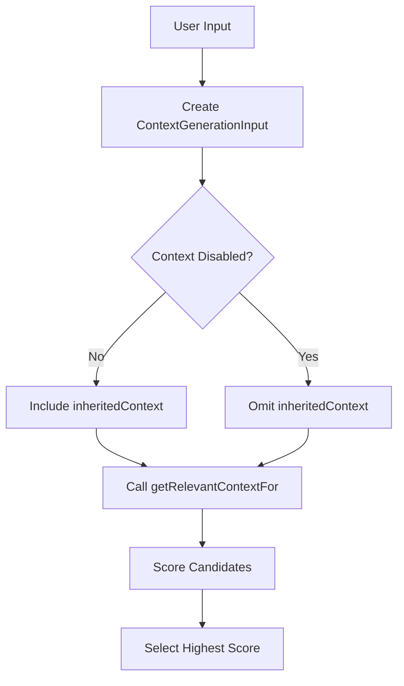

# Architecture Overview

## Problem Statement and Goals

### Atomic Task Matching

The system uses a uniform, heuristic approach for template matching:

- Only atomic tasks have templates; composite tasks are created by combining atomic tasks
- Template matching is performed heuristically by user-defined associative matching tasks with fixed I/O signatures
- Matching logic is uniform for MVP (no operator-specific differences or versioning)
- System always selects the highest-scoring candidate template
- Optional "disable context" flag allows tasks to run without inherited context
- Task results may include optional success score in "notes" field for future adaptive scoring



This document provides a high‑level overview of the system architecture. Detailed technical discussions have been moved into canonical files in the sub‑folders:

- **Patterns:** Core patterns such as Director‑Evaluator, Error Handling, and Resource Management (see files under `system/architecture/patterns/`).
– **Decisions (ADRs):** Architecture Decision Records on topics such as context management and memory system design (see `system/architecture/decisions/`).
– **Q&A and Open Questions:** Clarifications and unresolved issues (see `system/architecture/qa/` and `system/architecture/questions.md`).

## Document Map

**This folder contains:**
 - `overview.md`: This high‑level summary and navigation index.
 - `patterns/`: Detailed technical descriptions of core patterns.
 - `decisions/`: Architecture Decision Records (ADRs) with rationale and scope.
 - `qa/`: Frequently asked questions and clarifications.
 - `questions.md`: A list of open and unresolved architecture questions.

For full technical details on any topic, please refer to the canonical file listed above.

### System Goals
1. Primary Goals
- Provide reliable task automation through structured decomposition and execution
- Ensure consistent task processing despite resource constraints
- Enable robust error recovery without human intervention
- Maintain system coherence across task boundaries

2. Quality Goals
- Predictable resource usage through explicit tracking and limits
- Consistent behavior through standardized protocols and interfaces
- Extensible task handling via template-based architecture
- Maintainable system through clear component boundaries

3. Operational Goals
- Handle varying task complexities through dynamic decomposition
- Support diverse task types through flexible template system
- Preserve critical context across task boundaries
- Manage resources efficiently within defined constraints

### System Constraints

#### Resource Constraints
- Fixed context window size
- Limited turn counts
- Synchronous operation only
- File access via Handler tools only

#### Operational Constraints  
- One Handler per task execution
- Immutable Handler configuration
- No persistent state maintenance
- Template immutability during execution

## Core Patterns

### Director-Evaluator Pattern [Pattern:DirectorEvaluator:1.1]

The system implements a standardized mechanism for iterative refinement that supports both static (predefined) and dynamic (continuation-based) variants. This pattern enables:

- Iterative improvement through feedback loops
- Optional integration with script execution
- Explicit termination conditions based on evaluation results

For the complete specification, including implementation details, integration points, and context management integration, see [Pattern:DirectorEvaluator:1.1] in `system/architecture/patterns/director-evaluator.md`.

The system follows a unified context management model. Task input values are dynamically substituted using the `{{...}}` syntax, allowing direct parameter passing between tasks. This explicit binding mechanism (using the `from` attribute) improves clarity and flexibility in task execution by making data dependencies clear and reducing reliance on environment variables.

Context is managed via a single `<context_management>` block that distinguishes between:
 - **Inheritance:** (using the new `inherit_context` enumeration)
 - **Accumulation:** (using the boolean `accumulate_data` and the `accumulation_format` setting)

### Error Handling [Pattern:Error:1.0]
Defines how errors propagate and recover across component boundaries.

See [Interface:ErrorHandling:1.0] in system/contracts/interfaces.md for complete specification.

### Resource Management [Pattern:ResourceManagement:1.0]
Defines resource usage tracking and lifecycle across components.

#### Core Principles
- Handler-based resource isolation
- Per-task resource tracking
- Context window management
- Memory system integration
- No cross-Handler resource sharing
- Read-only memory access

#### Component Responsibilities

##### Handler
- Owns turn counting per task execution
- Manages context window size
- Tracks token usage
- Enforces resource limits
- Ensures session termination

##### Task System
- Creates Handler instances
- Configures immutable resource limits
- Delegates resource tracking to Handler
- Manages template persistence

##### Memory System
- Maintains task context data
- Provides context management interface
- Maintains global file metadata index
- No file content storage

#### Resource Types and Protocols
- Turn Counter: Per-Handler atomic tracking with strict limits
- Context Window: Token-based size monitoring and enforcement
- Memory Resources: Short-term task context with clear boundaries
- Resource Release: Coordinated cleanup and state invalidation
- Error Handling: Resource exhaustion detection and preservation

See [Contract:Resources:1.0] in system/contracts/resources.md for complete specification.

### Task Execution [Pattern:TaskExecution:2.0]
Defines how tasks are structured, executed, and managed.

Key concepts:
- Template-based definition
- Handler-managed execution
- Resource-aware processing
- XML-based protocols

See [Contract:Tasks:2.0] in system/contracts/protocols.md for complete specification.

## Delegation Mechanisms

The system provides a unified tool interface with distinct implementation mechanisms:

### Template Substitution Delegation
- The Evaluator is solely responsible for all template variable substitution
- Handlers receive fully resolved content with no remaining template variables
- This separation ensures clean component boundaries and single responsibility

### Tool Interface
What the LLM sees and interacts with:
- Consistent tool-based invocation pattern for all operations
- Unified parameter schemas and error handling
- Standardized result format regardless of implementation

### Implementation Mechanisms

1. **Direct Tool Implementation**
   - Used for external interactions (files, APIs, scripts)
   - No continuation mechanism or complex context management
   - Executed directly by the Handler component

2. **Subtask Tool Implementation**
   - Involve Memory System for context management
   - Use SubtaskRequest structure and CONTINUATION status
   - Follow the context management model defined in ADR 14

See [Pattern:ToolInterface:1.0] for a detailed explanation of this unified approach.

## Component Architecture

The system consists of four core components working together to process, execute, and manage tasks:

### Handler [Component:Handler:1.0]
LLM interface and resource tracking component.
- Performs ALL file I/O operations (reading, writing, deletion)
- Supports multiple LLM providers with appropriate tool configurations
- Abstracts provider-specific implementation details while maintaining consistent capabilities
- Manages resource usage tracking (turns, tokens)
- Handles LLM interactions and session management
- Works with fully resolved content (no template variable substitution)
- Works with fully resolved content (no template variable substitution)

### Compiler [Component:Compiler:1.0]
Task parsing and transformation component.
- Translates natural language to XML/AST
- Validates against XML schema
- Handles task transformation
- Manages template validation

See [Contract:Integration:CompilerTask:1.0] for integration specification.

### Evaluator [Component:Evaluator:1.0]
Execution control component.
- Controls AST processing and execution, including managing variable scoping, template substitution, function calls, and the control flow for composite task loops like Director-Evaluator
- Manages all lexical environments and variable scoping
- Performs all template variable substitution before Handler invocation
- Handles different substitution rules for function vs. standard templates
- Manages failure recovery
- Tracks resource usage
- Handles reparse requests

See [Contract:Integration:EvaluatorTask:1.0] for integration specification.

### Task System [Component:TaskSystem:1.0]
Task execution and management component.
- Coordinates task execution via Handlers
- Manages task templates and matching
- Interfaces with Memory System
- Processes XML input/output

See components/task-system/README.md for complete specification.

### Memory System [Component:Memory:3.0]
Metadata management component.
- Maintains global file metadata index (paths and descriptive strings)
- Provides metadata for associative matching without ranking or prioritization
- Supplies metadata for file-based lookup and partial matching
- Does NOT store file content, perform file operations, track resources, or rank matches
- NEVER performs file I/O operations - all file access is handled by Handler
- Follows read-only context model (no updateContext capability)

See [Contract:Integration:TaskMemory:3.0] for integration specification.

## Component Integration

### Core Integration Patterns
Components interact through defined contracts:

#### Compiler ↔ Task System
- Task parsing coordination
- Schema validation
- Template utilization

#### Evaluator ↔ Compiler
- AST execution feedback
- Reparse requests
- Resource usage updates

#### Task System ↔ Evaluator
- Execution coordination
- Resource allocation
- State management

#### Task System ↔ Memory System
- Context management
- Metadata index access
- Associative matching support

See system/contracts/interfaces.md for complete contract specifications.

### Resource Ownership
- Handlers own task resources
- Memory system owns context storage
- Task system coordinates allocation
- Clean resource release required

See system/contracts/resources.md for complete ownership model.

### System-Wide Protocols
- XML-based task definitions and protocols
- Standard error propagation
- Resource usage tracking
- Context management

---

### Function-Based Template Pattern [Pattern:FunctionTemplate:1.0]

The system implements a function-based template pattern that enforces clear boundaries between caller and callee contexts:

1. **Template Definition**
   - Templates explicitly declare their parameters using a `params` attribute
   - Each template has its own lexical scope containing only its parameters
   - Templates are registered in a central TaskLibrary during parsing

2. **Function Calling**
   - Function calls use positional arguments evaluated in the caller's context
   - Arguments can be literals, variable references, or nested expressions
   - A new environment is created for each function call with bindings for parameters
   - No implicit access to the caller's environment is allowed

3. **AST Representation**
   - TemplateNode represents function definitions
   - FunctionCallNode represents function invocations
   - ArgumentNode represents argument values

This pattern enables:
 - Clear data dependencies between components
 - Improved reasoning about variable scope
 - Better encapsulation of implementation details
 - Foundations for more advanced functional patterns

### Sequential Task Management [Pattern:SequentialTask:2.0]

The system maintains **explicit task history** for sequential operations. This design clarifies how multiple steps in a single task can share context in a controlled, trackable way, and how partial or final outputs are captured.

1. **Output Tracking**
   - The Evaluator maintains a list of all previous task outputs, keyed by step index or ID.
   - The lifecycle for this history is well-defined; it is preserved until the sequence finishes.
   - Storage must remain resource-aware to avoid memory limit issues. If output is large, the evaluator can store a summarized version or notes-only.

### Subtask Spawning Mechanism [Pattern:SubtaskSpawning:1.0]

The system implements a standardized subtask spawning mechanism that enables dynamic task creation and composition:

1. **Continuation Protocol**
   - A parent task returns with `status: "CONTINUATION"` and a `subtask_request` in its notes
   - The subtask_request contains type, description, inputs, and optional template_hints
   - The system validates the request structure before processing
   - Depth control prevents infinite recursion and detects cycles

2. **Request Structure**
   ```typescript
   interface SubtaskRequest {
     // Required fields
     type: TaskType;                      // Type of subtask to spawn
     description: string;                 // Description of the subtask
     inputs: Record<string, any>;         // Input parameters for the subtask
     
     // Optional fields
     template_hints?: string[];           // Hints for template selection
     context_management?: {               // Override default context settings
       inherit_context?: 'full' | 'none' | 'subset';
       accumulate_data?: boolean;
       accumulation_format?: 'notes_only' | 'full_output';
       fresh_context?: 'enabled' | 'disabled';
     };
     max_depth?: number;                  // Override default max nesting depth
     subtype?: string;                    // Optional subtype for atomic tasks
   }
   ```

3. **Data Flow**
   ```mermaid
   flowchart LR
       A[Parent LLM] -->|"tools.analyzeData({...})"| B[Handler]
       B -->|CONTINUATION with subtask_request| C[Task System]
       C -->|Execute subtask| D[Subtask LLM]
       D -->|Result| C
       C -->|Add as tool response| B
       B -->|Continue with tool result| A
   ```
   - Parent tasks make tool calls that require complex processing
   - Handler returns CONTINUATION status with subtask_request
   - Task System executes subtask independently
   - Subtask result is added as a tool response to parent's session
   - Parent continues execution with the tool result in conversation history
   - From the LLM's perspective, this appears as a normal tool call and response
   - No special resumption methods or complex continuation mechanisms required

4. **Context Integration**
   - Subtasks have default context management settings:
     | inherit_context | accumulate_data | accumulation_format | fresh_context |
     |-----------------|-----------------|---------------------|---------------|
     | subset          | false           | notes_only          | enabled       |
   - These defaults can be overridden through explicit configuration in the subtask_request
   - Context management follows the hybrid configuration approach with operator-specific defaults and explicit overrides

5. **Resource Protection**
   - Maximum nesting depth prevents infinite recursion (default: 5 levels)
   - Cycle detection prevents tasks from spawning themselves
   - Resource usage is tracked across the entire subtask chain
   - Partial results are preserved when subtasks fail

6. **Error Handling**
   - Subtask failures are wrapped in standardized error structures
   - Parent tasks receive detailed error information including:
     - Original subtask request
     - Specific error details from the subtask
     - Current nesting depth
     - Any partial results that were generated before failure
   - This enables robust recovery strategies at the parent task level

For historical context and decision rationale, see [ADR 11: Subtask Spawning Mechanism].

2. **Context Management**
   - The system implements a hybrid configuration approach with operator-specific defaults and explicit overrides:
     - **inherit_context**: Controls whether a subtask inherits "full" parent context, "none", or a "subset" based on relevance.
     - **accumulate_data**: Controls whether outputs from prior steps are accumulated.
     - **accumulation_format**: Specifies whether to store "notes_only" or "full_output" when accumulating data.
     - **fresh_context**: Controls whether new context is generated via associative matching.
   
   - **Constraint**: Fresh context generation (`fresh_context="enabled"`) is mutually exclusive with context inheritance (`inherit_context="full"` or `inherit_context="subset"`):
     - If a task inherits context (full or subset), it must not generate fresh context
     - If a task generates fresh context, it must not inherit context from its parent
     - This simplifies the system by preventing potential context duplication

   - **Subtype-Based Defaults**: Default context settings are determined by both operator type and subtype:
     - For atomic tasks with "standard" subtype: inherit_context="full", fresh_context="disabled"
     - For atomic tasks with "subtask" subtype: inherit_context="none", fresh_context="enabled"
     - This distinction allows different behavior for regular tasks vs. subtasks
   
   - Default settings for sequential tasks:
     | inherit_context | accumulate_data | accumulation_format | fresh_context |
     |-----------------|-----------------|---------------------|---------------|
     | full            | true            | notes_only          | disabled      |
   
   - These defaults can be overridden through an explicit XML structure:
   ```xml
   <context_management>
       <inherit_context>full|none|subset</inherit_context>
       <accumulate_data>true|false</accumulate_data>
       <accumulation_format>notes_only|full_output</accumulation_format>
       <fresh_context>enabled|disabled</fresh_context>
   </context_management>
   ```
   
   - When the context_management block is omitted, operator-specific defaults apply
   - When present, explicit settings override the defaults
   - This hybrid approach provides both consistency and flexibility

3. **Partial Failures**
   - If a step fails, all previous step outputs remain available in the final (error) output.
   - The final error output includes which step number or ID caused the failure.

4. **Resource Handling**
   - Maximum stored-history size is enforced by the system to prevent out-of-memory or context window exhaustion.
   - The evaluator must handle large output storage carefully, possibly discarding or summarizing to keep track usage in check.
   - Clear cleanup protocols ensure that once the sequence completes (successfully or in error), the stored step outputs are removed.

In summary, **SequentialTask** pattern addresses multi-step tasks with optional or partial data inheritance across steps, ensuring that both resource usage and error behavior remain consistent and predictable.

See system/contracts/protocols.md for protocol specifications.
