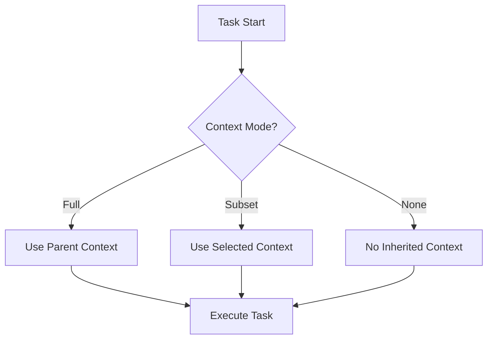

# Context Frame Pattern [Pattern:ContextFrame:1.0]

**Canonical Reference:** This document is the authoritative description of the Context Frame Pattern. All extended descriptions in other files should refer here.

## Related Documents
- Memory System ADR in [ADR:Memory:1.0]
- Memory component in [Component:Memory:3.0]
- Resource Management Pattern in [Pattern:ResourceManagement:1.0]

## Context Frame Operations

### Operator Default Settings

Each operator type and subtype combination has specific default context management settings:

| Operator Type (Subtype) | inherit_context | accumulate_data | accumulation_format | fresh_context |
|-------------------------|-----------------|-----------------|---------------------|---------------|
| atomic (standard)       | full            | false           | minimal             | disabled      |
| atomic (subtask)        | none            | false           | minimal             | enabled       |
| sequential              | full            | true            | minimal             | disabled      |
| reduce                  | none            | true            | minimal             | enabled       |
| script                  | full            | false           | minimal             | disabled      |
| director_evaluator_loop | none            | true            | minimal             | enabled       |

### Context Management Constraints

The following constraints apply to context management settings:

1. **Mutual Exclusivity**: `fresh_context="enabled"` cannot be combined with `inherit_context="full"` or `inherit_context="subset"`
   - If `inherit_context` is "full" or "subset", `fresh_context` must be "disabled"
   - If `fresh_context` is "enabled", `inherit_context` must be "none"

2. **Subtype-based Defaults**: Default context settings depend on both operator type and subtype
   - Atomic tasks with "standard" subtype default to `inherit_context="full"` and `fresh_context="disabled"`
   - Atomic tasks with "subtask" subtype default to `inherit_context="none"` and `fresh_context="enabled"`
   - For CONTINUATION-based subtasks, the "subtask" subtype is automatically applied

3. **Validation Errors**: Templates violating these constraints will fail validation with clear error messages

### File Paths as Orthogonal Context Control

In addition to the three-dimensional context model, the system supports direct file specification through the `file_paths` feature:

- **Purpose**: Explicitly include specific files in task context
- **Behavior**: Operates outside the standard three-dimensional model
- **Priority**: Files specified via `file_paths` are always included in context, regardless of other settings
- **Integration**: Works alongside other context management settings
- **Source Types**:
  - **literal** (default): Direct list of file paths
  - **command**: Bash command that outputs file paths (one per line)
  - **description**: Natural language description for context-specific associative matching

```xml
<!-- Literal paths (default behavior) -->
<task type="atomic">
  <description>Task with specific file context</description>
  <context_management>
    <inherit_context>none</inherit_context>
    <fresh_context>disabled</fresh_context>
  </context_management>
  <file_paths source="literal">
    <path>./src/main.py</path>
    <path>/absolute/path/file.txt</path>
  </file_paths>
</task>

<!-- Bash command that generates file paths -->
<task type="atomic">
  <description>Task with command-generated file context</description>
  <file_paths source="command">
    <command>find ./src -name "*.py" | grep -v "__pycache__"</command>
  </file_paths>
</task>

<!-- Natural language description for context files -->
<task type="atomic">
  <description>Task with description-based file context</description>
  <file_paths source="description">
    <description>Find all Python files related to authentication</description>
  </file_paths>
</task>
```

#### Integration with Context Settings

The `file_paths` element with source types integrates with context settings as follows:

- With `inherit_context="subset"`: Files from the chosen source take precedence over associative matching
- With `fresh_context="enabled"`: Files from the chosen source are added to the associatively matched context
- When using `source="description"`: A separate associative matching operation is performed using only this description

When `file_paths` is combined with other context settings:

- With `inherit_context="subset"`: Specified files become the subset (replacing associative matching-based subset selection)
- With `fresh_context="enabled"`: Specified files are forcibly included while associative matching still runs for additional context

### Common Context Management Patterns

The three-dimensional context management model can be configured to achieve various behaviors:

#### 1. Clear All Context (Fresh Start)
```xml
<context_management>
  <inherit_context>none</inherit_context>
  <accumulate_data>false</accumulate_data>
  <fresh_context>enabled</fresh_context>
</context_management>
```
This configuration:
- Ignores any parent/inherited context
- Doesn't accumulate previous results
- Generates entirely fresh context through associative matching

#### 2. Rebuild Context While Preserving History
```xml
<context_management>
  <inherit_context>none</inherit_context>
  <accumulate_data>true</accumulate_data>
  <accumulation_format>minimal</accumulation_format>
  <fresh_context>enabled</fresh_context>
</context_management>
```
This configuration:
- Ignores parent/inherited context
- Keeps accumulated outputs from previous steps
- Generates fresh context in addition to accumulated data
- Specifically, preserves essential metadata from previous steps

#### 3. Complete Context Preservation
```xml
<context_management>
  <inherit_context>full</inherit_context>
  <accumulate_data>true</accumulate_data>
  <accumulation_format>full</accumulation_format>
  <fresh_context>disabled</fresh_context>
</context_management>
```
This configuration:
- Preserves all parent context
- Keeps complete outputs from previous steps
- Doesn't generate additional context

- **Subtype Awareness**: Context defaults depend on both operator type and subtype
  - Standard atomic tasks inherit context but don't generate fresh context
  - Subtasks don't inherit context but do generate fresh context
  - This distinction avoids duplication while supporting different use cases

These defaults apply when no explicit context_management block is provided. When present, the explicit settings override the defaults:

```xml
<context_management>
    <inherit_context>full|none|subset</inherit_context>
    <accumulate_data>true|false</accumulate_data>
    <accumulation_format>notes_only|full_output</accumulation_format>
    <fresh_context>enabled|disabled</fresh_context>
</context_management>
```

Settings are merged during template loading, with explicit settings taking precedence over defaults.

### Context Inheritance Modes

The system supports three context inheritance modes:
- **full**: Complete inheritance of parent context
- **subset**: Selective inheritance of specific context elements
- **none**: No context inheritance

When the "disable context" flag is active, the inherited context is completely omitted from the ContextGenerationInput.



```mermaid
flowchart TD
    A[Atomic Task Begins] --> B[Check "Disable Context" Flag]
    B -- Yes --> C[Omit inheritedContext in ContextGenerationInput]
    B -- No --> D[Include parent context]
    C --> E[Pass to MemorySystem.getRelevantContextFor]
    D --> E
    E --> F[Heuristic Matching & Candidate Scoring]
    F --> G[Select Highest-scoring Template]
```

## Formal Definitions

Example ContextGenerationInput:
```json
{
  "taskText": "analyze experimental data",
  "inheritedContext": "context string if available",
  "previousOutputs": "summarized outputs if any"
}
```

Example AssociativeMatchResult:
```json
{
  "context": "retrieved relevant context",
  "matches": [
    ["fileA.txt", "metadata info"],
    ["fileB.txt", null]
  ]
}
```

See also:
- [ADR:002-context-management]
- [ADR:005-context-handling]

### Frame Creation and Extension
```typescript
interface ContextFrame {
    // Based on Memory System design (see [ADR:Memory:1.0])
    bindings: Map<string, any>;    // Current variable bindings
    context: Map<string, any>;     // Working memory context
    
    extend(bindings: Map<string, any>): ContextFrame;
    cleanup(): void;
}

---
**Related Decisions:** For higher‑level context management decisions, see [decisions/002-context-management.md](../decisions/002-context-management.md) and [decisions/005-context-handling.md](../decisions/005-context-handling.md).
```

## EnvironmentFrame Interface

To support argument passing during task evaluation, we introduce a new interface:

```typescript
interface EnvironmentFrame {
    bindings: Map<string, any>;    // Arguments bound to this scope
    parent?: EnvironmentFrame;     // Parent scope for lookup chain
    context: Record<string, any>;    // Task execution context (separate from bindings)
}
```

This `EnvironmentFrame` is created at the start of each task execution (using the new `createFrame` method) and is chained to any existing parent frame. Its purpose is to maintain a clear separation between argument bindings and the overall task context.

### Frame Immutability
- No modification of existing frames
- New frames created through extension
- Clear task isolation boundaries
- Minimal required context principle

## External Tool Context Integration

### Context Flow with External Tools

When integrating with external tools like Aider, context flows according to these principles:

1. **Context Identification**: The Memory System uses associative matching to identify relevant files for a given task.
2. **Context Transfer**: Relevant files are passed to the external tool using the `file_paths` mechanism.
3. **Context Persistence**: For interactive sessions, context persists across multiple interactions within the session.


### Aider Context Integration

For Aider integration specifically:

```typescript
interface AiderContextFlow {
    // File context provided to Aider
    fileContext: string[];  // Array of absolute file paths
    
    // Context source
    contextSource: 'associative_matching' | 'explicit_specification';
    
    // Context scope
    contextScope: 'session_wide' | 'single_operation';
}
```

In interactive mode:
- Context is initialized at session start
- Files remain in context throughout the session
- The user can add/remove files using Aider's commands
- Context changes within Aider do not propagate back to the system

In automatic mode:
- Context is provided for a single operation
- File paths are explicitly included in the subtask request
- Changes are reported back to the parent task in the TaskResult

### Context Transfer Mechanism

The `file_paths` element serves as the primary mechanism for context transfer:

```xml
<file_paths source="literal">
  <path>/absolute/path/to/file1.py</path>
  <path>/absolute/path/to/file2.py</path>
</file_paths>

<!-- OR -->
<file_paths source="command">
  <command>find ./src -name "*.py" | grep -v "__pycache__"</command>
</file_paths>

<!-- OR -->
<file_paths source="description">
  <description>Find all Python files related to authentication</description>
</file_paths>
```

These paths are generated through:
1. Associative matching using the task description
2. Explicit specification in the task definition
3. A combination of both (explicit paths augmented by matching)

For external tools, the system prioritizes:
1. Explicitly specified paths
2. Associatively matched paths
3. Paths derived from previous context (interactive mode only)

### Memory System Integration
- Associative memory system mediates between long-term and working memory
- Working memory instantiated from long-term storage using associative retrieval
- Context updates managed through frame extension
- Resource tracking delegated to Handler

## Implementation Examples

### Frame Creation
```typescript
// Example based on [Component:Memory:1.0] implementation
class ContextFrame implements IContextFrame {
    private bindings: Map<string, any>;
    private context: Map<string, any>;
    
    extend(newBindings: Map<string, any>): ContextFrame {
        const frame = new ContextFrame();
        frame.bindings = new Map([...this.bindings, ...newBindings]);
        frame.context = this.context;  // Shared context reference
        return frame;
    }
    
    cleanup(): void {
        // Resource cleanup handled by Handler
        this.bindings.clear();
        this.context = null;
    }
}
