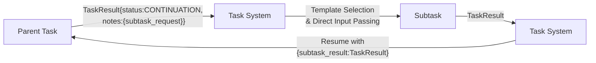

# Director‑Evaluator Pattern [Pattern:DirectorEvaluator:1.1]

**Canonical Reference:** This document is the authoritative description of the Director‑Evaluator Pattern. All extended descriptions in planning or misc files should refer here.

## Overview

The Director-Evaluator pattern is a specialized task execution model for iterative refinement, primarily implemented as a composite task type `director_evaluator_loop` that is directly executed by the Evaluator component. This pattern enables structured iteration with feedback between steps.

The pattern is primarily implemented using the S-expression DSL, leveraging its control flow and binding primitives.

1.  **S-expression Implementation (Primary)**: A workflow defined using S-expressions that structures the iterative loop. It uses primitives like `bind` or `let` to pass data between a 'director' step (often an atomic task call) and an 'evaluator' step (another atomic task call or S-expression logic). Conditionals (`if`) and potentially recursion or a dedicated `loop` primitive manage the iteration and termination. Script execution is integrated by calling a `system:run_script` primitive within the loop.

2.  **Dynamic Variant (via Subtask Spawning)**: A Director task (typically an atomic task) can still potentially trigger an evaluation step dynamically by returning a `CONTINUATION` status with a `subtask_request` (previously `evaluation_request`) in its `notes`. This uses the standard subtask spawning mechanism, where the Task System/S-expression Evaluator handles the invocation of the evaluation subtask.

**Note:** For the dynamic variant, the `evaluation_request` object must include:
 - `type`: a string indicating the evaluation type,
 - `criteria`: a free-form string providing descriptive criteria used for dynamic evaluation template selection via associative matching,
 - `target`: a string representing the target (for example, the bash script command to run or the evaluation focus).

## Pattern Description

### Dynamic Variant

This pattern follows a three-phase flow:

1. **Parent Task (Director):**
   - Generates an initial output based on the user's instructions.
   - May return a result with `status: 'CONTINUATION'` and a populated `evaluation_request` in its `notes`.
   - Uses a `<context_management>` block with `inherit_context` set to `none` to start a new execution chain.

2. **Evaluation Trigger via Continuation:**
   - The evaluation step is triggered dynamically when the Director task returns a `CONTINUATION` status.
   - The embedded `evaluation_request` specifies both:
       - The **bash script** (or external callback mechanism) to execute, and
       - The **target** string that describes the aspects of the output requiring evaluation.
   - The Evaluator uses this information—with associative matching—to select an appropriate evaluation task template.

3. **Child Task (Evaluator):**
   - Is dynamically spawned by the Evaluator when it detects a `CONTINUATION` status along with an `evaluation_request` in the Director's output.
   - Uses a `<context_management>` block with `inherit_context` set to `subset` and `accumulate_data` enabled to incorporate only the relevant context.
   - Executes the evaluation subtask—which may include invoking the specified bash script via the Handler or Evaluator—and feeds its results back to the parent task.

### S-expression Implementation Example (Conceptual)

The Director-Evaluator loop is now implemented within the S-expression DSL. Below is a *conceptual* example illustrating the structure. The exact primitives (`loop`, `bind`, `get-property`, `call-atomic-task`, `system:run_script`) depend on the final DSL specification.

```scheme
;; Conceptual S-expression Director-Evaluator Loop
(loop (iteration 1) (feedback null) (max_iterations 5)
  (bind director_result
        (call-atomic-task 'director-template
                          (original_prompt user_query)
                          (feedback feedback)
                          (iteration iteration)))

  (bind script_result ; Optional script execution
        (if (defined? script_path)
            (system:run_script script_path (input director_result.content) (timeout 300))
            null))

  (bind evaluation_result
        (call-atomic-task 'evaluator-template
                          (solution director_result.content)
                          (script_output script_result) ; Pass script output if available
                          (original_prompt user_query)))

  ;; Check termination condition
  (if (or (= iteration max_iterations)
          (get-property evaluation_result 'notes.success))
      evaluation_result ; Return final evaluation
      ;; Else, continue loop with updated feedback and iteration count
      (recur (+ iteration 1) (get-property evaluation_result 'notes.feedback))))
```

This S-expression defines the iterative flow, calls atomic tasks (defined in XML) for the director and evaluator steps, optionally runs a script, manages state (iteration count, feedback), and handles termination logic.

### Parameter Passing

The Director-Evaluator loop uses direct parameter passing rather than environment variables:



### Result Structure

All task results follow a consistent base structure with extensions for specific needs:

```typescript
// Base task result structure
interface TaskResult {
    content: string;
    status: "COMPLETE" | "CONTINUATION" | "WAITING" | "FAILED";
    notes: {
        [key: string]: any;
    };
}

// Specialized structure for evaluator feedback
interface EvaluationResult extends TaskResult {
    notes: {
        success: boolean;        // Whether the evaluation passed
        feedback: string;        // Human-readable feedback message
        details?: {              // Optional structured details
            metrics?: Record<string, number>; // Optional evaluation metrics
            violations?: string[];            // Specific validation failures
            suggestions?: string[];           // Suggested improvements
            [key: string]: any;               // Extension point
        };
        scriptOutput?: {         // Present when script execution is involved
            stdout: string;      // Standard output from script
            stderr: string;      // Standard error output from script
            exitCode: number;    // Exit code from script
        };
    };
}
```

### Example Workflow

Below is a conceptual example (in pseudocode) illustrating the updated director-evaluator flow. In this scenario, the Director task returns a result with `status: 'CONTINUATION'` and an embedded `evaluation_request`:

```typescript
// Example TaskResult returned by the Director task
const taskResult: TaskResult = {
    content: "Initial solution output...",
    status: 'CONTINUATION',
    notes: {
        evaluation_request: {
            type: "bash_script",
            criteria: ["validate", "log"],
            target: "run_analysis.sh"
        }
    }
};
```

Upon receiving this result, the Evaluator:
1. Uses the `evaluation_request` details (including the target string) to perform associative matching and select an appropriate evaluation task template.
2. Dynamically spawns an evaluation subtask (the Child Task) with a `<context_management>` block set to inherit a subset of context.
3. If necessary, invokes the specified bash script callback via the Handler or its own mechanism.
4. Feeds the evaluation results back to the Director, allowing the overall task to continue.

## Integration with the Unified Architecture

### Context Management in S-expression Implementation

Context management for the atomic tasks called within the S-expression loop follows the standard rules:
- Each `call-atomic-task` invocation can specify context overrides via a `SubtaskRequest`-like structure or rely on the defaults defined in the atomic task's XML template.
- The S-expression workflow itself manages the flow of data (like `feedback` or `director_result`) between steps using binding primitives, not the `<context_management>` settings which apply to individual atomic task executions.
- The overall S-expression execution might have its own initial context, potentially inherited from the user's session or the initial `/task` invocation. Primitives like `get-context` might be available within the DSL to explicitly fetch fresh context if needed during the workflow.

The hybrid configuration approach (operator defaults + explicit overrides) applies to the *atomic tasks* invoked by the S-expression, not the loop structure itself. The defaults relevant are those for `atomic (standard)` or `atomic (subtask)` depending on how the calls are made.

- **Inherited Context**: The parent task's context, controlled by `inherit_context` setting.
- **Accumulated Data**: The step-by-step outputs collected during sequential execution, controlled by `accumulate_data` setting.
- **Fresh Context**: New context generated via associative matching, controlled by `fresh_context` setting.

When the context_management block is omitted, the operator-specific defaults apply. When present, explicit settings override the defaults, providing both consistency and flexibility.

### Script Execution Integration

Script execution is integrated into the S-expression workflow by calling a dedicated primitive, for example `(system:run_script path [options...])`.

The execution flow works as follows:

1.  The S-expression evaluator encounters the `system:run_script` form during execution.
2.  It invokes the corresponding primitive implementation.
3.  This primitive likely calls the Handler's direct tool execution mechanism for running shell commands.
4.  The Handler executes the script, capturing stdout, stderr, and the exit code.
5.  The Handler returns the script results (as a structured object or TaskResult) back to the S-expression primitive.
6.  The primitive returns this result to the S-expression evaluator.
7.  The result can then be bound to a variable (e.g., `script_result` in the example) using `bind` or `let` and used in subsequent steps within the S-expression workflow (like passing it to the evaluator task).

This maintains separation: the S-expression evaluator controls the workflow, while the Handler executes the external process. Script execution is typically synchronous within the S-expression evaluation step.

### Data Flow Between Steps (S-expression)

Data flow between steps (Director, Script, Evaluator) within an S-expression loop iteration, and the passing of feedback to the next iteration, is managed explicitly via the S-expression evaluator's environment and binding primitives (`bind`, `let`, function arguments/return values, `recur` arguments).

The S-expression evaluator manages the environment scope:

1. **Initial Environment**: Contains the original inputs to the loop task
2. **Director Step**: Extends the environment with iteration number and any feedback from previous iterations
3. **After Director**: Extends the environment with `director_result` containing the Director's output
4. **After Script Execution**: Extends the environment with `script_stdout`, `script_stderr`, and `script_exit_code`
5. **Evaluator Step**: Receives the complete environment with all previous outputs
6. **Next Iteration**: The Director receives feedback from the Evaluator via `evaluation_feedback` and `evaluation_success` bindings

This explicit environment extension ensures clean data flow between steps and iterations without relying on global state or side effects.

## Relationship to Subtask Spawning

The S-expression based Director-Evaluator pattern and the Subtask Spawning mechanism are complementary:

### Integration Points

1. **Dynamic Evaluation Trigger**
   - The dynamic variant (where a Director task returns `CONTINUATION` with a `subtask_request` for evaluation) *is* an instance of the subtask spawning mechanism.
   - The S-expression evaluator (or Task System if called directly) handles the subtask creation and execution based on the `subtask_request`.
   - Results flow back to the calling context using the standard subtask result passing.

2. **Context Management Alignment**
   - Both patterns ultimately involve executing *atomic tasks*. The context management for these atomic tasks follows the hybrid configuration approach (defaults based on atomic task subtype + explicit overrides in the XML template or `SubtaskRequest`).
   - The S-expression loop itself doesn't have `<context_management>` settings; context for steps within the loop is managed via the S-expression environment and explicit calls (e.g., `(get-context ...)` or context settings passed to `call-atomic-task`).
   - Subtasks spawned dynamically follow the standard subtask context defaults (`inherit_context: subset`, `fresh_context: enabled`) unless overridden in the `SubtaskRequest`.

### Pattern Selection Guide

**S-expression based Director-Evaluator** is optimal for:
- Implementing iterative refinement processes requiring multiple feedback cycles within the DSL.
- Workflows needing external validation via scripts called using `system:run_script`.
- Scenarios where evaluation criteria and termination conditions can be expressed using S-expression logic.
- Cases where iteration history needs to be managed explicitly within the S-expression environment (e.g., accumulating results in a list).

**Subtask Spawning** is better for:
- Ad-hoc dynamic task creation based on runtime discoveries
- Complex task trees with varying subtypes and unpredictable branching
- Workflows requiring specialized template selection per subtask
- Situations where flexibility in execution path is more important than iteration structure

The patterns can be used together, with S-expression workflows (including Director-Evaluator implementations) spawning subtasks dynamically when needed for specialized processing.

## Conclusion

The Director-Evaluator pattern, implemented via S-expressions, provides a structured approach to iterative refinement. It uses explicit binding for clean data flow and integrates with the standard mechanisms for atomic task execution and context management. This approach ensures flexibility and seamless integration within the overall task execution architecture.
