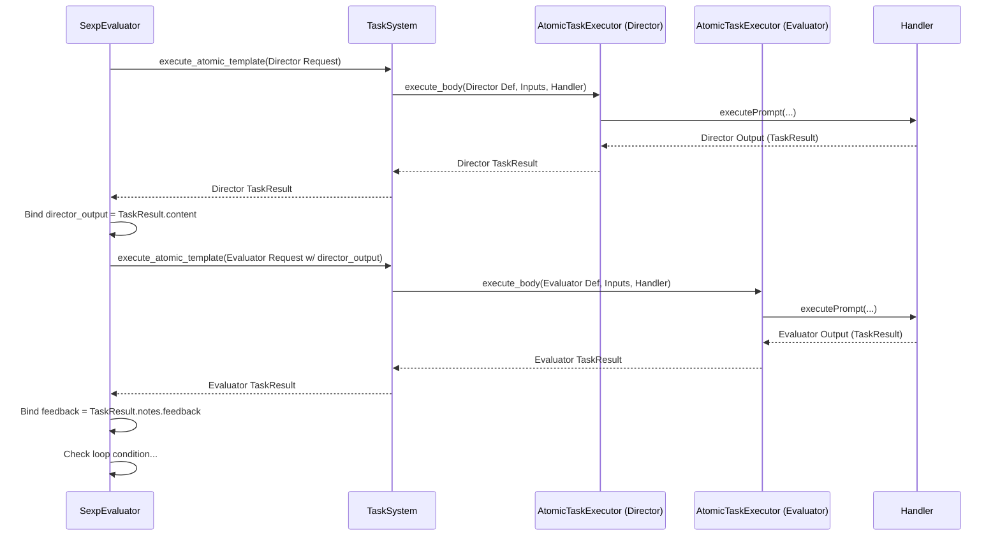

# Director‑Evaluator Pattern [Pattern:DirectorEvaluator:1.1]

**Canonical Reference:** This document is the authoritative description of the Director‑Evaluator Pattern. All extended descriptions in planning or misc files should refer here.

## Overview

The Director-Evaluator pattern is a specialized task execution model for iterative refinement, implemented using the S-expression DSL. It structures the flow between a 'director' step (generating content) and an 'evaluator' step (assessing content), both typically executed as atomic tasks called from the S-expression. This pattern enables structured iteration with feedback between steps.

1.  **S-expression Implementation (Primary)**: A workflow defined using S-expressions structures the iterative loop. It uses primitives like `bind` or `let` to pass data between the director atomic task call and the evaluator atomic task call (or other S-expression logic). Conditionals (`if`) and potentially recursion or a dedicated `loop` primitive manage the iteration and termination. Script execution for validation can be integrated by calling a `system:run_script` primitive within the loop.

2.  **Dynamic Variant (via Subtask Spawning)**: A Director atomic task can still potentially trigger an evaluation step dynamically by returning a `CONTINUATION` status with a `subtask_request` in its `notes`. This uses the standard subtask spawning mechanism, where the `SexpEvaluator` handles the invocation of the evaluation subtask (another atomic task).

**Note:** For the dynamic variant, the `subtask_request` object should contain the necessary information (type, description, inputs) for the `SexpEvaluator` to select and execute the appropriate evaluation atomic task template via the `TaskSystem`.

## Pattern Description

### Dynamic Variant (via Subtask Spawning)

This pattern follows a flow managed by the `SexpEvaluator`:

1. **Director Atomic Task Execution:**
   - The S-expression calls the Director atomic task via `TaskSystem.execute_atomic_template`.
   - The Director task generates output.
   - It returns a `TaskResult` with `status: 'CONTINUATION'` and a populated `subtask_request` in its `notes`, specifying the evaluation task to run next.

2. **Evaluation Trigger via Continuation:**
   - The `SexpEvaluator` receives the `CONTINUATION` result.
   - It extracts the `subtask_request` for the evaluation task.
   - It calls `TaskSystem.execute_atomic_template` again, passing the evaluation `subtask_request`.

3. **Evaluator Atomic Task Execution:**
   - The TaskSystem/AtomicTaskExecutor runs the evaluation task.
   - This task might involve calling external scripts via Handler tools (invoked by the AtomicTaskExecutor based on the evaluator template's instructions).
   - The evaluation task returns its `TaskResult` (e.g., with success status and feedback in `notes`).

4. **Result Propagation:**
   - The `SexpEvaluator` receives the evaluation result.
   - The S-expression logic determines whether to loop (calling the Director again with feedback) or terminate based on the evaluation result.

### S-expression Implementation Example (Conceptual)

The Director-Evaluator loop is implemented within the S-expression DSL. Below is a *conceptual* example illustrating the structure. The exact primitives (`loop`, `bind`, `get-property`, `call-atomic-task`, `system:run_script`) depend on the final DSL specification.

```scheme
;; Conceptual S-expression Director-Evaluator Loop
(loop (iteration 1) (feedback null) (max_iterations 5)
  (bind director_result
        (call-atomic-task 'director-template
                          (original_prompt user_query)
                          (feedback feedback)
                          (iteration iteration)))

  (bind script_result ; Optional script execution
        (if (defined? script_path)
            (system:run_script script_path (input director_result.content) (timeout 300))
            null))

  (bind evaluation_result
        (call-atomic-task 'evaluator-template
                          (solution director_result.content)
                          (script_output script_result) ; Pass script output if available
                          (original_prompt user_query)))

  ;; Check termination condition
  (if (or (= iteration max_iterations)
          (get-property evaluation_result 'notes.success))
      evaluation_result ; Return final evaluation
      ;; Else, continue loop with updated feedback and iteration count
      (recur (+ iteration 1) (get-property evaluation_result 'notes.feedback))))
```

This S-expression defines the iterative flow, calls atomic tasks (defined in XML) for the director and evaluator steps, optionally runs a script, manages state (iteration count, feedback), and handles termination logic.

### Parameter Passing (S-expression)

Data (like the director's output or evaluator's feedback) is passed between steps within the S-expression using binding primitives (`bind`, `let`) managed by the `SexpEvaluator` and its `SexpEnvironment`. Atomic tasks receive their inputs via the `SubtaskRequest.inputs` dictionary when called by the `SexpEvaluator`.



### Result Structure

All task results follow a consistent base structure with extensions for specific needs:

```typescript
// Base task result structure
interface TaskResult {
    content: string;
    status: "COMPLETE" | "CONTINUATION" | "WAITING" | "FAILED";
    notes: {
        [key: string]: any;
    };
}

// Specialized structure for evaluator feedback
interface EvaluationResult extends TaskResult {
    notes: {
        success: boolean;        // Whether the evaluation passed
        feedback: string;        // Human-readable feedback message
        details?: {              // Optional structured details
            metrics?: Record<string, number>; // Optional evaluation metrics
            violations?: string[];            // Specific validation failures
            suggestions?: string[];           // Suggested improvements
            [key: string]: any;               // Extension point
        };
        scriptOutput?: {         // Present when script execution is involved
            stdout: string;      // Standard output from script
            stderr: string;      // Standard error output from script
            exitCode: number;    // Exit code from script
        };
    };
}
```

### Example Workflow

Below is a conceptual example (in pseudocode) illustrating the updated director-evaluator flow. In this scenario, the Director task returns a result with `status: 'CONTINUATION'` and an embedded `evaluation_request`:

```typescript
// Example TaskResult returned by the Director task
const taskResult: TaskResult = {
    content: "Initial solution output...",
    status: 'CONTINUATION',
    notes: {
        evaluation_request: {
            type: "bash_script",
            criteria: ["validate", "log"],
            target: "run_analysis.sh"
        }
    }
};
```

Upon receiving this result, the Evaluator:
1. Uses the `evaluation_request` details (including the target string) to perform associative matching and select an appropriate evaluation task template.
2. Dynamically spawns an evaluation subtask (the Child Task) with a `<context_management>` block set to inherit a subset of context.
3. If necessary, invokes the specified bash script callback via the Handler or its own mechanism.
4. Feeds the evaluation results back to the Director, allowing the overall task to continue.

## Integration with the Unified Architecture

### Context Management in S-expression Implementation

Context management applies to the individual *atomic tasks* (Director, Evaluator) called within the S-expression loop:
- When the `SexpEvaluator` calls `TaskSystem.execute_atomic_template`, the TaskSystem determines the context for that specific atomic task execution based on the `SubtaskRequest` overrides and the template's `<context_management>` definition, following the standard hybrid configuration approach.
- The S-expression workflow itself manages the flow of *data* (like `feedback` or `director_result`) between steps using binding primitives within the `SexpEnvironment`. It does not directly use `<context_management>` settings.
- The overall S-expression execution might have an initial context. Primitives like `(get-context ...)` might be available within the DSL for the S-expression logic to explicitly fetch fresh context if needed during the workflow, which could then be passed as input or file paths to subsequent atomic task calls.

### Script Execution Integration (via Primitives or Atomic Tasks)

Script execution can be integrated in two main ways:

1.  **Via S-expression Primitive:**
    *   The S-expression calls a primitive like `(system:run_script path [options...])`.
    *   The primitive's implementation likely calls the Handler's direct tool for shell execution.
    *   The Handler runs the script and returns results (stdout, stderr, exit code) to the primitive.
    *   The primitive returns the results to the S-expression evaluator, where they can be bound to variables.

2.  **Via Atomic Task:**
    *   The S-expression calls an atomic task specifically designed for script execution (e.g., `atomic:script_runner`).
    *   The `AtomicTaskExecutor` executes this template.
    *   The template's instructions likely involve a tool call for the Handler to execute the script.
    *   The script results are returned within the `TaskResult` of the atomic task.

This maintains separation: the S-expression evaluator controls the workflow, while the Handler (invoked either directly via a primitive or indirectly via an atomic task's tool call) executes the external process.

### Data Flow Between Steps (S-expression)

Data flow between steps (Director atomic task, Script execution, Evaluator atomic task) within an S-expression loop iteration, and the passing of feedback to the next iteration, is managed explicitly via the `SexpEvaluator`'s `SexpEnvironment` and binding primitives (`bind`, `let`, function arguments/return values, `recur` arguments).

The `SexpEvaluator` manages the environment scope:

1.  **Initial Environment**: Contains the original inputs to the loop task.
2.  **Director Call**: Arguments (like iteration number, feedback) are passed via the `SubtaskRequest.inputs` when calling the Director atomic task.
3.  **After Director**: The `TaskResult` from the Director task is returned to the S-expression. Its content/notes can be bound to variables (e.g., `director_output`).
4.  **Script Call**: Inputs for the script are passed as arguments to the `system:run_script` primitive or the script-running atomic task.
5.  **After Script Execution**: Script results (stdout, stderr, exit code) are returned and can be bound to variables.
6.  **Evaluator Call**: Arguments (like `director_output`, script results) are passed via `SubtaskRequest.inputs` when calling the Evaluator atomic task.
7.  **After Evaluator**: The `TaskResult` from the Evaluator task is returned. Feedback/success status from its `notes` can be bound to variables.
8.  **Next Iteration**: Bound variables (like feedback) are used when constructing the arguments for the next call to the Director atomic task.

This explicit binding ensures clean data flow between steps and iterations.

## Relationship to Subtask Spawning

The S-expression based Director-Evaluator pattern and the Subtask Spawning mechanism (handling `CONTINUATION` from atomic tasks) are integrated:

1.  **Dynamic Evaluation Trigger:** The "dynamic variant" described earlier *is* the subtask spawning mechanism applied within a Director-Evaluator context. The Director atomic task returns `CONTINUATION`, and the `SexpEvaluator` handles spawning the Evaluator subtask.
2.  **Context Management Alignment:** Both the explicitly called atomic tasks (Director, Evaluator) within the S-expression loop and any dynamically spawned subtasks follow the standard context management rules for atomic tasks (hybrid configuration: subtype defaults + overrides from template/`SubtaskRequest`).
3.  **Flexibility:** An S-expression workflow (including a Director-Evaluator loop) can use *both* explicit calls (`call-atomic-task`) and handle `CONTINUATION` results to dynamically spawn subtasks as needed.

## Conclusion

The Director-Evaluator pattern, implemented via S-expressions calling atomic tasks, provides a structured approach to iterative refinement. It uses explicit binding within the `SexpEnvironment` for clean data flow and integrates seamlessly with the standard mechanisms for atomic task execution (via `TaskSystem` and `AtomicTaskExecutor`), context management, and dynamic subtask spawning (managed by the `SexpEvaluator`).
