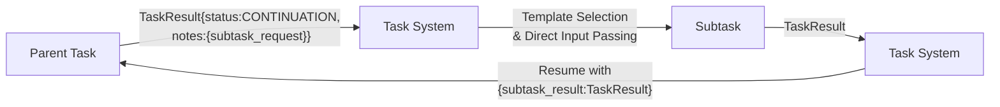

# Director‑Evaluator Pattern [Pattern:DirectorEvaluator:1.1]

**Canonical Reference:** This document is the authoritative description of the Director‑Evaluator Pattern. All extended descriptions in planning or misc files should refer here.

## Overview

The Director-Evaluator pattern is a specialized task execution model for iterative refinement, primarily implemented as a composite task type `director_evaluator_loop` that is directly executed by the Evaluator component. This pattern enables structured iteration with feedback between steps.

The pattern has two implementation variants:

1. **Static Variant (Primary Implementation)**: A predefined task structure of type `director_evaluator_loop` that explicitly defines the Director, Evaluator, and optional script execution steps with clear iteration control. This is the canonical, implemented pattern executed directly by the Evaluator component.

2. **Dynamic Variant (Historical Context)**: A parent task (the **Director**) produces an initial output that may require evaluation. When the Director's output returns with a `CONTINUATION` status and an `evaluation_request` object in its `notes`, the evaluation subtask is spawned dynamically.

**Note:** For the dynamic variant, the `evaluation_request` object must include:
 - `type`: a string indicating the evaluation type,
 - `criteria`: a free-form string providing descriptive criteria used for dynamic evaluation template selection via associative matching,
 - `target`: a string representing the target (for example, the bash script command to run or the evaluation focus).

## Pattern Description

### Dynamic Variant

This pattern follows a three-phase flow:

1. **Parent Task (Director):**
   - Generates an initial output based on the user's instructions.
   - May return a result with `status: 'CONTINUATION'` and a populated `evaluation_request` in its `notes`.
   - Uses a `<context_management>` block with `inherit_context` set to `none` to start a new execution chain.

2. **Evaluation Trigger via Continuation:**
   - The evaluation step is triggered dynamically when the Director task returns a `CONTINUATION` status.
   - The embedded `evaluation_request` specifies both:
       - The **bash script** (or external callback mechanism) to execute, and
       - The **target** string that describes the aspects of the output requiring evaluation.
   - The Evaluator uses this information—with associative matching—to select an appropriate evaluation task template.

3. **Child Task (Evaluator):**
   - Is dynamically spawned by the Evaluator when it detects a `CONTINUATION` status along with an `evaluation_request` in the Director's output.
   - Uses a `<context_management>` block with `inherit_context` set to `subset` and `accumulate_data` enabled to incorporate only the relevant context.
   - Executes the evaluation subtask—which may include invoking the specified bash script via the Handler or Evaluator—and feeds its results back to the parent task.

### Static Variant (Director-Evaluator Loop)

The static variant uses a dedicated task type with a standardized structure:

```xml
<task type="director_evaluator_loop">
  <description>{{task_description}}</description>
  <max_iterations>5</max_iterations>
  <context_management>
    <inherit_context>none</inherit_context>
    <accumulate_data>true</accumulate_data>
    <accumulation_format>notes_only</accumulation_format>
    <fresh_context>enabled</fresh_context>
  </context_management>
  <director>
    <description>Generate solution for {{original_prompt}}</description>
    <inputs>
      <input name="original_prompt" from="user_query"/>
      <input name="feedback" from="evaluation_feedback"/>
      <input name="iteration" from="current_iteration"/>
    </inputs>
  </director>
  <evaluator>
    <description>Evaluate solution against {{original_prompt}}</description>
    <inputs>
      <input name="solution" from="director_result"/>
      <input name="original_prompt" from="user_query"/>
    </inputs>
  </evaluator>
  <script_execution>
    <!-- Optional script execution -->
    <command>{{script_path}}</command>
    <timeout>300</timeout>
    <inputs>
      <input name="script_input" from="director_result"/>
    </inputs>
  </script_execution>
  <termination_condition>
    <!-- Optional early termination -->
    <condition>evaluation.success === true</condition>
  </termination_condition>
</task>
```

### Parameter Passing

The Director-Evaluator loop uses direct parameter passing rather than environment variables:



### Result Structure

All task results follow a consistent base structure with extensions for specific needs:

```typescript
// Base task result structure
interface TaskResult {
    content: string;
    status: "COMPLETE" | "CONTINUATION" | "WAITING" | "FAILED";
    notes: {
        [key: string]: any;
    };
}

// Specialized structure for evaluator feedback
interface EvaluationResult extends TaskResult {
    notes: {
        success: boolean;        // Whether the evaluation passed
        feedback: string;        // Human-readable feedback message
        details?: {              // Optional structured details
            metrics?: Record<string, number>; // Optional evaluation metrics
            violations?: string[];            // Specific validation failures
            suggestions?: string[];           // Suggested improvements
            [key: string]: any;               // Extension point
        };
        scriptOutput?: {         // Present when script execution is involved
            stdout: string;      // Standard output from script
            stderr: string;      // Standard error output from script
            exitCode: number;    // Exit code from script
        };
    };
}
```

### Example Workflow

Below is a conceptual example (in pseudocode) illustrating the updated director-evaluator flow. In this scenario, the Director task returns a result with `status: 'CONTINUATION'` and an embedded `evaluation_request`:

```typescript
// Example TaskResult returned by the Director task
const taskResult: TaskResult = {
    content: "Initial solution output...",
    status: 'CONTINUATION',
    notes: {
        evaluation_request: {
            type: "bash_script",
            criteria: ["validate", "log"],
            target: "run_analysis.sh"
        }
    }
};
```

Upon receiving this result, the Evaluator:
1. Uses the `evaluation_request` details (including the target string) to perform associative matching and select an appropriate evaluation task template.
2. Dynamically spawns an evaluation subtask (the Child Task) with a `<context_management>` block set to inherit a subset of context.
3. If necessary, invokes the specified bash script callback via the Handler or its own mechanism.
4. Feeds the evaluation results back to the Director, allowing the overall task to continue.

## Integration with the Unified Architecture

### Context Management Defaults

The Director-Evaluator pattern has specific default context management settings:

| Task Type | inherit_context | accumulate_data | accumulation_format | fresh_context |
|-----------|-----------------|-----------------|---------------------|---------------|
| director_evaluator_loop | none | true | notes_only | enabled |
| director (component) | full | false | notes_only | disabled |
| evaluator (component) | full | false | notes_only | disabled |

These defaults adhere to the mutual exclusivity constraint: when `inherit_context` is "full", `fresh_context` must be "disabled".

These defaults can be overridden through explicit configuration:

```xml
<task type="director_evaluator_loop">
  <description>Iterative refinement process</description>
  <context_management>
    <inherit_context>none</inherit_context>
    <accumulate_data>true</accumulate_data>
    <accumulation_format>full_output</accumulation_format>
    <fresh_context>enabled</fresh_context>
  </context_management>
  <!-- other elements -->
</task>
```

The Director-Evaluator pattern fully embraces the hybrid configuration approach and integrates with the three-dimensional context management model:

- **Inherited Context**: The parent task's context, controlled by `inherit_context` setting.
- **Accumulated Data**: The step-by-step outputs collected during sequential execution, controlled by `accumulate_data` setting.
- **Fresh Context**: New context generated via associative matching, controlled by `fresh_context` setting.

When the context_management block is omitted, the operator-specific defaults apply. When present, explicit settings override the defaults, providing both consistency and flexibility.

### Script Execution Integration

Script execution within the Director-Evaluator loop is implemented through the Evaluator's recursive evaluation mechanism:

```xml
<script_execution>
  <command>{{script_path}}</command>
  <timeout>300</timeout>
  <inputs>
    <input name="script_input" from="director_result"/>
  </inputs>
</script_execution>
```

The execution flow works as follows:

1. The `<script_execution>` element in the loop's XML definition contains a task node (typically a `<call task="system:run_script">` or similar)
2. During loop execution, the Evaluator encounters this element and evaluates it by recursively calling its own `eval` method on the contained task node
3. This evaluation triggers the standard mechanism for tool calls, which leads to the Handler executing the registered Direct Tool (e.g., `system:run_script`)
4. The tool executes the script and captures stdout, stderr, and exit code
5. These results are returned from the `eval` call back to the loop logic within the Evaluator
6. The Evaluator makes these results available in the Environment for the subsequent Evaluator step of the same iteration

This approach maintains a clean separation of concerns:
- The Evaluator manages the control flow and environment updates
- The Handler executes the actual script via its Direct Tool mechanism
- Script execution is synchronous within the loop iteration
- Results are structured and consistently formatted for the Evaluator step

### Data Flow Between Steps

Data flow between the Director, Script, and Evaluator steps within a single iteration, and the passing of feedback from the Evaluator step to the next iteration's Director step, is managed via the Environment object.

The Evaluator extends the environment at each stage of the loop:

1. **Initial Environment**: Contains the original inputs to the loop task
2. **Director Step**: Extends the environment with iteration number and any feedback from previous iterations
3. **After Director**: Extends the environment with `director_result` containing the Director's output
4. **After Script Execution**: Extends the environment with `script_stdout`, `script_stderr`, and `script_exit_code`
5. **Evaluator Step**: Receives the complete environment with all previous outputs
6. **Next Iteration**: The Director receives feedback from the Evaluator via `evaluation_feedback` and `evaluation_success` bindings

This explicit environment extension ensures clean data flow between steps and iterations without relying on global state or side effects.

## Relationship to Subtask Spawning

The Director-Evaluator Loop and Subtask Spawning mechanism are complementary features:

### Integration Points

1. **Dynamic Director-Evaluator Implementation**
   - The dynamic variant of Director-Evaluator uses the subtask spawning mechanism
   - When a Director task returns with `CONTINUATION` status and an `evaluation_request`, it's using subtask spawning
   - The Evaluator component handles the subtask creation and execution
   - Results flow back to the parent task using the standard subtask result passing

2. **Context Management Alignment**
   - Both patterns follow the hybrid configuration approach from [ADR 14: Operator Context Configuration]
   - Director-Evaluator Loop uses `inherit_context: none` by default
   - Subtasks use `inherit_context: subset` by default
   - Both can be explicitly configured through their respective XML structures

### Pattern Selection Guide

**Director-Evaluator Loop** is optimal for:
- Iterative refinement processes requiring multiple feedback cycles
- Workflows needing external validation via scripts with standardized input/output
- Scenarios with well-defined evaluation criteria and termination conditions
- Cases requiring preservation of iteration history for auditing or debugging

**Subtask Spawning** is better for:
- Ad-hoc dynamic task creation based on runtime discoveries
- Complex task trees with varying subtypes and unpredictable branching
- Workflows requiring specialized template selection per subtask
- Situations where flexibility in execution path is more important than iteration structure

The patterns can be used together, with Director-Evaluator loops spawning subtasks when needed for specialized processing.

## Conclusion

The Director-Evaluator pattern provides a structured approach to iterative refinement, with both dynamic and static variants. It uses direct parameter passing for clean data flow and integrates fully with the unified context management model. This approach ensures flexibility and seamless integration within the overall task execution architecture.
