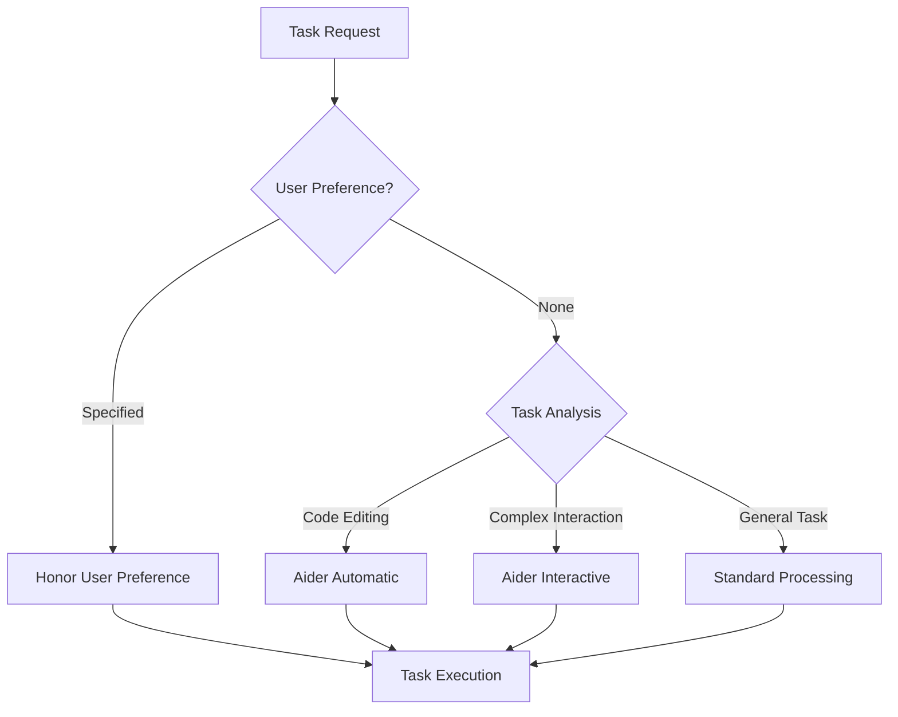

# Task Delegation Pattern [Pattern:TaskDelegation:1.0]

## Purpose

Define a mechanism for routing tasks to appropriate handlers, including external tools like Aider, based on task requirements and user preferences.

## Pattern Description

The Task Delegation Pattern determines whether a task should be handled:
1. By the system's internal LLM-based processing
2. By an external tool (e.g., Aider) in interactive mode
3. By an external tool in automatic mode



## Task Analysis Interface

```typescript
/**
 * Task analysis determines appropriate routing
 * [Interface:TaskAnalysis:1.0]
 */
interface TaskAnalyzer {
    /**
     * Analyze task to determine appropriate delegation
     * 
     * @param taskDescription - The task to analyze
     * @param userPreference - Optional user-specified preference
     * @returns The delegation decision
     */
    analyzeTaskForDelegation(
        taskDescription: string, 
        userPreference?: string
    ): DelegationDecision;
}

/**
 * Delegation decision structure
 * [Type:TaskDelegation:DelegationDecision:1.0]
 */
interface DelegationDecision {
    /**
     * Handler type to use
     */
    handlerType: 'standard' | 'aider_interactive' | 'aider_automatic' | string;
    
    /**
     * Rationale for delegation decision
     */
    rationale: string;
    
    /**
     * Task subtype to use
     */
    taskSubtype?: string;
}
```

## Decision Criteria

Tasks are analyzed along several dimensions:

1. **User Preference**: Explicit user preferences override other criteria
   - Command syntax: `/aider [interactive|automatic]`
   - Previous mode selection

2. **Task Characteristics**:
   - Code editing tasks → Aider (automatic by default)
   - Large codebase understanding → Aider (interactive by default)
   - General tasks → Standard processing

## Related Documents

For integration details, see:
- [Pattern:ToolInterface:1.0] in system/architecture/patterns/tool-interface.md
- [Pattern:ContextFrame:1.0] in system/architecture/patterns/context-frames.md
