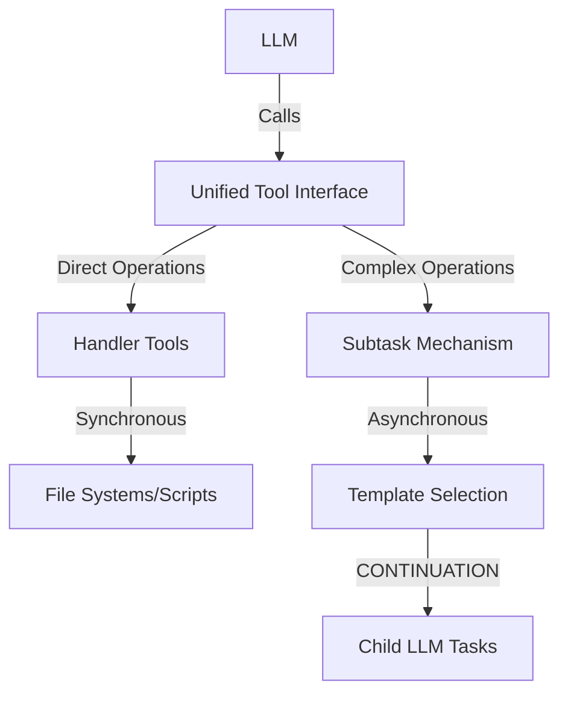
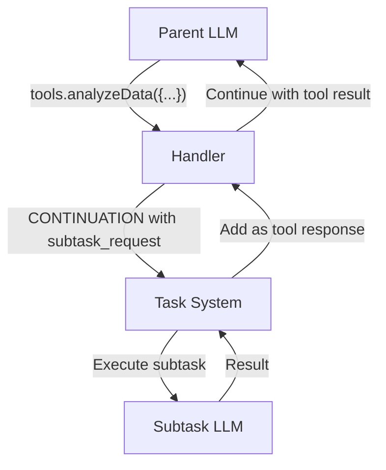

# Unified Tool Interface Pattern [Pattern:ToolInterface:1.0]

**Canonical Reference:** This document is the authoritative description of the Unified Tool Interface Pattern. All extended descriptions in other files should refer here.

## Purpose

Define a consistent tool-based delegation model for LLMs that unifies direct operations (file I/O, scripts) and complex operations (subtasks, evaluations) under a common interface while maintaining separate implementation mechanisms.

## Pattern Description

The Unified Tool Interface pattern separates the LLM-facing interface from the underlying implementation mechanisms:

1. **Interface Layer**: What the LLM sees and interacts with
   - Consistent tool-based invocation pattern
   - Standardized parameter schemas
   - Unified error handling

2. **Implementation Layer**: How tools are executed
   - **Direct Tools**: Synchronous execution via Handler
   - **Subtask Tools**: Asynchronous execution via CONTINUATION mechanism



## Interface vs. Implementation

### What the LLM Sees

From the LLM's perspective, all tools share a common invocation pattern:

```python
# Direct tool example
result = tools.readFile("path/to/file")

# Subtask tool example
result = tools.analyzeData({
  "data": fileContent,
  "method": "statistical" 
})
```

### How It's Implemented

Behind the interface, tools operate differently:

1. **Direct Tools**:
   - Executed synchronously by the Handler
   - No complex context management
   - Predictable resource usage
   - Examples: file operations, script execution, API calls

2. **Subtask Tools**:
   - Implemented via CONTINUATION mechanism
   - Managed by Task System and Evaluator
   - Full context management capabilities
   - Depth tracking and cycle detection
   - Examples: data analysis, creative generation, complex reasoning

## Implementation Details

### Handler Responsibilities

The Handler component exposes both types of tools through a unified registry:

```typescript
interface ToolRegistry {
  registerDirectTool(name: string, handler: Function): void;
  registerSubtaskTool(name: string, templateHints: string[]): void;
  
  // Called by LLM through tool interface
  invokeTool(name: string, params: any): Promise<any>;
}
```

When a tool is invoked:
1. Handler determines tool type (direct or subtask)
2. For direct tools: executes immediately and returns result
3. For subtask tools: creates CONTINUATION with SubtaskRequest and yields

## Subtask Results as Tool Responses

When a subtask tool is called, the system implements a streamlined approach that preserves session continuity:



### Key Benefits
1. **Session Preservation**: The parent Handler session is maintained throughout execution
2. **Natural Conversation Flow**: From the LLM's perspective, this is just a tool call and response
3. **No Special Methods**: No need for `resumeTask()` or similar special continuation methods
4. **Simplified Implementation**: Clean component boundaries with clear responsibilities

### Example Flow
1. Parent LLM calls a subtask tool (e.g., `tools.analyzeData({...})`)
2. Handler recognizes this as a subtask tool and returns CONTINUATION with subtask_request
3. Task System executes the subtask as a separate LLM interaction
4. Task System adds the subtask result to the parent's session as a tool response
5. Parent LLM continues execution with the tool result in its conversation history

This approach eliminates the need for the LLM to understand continuation concepts - it simply sees its tool call and the corresponding response.

### Task System Integration

For subtask tools, the Task System:
1. Receives CONTINUATION status with subtask_request
2. Selects appropriate template using associative matching
3. Executes subtask with context management
4. Returns result to parent task

## Usage Examples

### Direct Tool Example

```typescript
// LLM invocation
const fileContent = tools.readFile("data.csv");

// Implementation (synchronous via Handler)
async function readFile(path: string): Promise<string> {
  return await fs.readFile(path, 'utf8');
}
```

### Subtask Tool Example

```typescript
// LLM invocation
const analysis = tools.analyzeData({
  "data": fileContent,
  "method": "statistical"
});

// Implementation (asynchronous via CONTINUATION)
async function analyzeData(params: any): Promise<any> {
  return {
    status: "CONTINUATION",
    notes: {
      subtask_request: {
        type: "atomic",
        description: `Analyze data using ${params.method} method`,
        inputs: { data: params.data, method: params.method },
        template_hints: ["data_analysis", "statistics"]
      }
    }
  };
}
```

## Selection Criteria

Use **Direct Tools** when:
- Operations are deterministic with predictable outputs
- No complex reasoning is required
- Response format is simple and structured
- Resource usage is predictable

Use **Subtask Tools** when:
- Complex reasoning or creativity is required
- Dynamic template selection would be beneficial
- Operation might involve multiple steps or iterations
- Context management needs are sophisticated

## Integration with Other Patterns

This pattern complements:
- [Pattern:DirectorEvaluator:1.1] - Can use both mechanism types
- [Pattern:SubtaskSpawning:1.0] - Provides tool interface for spawning
- [Pattern:ContextFrame:1.0] - Works with context management model
- [Pattern:Error:1.0] - Unified error handling across mechanisms

## Constraints

1. **Naming Consistency**: Tool names must be unique across both direct and subtask tools
2. **Parameter Validation**: All tools must validate parameters regardless of implementation
3. **Error Propagation**: Error handling must be consistent across both mechanisms
4. **Resource Tracking**: Both mechanisms must track resource usage appropriately

### User Input Request Tool

The system provides a standardized tool for requesting user input:

```typescript
// Standard tool for requesting user input
const USER_INPUT_TOOL: ToolDefinition = {
  name: "requestUserInput",
  description: "Request input from the user when additional information is needed",
  parameters: {
    type: "object",
    properties: {
      prompt: {
        type: "string",
        description: "The question or prompt to show to the user"
      }
    },
    required: ["prompt"]
  }
};

// LLM usage
const userAnswer = tools.requestUserInput({
  prompt: "What file would you like to analyze?"
});

// Handler implementation
class Handler implements IHandler {
  constructor(config: HandlerConfig) {
    // Register standard tools
    this.registerDirectTool(USER_INPUT_TOOL.name, this.handleUserInputRequest.bind(this));
  }
  
  private async handleUserInputRequest(params: {prompt: string}): Promise<{userInput: string}> {
    if (!this.onRequestInput) {
      throw new Error("No input request handler registered");
    }
    
    const userInput = await this.onRequestInput(params.prompt);
    this.session.addUserMessage(userInput);
    
    return { userInput };
  }
}
```

This standardized approach allows LLMs to consistently request user input across different providers while maintaining proper conversation tracking and resource management.

## Aider Integration

The system provides specialized integration with Aider (AI pair programming tool) through two distinct modes that follow the unified tool interface pattern:

### Interactive Mode

Interactive mode follows the Direct Tool pattern, providing a PassthroughHandler-like experience:

```typescript
/**
 * Interface for Aider Interactive mode integration
 * [Interface:AiderInteractive:1.0]
 */
interface AiderInteractiveHandler {
    /**
     * Start an interactive Aider session with context
     * 
     * @param query - Initial query to provide context
     * @param fileContext - Optional explicit file paths to include
     * @returns Promise resolving to session result summary
     */
    startInteractiveSession(query: string, fileContext?: string[]): Promise<SessionResult>;
    
    /**
     * Terminate an active Aider session
     * 
     * @returns Promise resolving when session is terminated
     */
    terminateSession(): Promise<void>;
}
```

In interactive mode:
- The system uses associative matching to identify relevant files
- Terminal control transfers to Aider's REPL
- The user interacts directly with Aider
- Context is maintained across the session
- Control returns to the system when the session ends

### Automatic Mode

Automatic mode follows the Subtask Tool pattern, using the CONTINUATION mechanism:

```typescript
/**
 * Interface for Aider Automatic mode integration
 * [Interface:AiderAutomatic:1.0]
 */
interface AiderAutomaticHandler {
    /**
     * Execute a single Aider task with auto-confirmation
     * 
     * @param prompt - The instruction for code changes
     * @param fileContext - Optional explicit file paths to include
     * @returns Promise resolving to TaskResult
     */
    executeTask(prompt: string, fileContext?: string[]): Promise<TaskResult>;
}
```

In automatic mode:
- The system uses associative matching to identify relevant files
- Aider executes non-interactively with auto-confirmation
- Results are formatted as a standard TaskResult
- The operation completes in a single step

### Aider Tool Registration

Aider tools are registered with the Handler using the standard tool registration methods:

```typescript
// Register interactive mode as a Direct Tool
handler.registerDirectTool("aiderInteractive", 
  (query: string, fileContext?: string[]) => {
    return aiderBridge.startInteractiveSession(query, fileContext);
  });

// Register automatic mode as a Subtask Tool
handler.registerSubtaskTool("aiderAutomatic", 
  ["code_editing", "programming"]);
```

The registration process follows the same pattern as other tools in the system:
- Direct tools are executed synchronously by the Handler
- Subtask tools return CONTINUATION status with a subtask_request
- Tool names should be descriptive and follow camelCase convention

## Implementation Guidance

1. Register direct tools during Handler initialization
2. Define subtask tools in the TaskLibrary with template hints
3. Implement invocation routing in the Handler
4. Ensure consistent error handling in both paths
5. Provide clear documentation of available tools to the LLM
