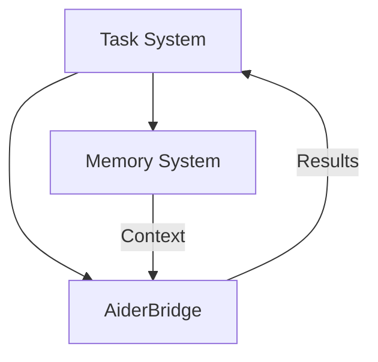
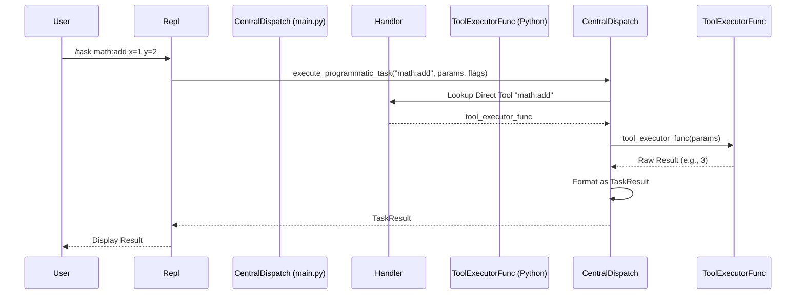
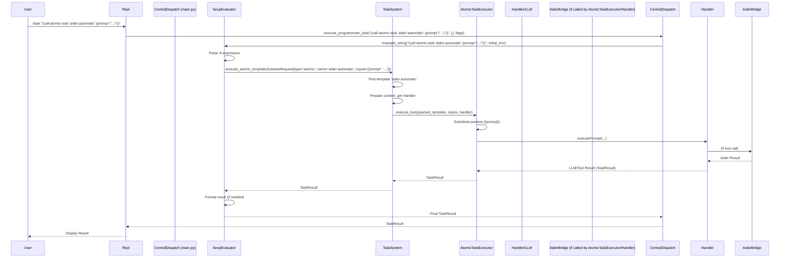

# Cross-Component Integration
    
This document describes how system components interact with each other.

## External Tool Integration

### Aider Integration

The system integrates with Aider (AI pair programming tool) through a bridge component:



#### Integration Points

- **Memory System ↔ Aider**
  - Memory System provides relevant file context
  - Associative matching identifies important files
  - File paths are passed explicitly to Aider

- **Task System ↔ Aider**
  - Task System delegates appropriate tasks to Aider
  - Results flow back as standard TaskResult objects

- **Handler ↔ Aider**
  - Interactive mode uses PassthroughHandler-like functionality
  - Terminal control transfers for interactive sessions
  - Tool registration for both modes

#### TaskResult Formatting

Results from Aider follow the standard TaskResult structure:

```typescript
// Interactive mode result
{
  content: "Interactive Aider session completed",
  status: "COMPLETE",
  notes: {
    files_modified: ["file1.py", "file2.py"],
    session_summary: "Summary of changes made"
  }
}

// Automatic mode result
{
  content: "Code changes applied successfully",
  status: "COMPLETE",
  notes: {
    files_modified: ["file1.py"],
    changes: [
      {
        file: "file1.py",
        description: "Added new function"
      }
    ]
  }
}
```

### Component Placement

The AiderBridge component fits within the existing architecture as follows:

```
handler/
  ├── __init__.py
  ├── handler.py
  ├── passthrough_handler.py
  └── aider_bridge.py  # Aider integration component
```

The AiderBridge component:
- Acts as a bridge between the Handler and Aider
- Depends on the Memory System for context retrieval
- Is referenced by Handler for tool execution
- Follows the same dependency injection pattern as other components

### Testing Strategy

Testing for the Aider integration follows the project's standard patterns:

```
tests/
  └── handler/
      └── test_aider_bridge.py  # Tests for AiderBridge component
```

Testing considerations:
- Mock Aider's functionality for unit tests
- Test the bridge component in isolation from actual Aider
- Verify correct context flow between components
- Test both interactive and automatic modes
- Include integration tests for the complete flow

### Programmatic Invocation Flow (`/task`)

The `/task` command, typically initiated from the REPL, bypasses the standard conversational handler flow and uses a central dispatch mechanism (e.g., logic within `main.py`) to route requests directly to either a Handler's Direct Tool or the TaskSystem's `execute_subtask_directly` method.

**Flow for `/task` -> Direct Tool:**



**Flow for `/task` -> Subtask Template:**



## SexpEvaluator ↔ TaskSystem

### Responsibilities

**SexpEvaluator:**
- Parses and executes S-expression workflows.
- Manages DSL environment (`SexpEnvironment`) and control flow.
- Resolves arguments for atomic task calls within the S-expression.
- Calls `TaskSystem.execute_atomic_template` for atomic steps.
- Handles `CONTINUATION` results from atomic tasks for subtask spawning.

**TaskSystem:**
- Manages atomic task template definitions (XML).
- Provides `find_template` to check if an identifier is an atomic task.
- Provides `execute_atomic_template` to run a single atomic task.
- Orchestrates setup for atomic task execution (context determination, Handler instantiation, parameter preparation).
- Instantiates `AtomicTaskExecutor`.

### Integration Points

- SexpEvaluator calls `TaskSystem.find_template(identifier)` during S-expression evaluation to determine if an identifier refers to a registered atomic task.
- SexpEvaluator calls `TaskSystem.execute_atomic_template(request)` with a fully resolved `SubtaskRequest` (inputs, paths, context settings evaluated).
- TaskSystem returns the `TaskResult` or `TaskError` from the atomic task execution back to the SexpEvaluator.

### Data Flow

```
SexpEvaluator → find_template(id) → TaskSystem
TaskSystem → Template Found/Not Found → SexpEvaluator

SexpEvaluator → execute_atomic_template(SubtaskRequest) → TaskSystem
TaskSystem → TaskResult/TaskError → SexpEvaluator
```

## TaskSystem ↔ AtomicTaskExecutor

### Responsibilities

**TaskSystem:**
- Parses and validates atomic task XML definitions.
- Determines final context and file paths for an atomic task execution.
- Prepares the `params` dictionary (resolved inputs) for the atomic task.
- Instantiates the correct Handler.
- Instantiates the AtomicTaskExecutor.
- Calls `AtomicTaskExecutor.execute_body`.
- Receives the final `TaskResult` from the executor.

**AtomicTaskExecutor:**
- Receives parsed atomic task definition, resolved `params`, and Handler instance.
- Performs `{{parameter}}` substitution using **only** the provided `params`.
- Constructs the `HandlerPayload`.
- Calls the Handler.
- Returns the Handler's result.

### Integration Points

- TaskSystem calls `AtomicTaskExecutor.execute_body(atomic_task_def, params, handler)`.
- AtomicTaskExecutor returns `TaskResult` or throws `TaskError`.

### Data Flow

```
TaskSystem → execute_body(def, params, handler) → AtomicTaskExecutor
AtomicTaskExecutor → TaskResult/TaskError → TaskSystem
```

## AtomicTaskExecutor ↔ Handler

### Responsibilities

**AtomicTaskExecutor:**
- Prepares the fully resolved prompts, system messages, context, and tool definitions.
- Constructs the `HandlerPayload`.
- Calls the appropriate Handler method (e.g., `executePrompt`).

**Handler:**
- Interacts with the LLM provider.
- Executes tools (including file I/O, shell commands).
- Enforces resource limits (turns, tokens) for this specific execution.
- Returns the `LLMResponse` or `TaskResult` from tool execution.

### Integration Points

- AtomicTaskExecutor calls `Handler.executePrompt(payload)` or similar.
- Handler returns `LLMResponse` or `TaskResult`.

### Data Flow

```
AtomicTaskExecutor → executePrompt(payload) → Handler
Handler → LLMResponse/TaskResult → AtomicTaskExecutor
```

## Task System ↔ Memory

### Responsibilities
**Task System:**
- Determines when fresh context is needed for an atomic task based on effective context settings.
- Constructs `ContextGenerationInput`.
- Calls `MemorySystem.getRelevantContextFor`.
- Uses the returned context (summary, file paths) when invoking the `AtomicTaskExecutor`.

**Memory System:**
- Maintains global file metadata index.
- Provides context via `getRelevantContextFor` based on `ContextGenerationInput`.
- Does NOT store file content or perform file operations.

### Integration Points

- Task System calls `MemorySystem.getRelevantContextFor(context_input)` when `fresh_context` is enabled for an atomic task.
- Memory System returns `AssociativeMatchResult`.
- Task System uses the result to prepare context for the `AtomicTaskExecutor`.

### Data Flow

```
Task System → getRelevantContextFor(input) → Memory System
Memory System → AssociativeMatchResult → Task System
```

## Compiler ↔ Task System / SexpEvaluator (Reduced Role)

With S-expressions defining workflows, the Compiler's role might be reduced to:
- Initial parsing of user input into a basic structure if needed.
- Parsing and validating XML definitions for *atomic* task templates during registration (`TaskSystem.register_template`).

The Compiler is less involved in the core execution flow compared to the previous AST-centric model.

## Responsibility Boundaries

### File Operations

- **Memory System**: Manages ONLY file metadata (paths and descriptions). Read-only.
- **Handler**: Performs ALL file I/O operations (read, write, list, delete).
- **Task System**: Coordinates context preparation, may pass file paths to Handler via AtomicTaskExecutor.
- **SexpEvaluator**: May trigger file operations via Handler direct tool calls (e.g., `(system:run_script "ls")`).
- **AtomicTaskExecutor**: Does not perform file I/O directly; relies on Handler.

### Resource Management

- **Handler**: Tracks and enforces resource limits (turns, tokens) **per atomic task execution**.
- **Task System**: Configures Handler instances with appropriate limits for each atomic task.
- **SexpEvaluator**: May have high-level limits (e.g., max execution time, max steps) for workflows. Does not track LLM tokens/turns directly.
- **Memory System**: No resource tracking responsibility.
- **AtomicTaskExecutor**: Operates within the limits enforced by the Handler it uses.

### Template Management

- **Task System**: Manages *atomic* task template registration (`register_template`) and lookup (`find_template`). Validates XML templates.
- **SexpEvaluator**: Defines and executes S-expression workflows. Looks up atomic tasks via TaskSystem. May define S-expression functions.
- **Compiler**: Validates atomic task XML schema during registration.
- **AtomicTaskExecutor**: Executes the body of a resolved atomic task template.
- **Handler**: No template responsibilities.

## Error Handling Across Components

### Resource Exhaustion (Handler)

1. **Handler** detects resource exhaustion during an atomic task execution.
2. **Handler** returns `TaskError` (type `RESOURCE_EXHAUSTION`) to **AtomicTaskExecutor**.
3. **AtomicTaskExecutor** propagates the error to **TaskSystem**.
4. **TaskSystem** propagates the error to **SexpEvaluator** (or original caller).
5. **SexpEvaluator** handles the error according to its workflow logic (e.g., terminate, retry with different params, return error).

### Context Failures (Memory System)

1. **Memory System** fails during `getRelevantContextFor`.
2. **Memory System** returns error/empty result to **TaskSystem**.
3. **TaskSystem** may attempt recovery (e.g., proceed without fresh context) or fail the atomic task setup.
4. If setup fails, **TaskSystem** returns `TaskError` (e.g., reason `context_retrieval_failure`) to **SexpEvaluator**.
5. **SexpEvaluator** handles the error.

### Execution Failures (Atomic Task / Handler)

1. **Handler** detects execution failure (e.g., LLM API error, tool execution error).
2. **Handler** returns `TaskError` to **AtomicTaskExecutor**.
3. **AtomicTaskExecutor** propagates error to **TaskSystem**.
4. **TaskSystem** propagates error to **SexpEvaluator**.
5. **SexpEvaluator** handles the error.

### S-expression Evaluation Errors (SexpEvaluator)

1. **SexpEvaluator** detects parsing or runtime error (e.g., unbound symbol, invalid primitive use).
2. **SexpEvaluator** generates `TaskError` (e.g., reason `sexp_evaluation_error`).
3. **SexpEvaluator** returns the error to its caller (e.g., Dispatcher).

## Related Documentation

- [Component Interfaces](../contracts/interfaces.md)
- [Resource Management Pattern](../architecture/patterns/resource-management.md)
- [Error Handling Pattern](../architecture/patterns/errors.md)
