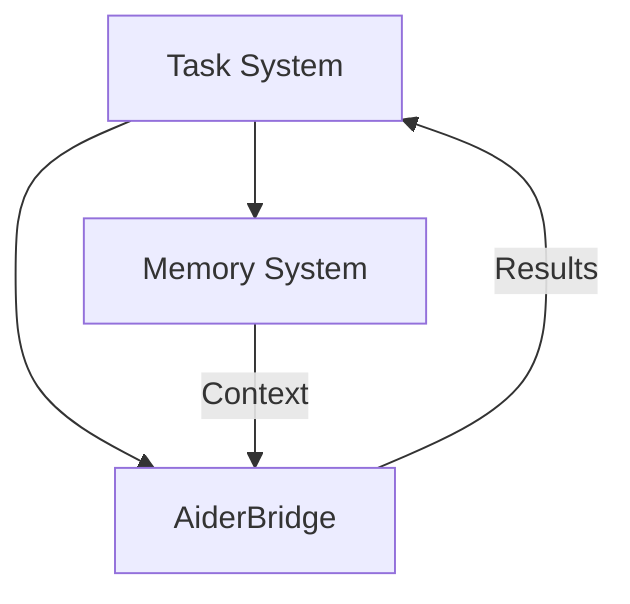
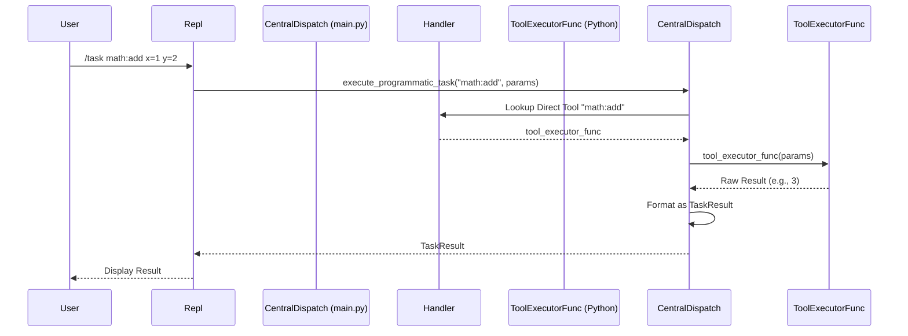
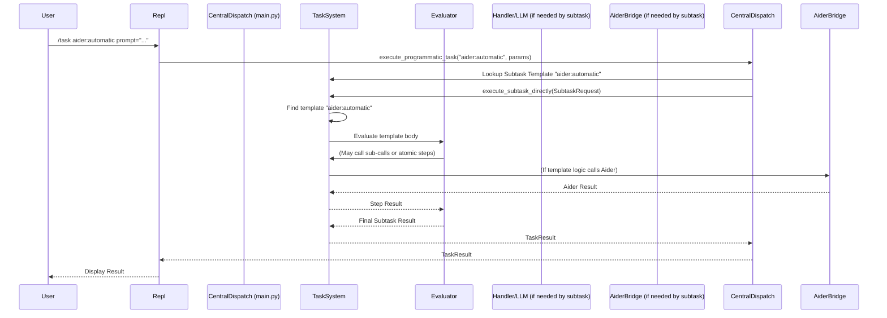

# Cross-Component Integration
    
This document describes how system components interact with each other.

## External Tool Integration

### Aider Integration

The system integrates with Aider (AI pair programming tool) through a bridge component:



#### Integration Points

- **Memory System ↔ Aider**
  - Memory System provides relevant file context
  - Associative matching identifies important files
  - File paths are passed explicitly to Aider

- **Task System ↔ Aider**
  - Task System delegates appropriate tasks to Aider
  - Results flow back as standard TaskResult objects

- **Handler ↔ Aider**
  - Interactive mode uses PassthroughHandler-like functionality
  - Terminal control transfers for interactive sessions
  - Tool registration for both modes

#### TaskResult Formatting

Results from Aider follow the standard TaskResult structure:

```typescript
// Interactive mode result
{
  content: "Interactive Aider session completed",
  status: "COMPLETE",
  notes: {
    files_modified: ["file1.py", "file2.py"],
    session_summary: "Summary of changes made"
  }
}

// Automatic mode result
{
  content: "Code changes applied successfully",
  status: "COMPLETE",
  notes: {
    files_modified: ["file1.py"],
    changes: [
      {
        file: "file1.py",
        description: "Added new function"
      }
    ]
  }
}
```

### Component Placement

The AiderBridge component fits within the existing architecture as follows:

```
handler/
  ├── __init__.py
  ├── handler.py
  ├── passthrough_handler.py
  └── aider_bridge.py  # Aider integration component
```

The AiderBridge component:
- Acts as a bridge between the Handler and Aider
- Depends on the Memory System for context retrieval
- Is referenced by Handler for tool execution
- Follows the same dependency injection pattern as other components

### Testing Strategy

Testing for the Aider integration follows the project's standard patterns:

```
tests/
  └── handler/
      └── test_aider_bridge.py  # Tests for AiderBridge component
```

Testing considerations:
- Mock Aider's functionality for unit tests
- Test the bridge component in isolation from actual Aider
- Verify correct context flow between components
- Test both interactive and automatic modes
- Include integration tests for the complete flow

### Programmatic Invocation Flow (`/task`)

The `/task` command, typically initiated from the REPL, bypasses the standard conversational handler flow and uses a central dispatch mechanism (e.g., logic within `main.py`) to route requests directly to either a Handler's Direct Tool or the TaskSystem's `execute_subtask_directly` method.

**Flow for `/task` -> Direct Tool:**



**Flow for `/task` -> Subtask Template:**


    
## Task System ↔ Evaluator
    
### Responsibilities
    
**Task System:**
- Selects and provides templates
- Creates Handler instances
- Manages resource limits
- Coordinates overall execution
    
**Evaluator:**
- Resolves template variables
- Manages execution context
- Handles function calls
- Manages variable bindings
    
### Integration Points
    
- Task System delegates template variable resolution to Evaluator
- Evaluator executes the task using Handler provided by Task System
- Task System handles template matching and selection
- Evaluator manages execution context and variable bindings
    
### Data Flow
    
```
Task System → Provides template → Evaluator
Evaluator → Resolves variables → Task System
Task System → Creates Handler → Evaluator
Evaluator → Executes through Handler → Task System
```
    
## Task System ↔ Memory
    
### Responsibilities
    
**Task System:**
- Uses context for task execution
- Receives file references via associative matching
- Delegates file access to Handler tools
    
**Memory System:**
- Maintains global file metadata index
- Provides context for associative matching
- Supplies metadata for file-based lookup
- Does NOT store file content or perform file operations
    
### Integration Points
    
- Task System requests context via `getRelevantContextFor`
- Memory System provides metadata and file paths
- Task System uses Handler tools for file access
- Memory System provides repository indexing for initial context
- Task System uses indexed files for associative matching
- No direct interaction with file content in Memory System
    
### Data Flow
    
```
Task System → Context request → Memory System
Memory System → Metadata and file paths → Task System
Task System → File paths → Handler tools
Handler tools → File content → Task System
```
    
## Evaluator ↔ Memory
    
### Responsibilities
    
**Evaluator:**
- Manages context for task execution
- Uses Memory System for associative matching
- Controls context inheritance between tasks
    
**Memory System:**
- Provides context based on task description
- Returns relevant file paths
- Does not track resources or rank matches
    
### Integration Points
    
- Evaluator requests context based on task description
- Memory System returns relevant context and file paths
- Evaluator manages context flow between tasks
- No direct file access in Memory System
    
### Data Flow
    
```
Evaluator → Context request → Memory System
Memory System → Context and file paths → Evaluator
Evaluator → Context to task → Handler
```
    
## Compiler ↔ Task System
    
### Responsibilities
    
**Compiler:**
- Translates natural language to structured tasks
- Validates task structure
- Generates XML or AST representation
    
**Task System:**
- Executes compiled tasks
- Manages template registration
- Coordinates resources for execution
    
### Integration Points
    
- Compiler provides structured tasks to Task System
- Task System executes tasks using appropriate components
- Compiler validates task structure before execution
- Handler processes passthrough queries via subtask creation
- Task System manages context for passthrough mode
    
### Data Flow
    
```
Natural Language → Compiler → Structured Task
Compiler → Structured Task → Task System
Task System → Template Registration → TaskLibrary
Task System → Execution → Handler and Evaluator
```
    
## Responsibility Boundaries
    
### File Operations
    
- **Memory System**: Manages ONLY file metadata (paths and descriptions)
- **Handler**: Performs ALL file I/O operations
- **Task System**: Coordinates file operations via Handler tools
- **Evaluator**: Uses file content for task execution
    
### Resource Management
    
- **Handler**: Tracks and enforces resource limits
- **Task System**: Configures resource limits
- **Evaluator**: Makes decisions based on resource constraints
- **Memory System**: No resource tracking responsibility
    
### Template Management
    
- **Task System**: Manages template registration and selection
- **Compiler**: Validates and transforms templates
- **Evaluator**: Resolves template variables
- **Handler**: No template responsibilities
    
## Error Handling Across Components
    
### Resource Exhaustion
    
1. **Handler** detects resource exhaustion
2. **Handler** returns error to **Evaluator**
3. **Evaluator** decides on recovery strategy
4. **Task System** receives error if recovery fails
    
### Context Failures
    
1. **Memory System** returns error for context retrieval failure
2. **Evaluator** receives error and attempts recovery
3. **Task System** receives error if recovery fails
    
### Execution Failures
    
1. **Handler** detects execution failure
2. **Evaluator** receives error and decides on recovery
3. **Task System** receives error if recovery fails
    
## Related Documentation
    
- [Component Interfaces](../contracts/interfaces.md)
- [Resource Management Pattern](../architecture/patterns/resource-management.md)
- [Error Handling Pattern](../architecture/patterns/errors.md)
