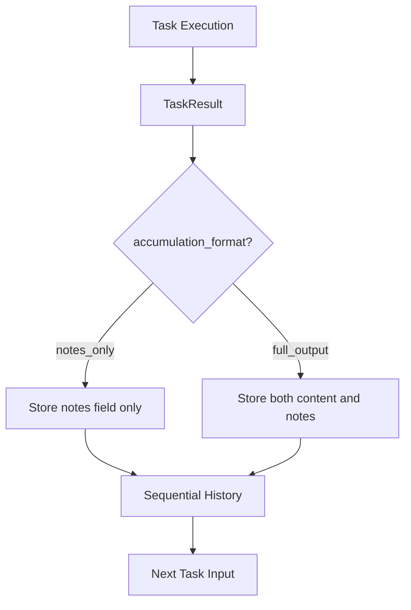

# ADR 15: Notes Field Standardization

## Status
Proposed

## Context
The documentation inconsistently uses "notes" and "summary information" when referring to task outputs, creating ambiguity about:
- What's generated by tasks
- What's preserved during accumulation
- Component responsibilities

Example inconsistencies:
```typescript
// In TaskResult
notes: {
    dataUsage: string;
    successScore?: number;
    partialOutput?: string;
    [key: string]: any;
};

// In SequentialHistory.TaskOutput
interface TaskOutput {
    stepId: string;
    output: string;  // The main content
    notes: any;      // Described as "Additional metadata or partial information"
    timestamp: Date;
}
```

Documentation describing `accumulation_format` options inconsistently refers to "summary information" vs "notes":
```
- `notes_only`: Only summary information is preserved (default)
- `full_output`: Complete output (with reasonable size limits)
```

## Decision

1. **Terminology Standardization**
   - Use "notes" consistently throughout documentation
   - Eliminate ambiguous term "summary information" entirely

2. **Component Responsibilities**
   - LLM/Task: Generates notes content during task execution
   - Evaluator: Stores and manages notes without modification
   - No separate summary generation mechanism needed

3. **Accumulation Format Behavior**
   ```typescript
   // Clarified behavior:
   enum AccumulationFormat {
     NOTES_ONLY,  // Preserves only the complete notes field
     FULL_OUTPUT  // Preserves both content and notes fields
   }
   ```

4. **Sequential History Management**
   ```typescript
   // When accumulation_format is "notes_only":
   sequentialHistory.push({
     stepId: generateStepId(),
     output: null,  // Not preserved
     notes: taskResult.notes,  // Preserved intact
     timestamp: new Date()
   });
   
   // When accumulation_format is "full_output":
   sequentialHistory.push({
     stepId: generateStepId(),
     output: taskResult.content,  // Preserved
     notes: taskResult.notes,     // Preserved
     timestamp: new Date()
   });
   ```

## Consequences

### Positive
- Simplified Evaluator implementation (no summary generation needed)
- Clearer component responsibilities
- Consistent terminology across documentation
- Reduced ambiguity in implementation

### Negative
- Requires documentation updates across multiple components
- Potential confusion for developers familiar with previous terminology

## Implementation



Required documentation updates:
1. `components/task-system/spec/types.md`: Update TaskResult and TaskOutput interfaces
2. `components/task-system/spec/behaviors.md`: Clarify accumulation_format behavior
3. `components/task-system/impl/*.md`: Update implementation examples
4. `system/architecture/patterns/*.md`: Update pattern descriptions 
5. `system/contracts/*.md`: Update contract specifications

Type definition updates:
```typescript
// Updated accumulation_format documentation
/**
 * Controls what information is preserved during sequential task execution
 * - notes_only: Only the notes field is preserved (default)
 * - full_output: Both content and notes fields are preserved
 */
type AccumulationFormat = 'notes_only' | 'full_output';
```
