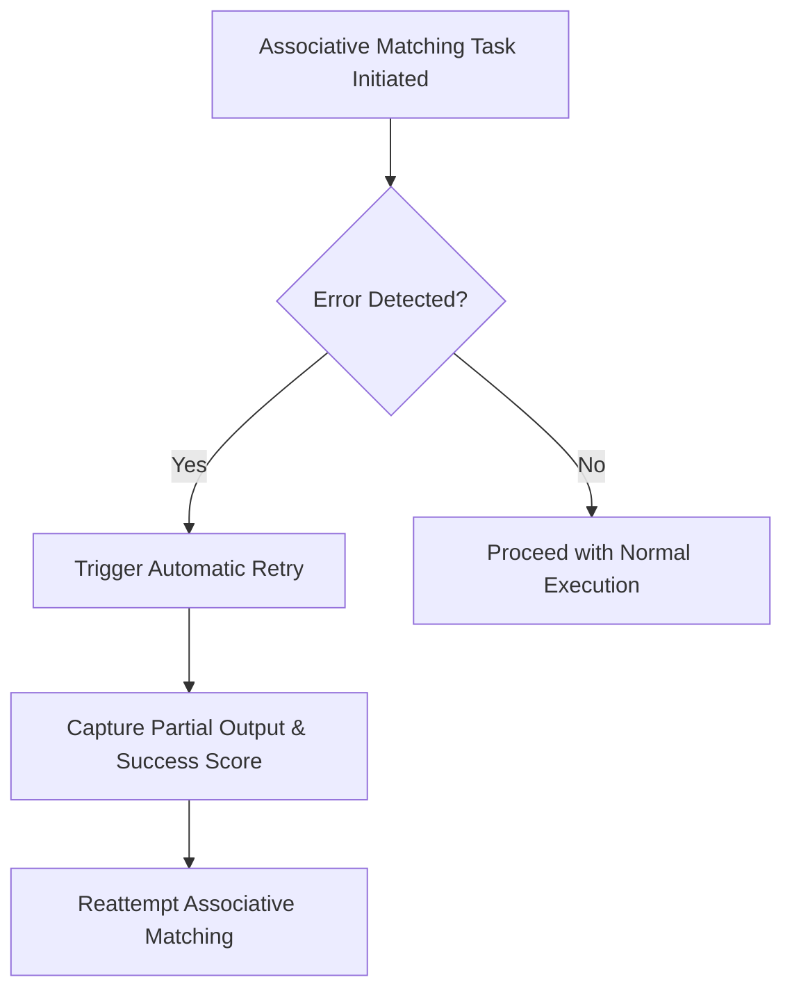

# Error Handling and Recovery Pattern [Pattern:Error:1.0]

**Canonical Reference:** This document is the authoritative description of the Error Handling and Recovery Pattern. All extended descriptions in other files should refer here.

**Intended Focus:** This document covers overall error detection, classification, and recovery strategies. For resource‑related cleanup details, see the "Resource Cleanup" subsection below. (For low‑level resource metrics, refer to [Pattern:ResourceManagement:1.0] and related docs.)

## 1. Pattern Definition

### 1.1 Purpose
Error handling pattern for the task execution system, focusing on three key concerns:
- Resource exhaustion detection and recovery
- Invalid output handling
- Progress failure management

### 1.2 Context
This pattern is used by:
- [Component:TaskSystem:1.0] for error detection
- [Component:Evaluator:1.0] for error recovery
- [Component:Handler:1.0] for resource monitoring

### 1.3 Core Elements
- Error Type System: See [Type:TaskSystem:TaskError:1.0]
- Recovery Protocols: See [Protocol:Tasks:Reparse:1.0]
- Resource Contracts: See [Contract:Resources:1.0]

## 2. Error Categories

### 2.1 Resource Exhaustion
Handled by [Protocol:Tasks:Reparse:1.0]

Resource exhaustion occurs when a task exceeds allocated system resources:
- **Type**: 'RESOURCE_EXHAUSTION'
- **Resources**: 'turns' | 'context' | 'output'
- **Metrics**: Contains usage and limit values
- **Recovery**: Attempt task decomposition

### 2.2 Task Failure
Related to [Contract:Tasks:TemplateSchema:1.0]

Task failures now include a standardized `reason` field for more specific categorization:

```typescript
type TaskFailureReason = 
  | 'context_retrieval_failure'    // Failure to retrieve context data
  | 'context_matching_failure'     // Failure in associative matching algorithm 
  | 'context_parsing_failure'      // Failure to parse or process retrieved context
  | 'xml_validation_failure'       // Output doesn't conform to expected XML schema
  | 'output_format_failure'        // Output doesn't meet format requirements
  | 'execution_timeout'            // Task execution exceeded time limits
  | 'execution_halted'             // Task execution was deliberately terminated
  | 'subtask_failure'              // A subtask failed, causing parent task failure
  | 'input_validation_failure'     // Input data didn't meet requirements
  | 'unexpected_error';            // Catch-all for truly unexpected errors
```

Task failures also include a structured details object that may contain error-specific information such as:
- partial_context: Any partial context that was retrieved before failure
- context_metrics: Metrics related to context retrieval
- violations: Specific validation rule violations
- partialResults: Results from steps that completed before failure
- failedStep: Index of the step that failed in a sequential task

### 2.3 Failure to Make Progress
Progress failures occur when a task cannot advance despite resources being available:
- **Type**: 'TASK_FAILURE'
- **Reason**: 'execution_halted'
- **Indicators**: Multiple rounds with no state change
- **Recovery**: Alternative approach or termination

### 2.4 Partial Results Handling

The system maintains a standardized approach for preserving partial results when multi-step operations fail:

### Error Output Structure

#### Atomic Tasks
```typescript
// Successful atomic task
{
  content: "Complete task output",
  status: "COMPLETE", 
  notes: {
    dataUsage: "Resource usage statistics",
    successScore: 0.95
  }
}

// Failed atomic task
{
  content: "Partial output generated before failure",  // Partial content in content field
  status: "FAILED",
  notes: {
    dataUsage: "Resource usage statistics",
    executionStage: "validation",
    completionPercentage: 60
  }
}
```
Task status (`COMPLETE` vs `FAILED`) indicates whether content is complete or partial.

#### Sequential Tasks
```typescript
{
  type: 'TASK_FAILURE',
  reason: 'subtask_failure',
  message: 'Sequential task "Process Dataset" failed at step 3',
  details: {
    failedStep: 2,
    totalSteps: 5,
    partialResults: [
      { 
        stepIndex: 0, 
        content: "Data loaded successfully: 1000 records",
        notes: { 
          recordCount: 1000, 
          status: "completed"
        }
      },
      { 
        stepIndex: 1, 
        content: "Data transformed to required format",
        notes: { 
          transformType: "normalization", 
          status: "completed"
        }
      }
    ]
  }
}
```

#### Reduce Tasks
```typescript
{
  type: 'TASK_FAILURE',
  reason: 'subtask_failure',
  message: 'Reduce task "Aggregate metrics" failed processing input 2',
  details: {
    failedInputIndex: 2,
    totalInputs: 5,
    processedInputs: [0, 1],
    currentAccumulator: { totalCount: 1500, averageValue: 42.3 },
    partialResults: [
      { 
        inputIndex: 0, 
        content: "Processed metrics for server 1",
        notes: { 
          status: "completed",
          serverName: "server-01",
          metricsCount: 250
        }
      },
      { 
        inputIndex: 1, 
        content: "Processed metrics for server 2",
        notes: { 
          status: "completed",
          serverName: "server-02",
          metricsCount: 180
        }
      }
    ]
  }
}
```

#### Storage Format Control
The format of preserved partial results depends on the task's `accumulation_format` setting:
- `notes_only`: Only the notes field is preserved (default for memory efficiency)
- `full_output`: Both content and notes fields are preserved (with size limits)

```typescript
// With accumulation_format="notes_only"
partialResults: [
  { 
    stepIndex: 0, 
    notes: { 
      recordCount: 1000,
      status: "completed"
      // Other essential metadata
    }
  }
]

// With accumulation_format="full_output"
partialResults: [
  { 
    stepIndex: 0,
    content: "Complete step output text",
    notes: { 
      recordCount: 1000,
      status: "completed"
    }
  }
]
```

Each operator type has specific default settings for context management. For sequential tasks, the default `accumulation_format` is `minimal`. These defaults apply when the `context_management` block is omitted. When present, explicit settings override the defaults, following the hybrid configuration approach.

#### Size Management
To prevent memory issues:
- Individual step outputs are kept reasonably sized
- When accumulated data becomes too large, older results may be summarized or truncated
- The system indicates when truncation has occurred

### 2.5 Output Format Validation

When a task specifies an output format using `<output_format type="json" schema="...">`, validation failures result in:

```typescript
{
  type: 'TASK_FAILURE',
  reason: 'output_format_failure',
  message: 'Expected output of type "array" but got "object"',
  details: {
    expectedType: "array",
    actualType: "object",
    originalOutput: "..." // The original output
  }
}
```

This error occurs when:
1. The task specifies an output format with `type="json"`
2. The output is successfully parsed as JSON
3. The parsed content doesn't match the specified schema type

The original output is preserved in the `partialOutput` field to allow for potential recovery or manual parsing. The error includes both the expected and actual types to aid in debugging and recovery.

## 3. Recovery Process

### 3.1 Detection Phase
See [Interface:Handler:ResourceMonitoring:1.0]

Error detection now includes identifying:
- Context retrieval failures
- Context matching failures
- Context parsing failures
- Output format validation failures

```typescript
function handleTaskError(error: TaskError) {
  if (error.type === 'RESOURCE_EXHAUSTION') {
    // Handle resource exhaustion based on resource type
    handleResourceExhaustion(error);
  } else if (error.type === 'TASK_FAILURE') {
    // Handle task failure based on reason
    if (error.reason.startsWith('context_')) {
      // Handle context-related failures
      handleContextFailure(error);
    } else if (error.reason === 'subtask_failure') {
      // Handle subtask failures, potentially using partial results
      handleSubtaskFailure(error);
    } else if (error.reason === 'output_format_failure') {
      // Handle output validation failures
      handleOutputFormatFailure(error);
    } else {
      // Handle other failures
      handleGeneralFailure(error);
    }
  }
}
```

### 3.2 Planning Phase
See [Component:Evaluator:1.0] for error handling.

Based on error type and reason, the system will surface appropriate error information:
- **Resource Exhaustion**: Complete resource metrics and context
- **Context Failures**: Context-related error details
- **Validation Errors**: Validation failure specifics
- **Subtask Failures**: Error details including partial execution data

### 3.3 Execution Phase
See [Protocol:Tasks:Reparse:1.0] for execution details.

Error handling involves:
- Preparing complete error context
- Including relevant partial execution data
- Surfacing errors through standard error flow
- Providing detailed diagnostics

- **Associative Matching Failures:** If an associative matching task encounters an error—such as insufficient context or partial output—it will automatically trigger a retry. These errors will include any partial output and, if available, an optional success score (recorded in the task's `notes` field) to support future adaptive behavior.

#### Error Recovery Flow for Associative Matching



### Subtask Failure Handling

When a subtask fails, the system provides a standardized error structure that preserves context and enables recovery:

```typescript
{
  type: 'TASK_FAILURE',
  reason: 'subtask_failure',
  message: 'Subtask "Process complex data" failed',
  details: {
    subtaskRequest: {
      type: 'atomic',
      description: 'Process complex data',
      inputs: { /* original inputs */ }
    },
    subtaskError: {
      type: 'TASK_FAILURE',
      reason: 'execution_halted',
      message: 'Failed to process data format'
    },
    nestingDepth: 2,
    partialOutput: "Partial processing results before failure"
  }
}
```

This standardized structure provides several benefits:
1. Complete error context preservation
2. Clear indication of which subtask failed
3. Access to the original subtask request for potential retry
4. Preservation of partial results for recovery

Example of parent task handling subtask failures:
```typescript
try {
  const result = await taskSystem.executeTask(complexTask);
} catch (error) {
  if (error.type === 'TASK_FAILURE' && error.reason === 'subtask_failure') {
    console.log(`Subtask failed: ${error.details.subtaskRequest.description}`);
    
    // Access the original subtask request for potential retry
    const modifiedRequest = {
      ...error.details.subtaskRequest,
      description: `Retry: ${error.details.subtaskRequest.description} with simplified approach`
    };
    
    // Use partial results if available
    if (error.details.partialOutput) {
      console.log(`Using partial output: ${error.details.partialOutput}`);
    }
    
    // Attempt recovery with modified request
    const recoveryResult = await taskSystem.executeTask(modifiedRequest);
  }
}
```

### 3.4 Validation Phase
Recovery validation includes:
- Verifying resource usage of recovery approach
- Ensuring progress is made
- Validating output structure and format
- Limiting recovery depth to prevent infinite loops

## 4. Pattern Examples
See components/task-system/impl/examples.md for concrete examples.

### Context Retrieval Failure Example
```typescript
// Memory System's file index is corrupted or unavailable
const error = {
  type: 'TASK_FAILURE',
  reason: 'context_retrieval_failure',
  message: 'Failed to access memory system index',
  details: { error: 'Index corruption detected' }
};

// Recovery involves alternative context strategy
const recovery = await evaluator.recoverFromContextFailure(error);
```

### Sequential Task Failure Example
```typescript
try {
  const result = await taskSystem.executeTask(
    "process data in multiple steps",
    memorySystem
  );
} catch (error) {
  if (error.type === 'TASK_FAILURE' && error.reason === 'subtask_failure') {
    console.log(`Failed at step ${error.details.failedStep} of ${error.details.totalSteps}`);
    
    // Access partial results from completed steps
    error.details.partialResults.forEach(result => {
      console.log(`Step ${result.stepIndex} output: ${result.output}`);
    });
    
    // Potentially use partial results for recovery
    const recoveryResult = await evaluator.recoverWithPartialResults(error);
  }
}
```

## 5. Known Limitations
- **Recovery Depth**: Limited to prevent infinite loops
- **Partial Result Size**: May be truncated for very large outputs
- **Stateful Recovery**: Not supported across sessions
- **Complex Dependencies**: Recovery may not work for deeply nested failures

## 6. Related Patterns
- [Pattern:ResourceManagement:1.0]
- [Pattern:TaskExecution:2.0]
