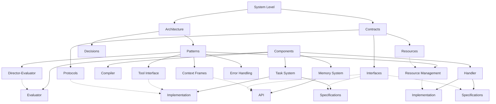

# Documentation Guide

## Documentation Map

This guide provides navigation paths through the system documentation.

### System Level

| Document | Purpose | Key Content |
|----------|---------|-------------|
| `/system/README.md` | System overview | Architecture diagram, component responsibilities |
| `/system/docs-guide.md` | Documentation map | Navigation paths, references (this document) |

#### Architecture

| Document | Purpose | Key Content |
|----------|---------|-------------|
| `/system/architecture/overview.md` | High-level design | Core patterns, execution model, delegation |
| `/system/architecture/decisions/` | Architecture Decision Records | Rationale for key design decisions |
| `/system/architecture/patterns/` | Core patterns | Reusable patterns and implementations |

#### Key Patterns

| Pattern | Location | Purpose |
|---------|----------|---------|
| Resource Management | `/system/architecture/patterns/resource-management.md` | Resource tracking and limits |
| Tool Interface | `/system/architecture/patterns/tool-interface.md` | Unified tool delegation pattern |
| Error Handling | `/system/architecture/patterns/errors.md` | Error taxonomy and recovery |
| Context Frame | `/system/architecture/patterns/context-frames.md` | Context management model |
| Director-Evaluator | `/system/architecture/patterns/director-evaluator.md` | Iterative refinement pattern |

#### System Contracts

| Document | Purpose | Key Content |
|----------|---------|-------------|
| `/system/contracts/interfaces.md` | System interfaces | Component integration contracts |
| `/system/contracts/resources.md` | Resource contracts | Resource types and management |
| `/system/contracts/protocols.md` | Communication protocols | XML schema, template protocols |

### Component Documentation

#### Task System

| Document | Purpose | Key Content |
|----------|---------|-------------|
| `/components/task-system/README.md` | Component overview | Capabilities, interfaces, usage |
| `/components/task-system/spec/types.md` | Type definitions | Core data structures |
| `/components/task-system/spec/interfaces.md` | Public interfaces | Component API |
| `/components/task-system/spec/behaviors.md` | Expected behaviors | Runtime behavior details |
| `/components/task-system/impl/` | Implementation docs | Design, resource management, XML |

#### Evaluator

| Document | Purpose | Key Content |
|----------|---------|-------------|
| `/components/evaluator/README.md` | Component overview | Responsibilities, execution model |

#### Memory System

| Document | Purpose | Key Content |
|----------|---------|-------------|
| `/components/memory/README.md` | Component overview | Capabilities, interfaces, usage |
| `/components/memory/api/interfaces.md` | Public interfaces | Memory System API |

#### Handler

| Document | Purpose | Key Content |
|----------|---------|-------------|
| `/components/handler/README.md` | Component overview | Responsibilities, interfaces |
| `/components/handler/spec/types.md` | Type definitions | Core data structures |
| `/components/handler/spec/interfaces.md` | Public interfaces | Handler API |
| `/components/handler/spec/behaviors.md` | Expected behaviors | Runtime behavior details |
| `/components/handler/impl/` | Implementation docs | Provider integration, resource tracking |

#### Compiler

| Document | Purpose | Key Content |
|----------|---------|-------------|
| `/components/compiler/README.md` | Component overview | Capabilities, interfaces, usage |

## Navigation Paths

### I want to understand the system architecture
1. Start with `/system/README.md` for high-level overview
2. Read `/system/architecture/overview.md` for detailed architecture
3. Explore patterns in `/system/architecture/patterns/` for core concepts
4. Review contracts in `/system/contracts/` for component interfaces

### I want to implement a specific component
1. Start with the component README (e.g., `/components/task-system/README.md`)
2. Review the component's spec directory for interfaces and types
3. Consult implementation docs in the component's impl directory
4. Check relevant patterns and ADRs for design rationale

### I need to understand error handling
1. Start with `/system/architecture/patterns/errors.md` for taxonomy
2. Check component-specific error handling in respective spec files
3. Review ADR 8 (Errors) for detailed rationale

### I need to understand resource management
1. Read `/system/architecture/patterns/resource-management.md`
2. Check `/components/handler/impl/resource-tracking.md` for implementation
3. Review resource contracts in `/system/contracts/resources.md`

### I need to understand context management
1. Start with `/system/architecture/patterns/context-frames.md`
2. Review ADR 7 (Context Standardization) for rationale
3. Check specific operator implementations in task system docs

## Visual Documentation Map

## Cross-Reference Guide

The documentation uses a consistent cross-reference syntax:
- `[Type:Name:Version]` for type references (e.g., `[Type:TaskSystem:TaskResult:1.0]`)
- `[Pattern:Name:Version]` for pattern references (e.g., `[Pattern:DirectorEvaluator:1.1]`)
- `[ADR N: Title]` for architecture decision references (e.g., `[ADR 14: Operator Context Configuration]`)
- `[Component:Name:Version]` for component references (e.g., `[Component:Evaluator:1.0]`)
- `[Contract:Category:Name:Version]` for contract references (e.g., `[Contract:Tasks:TemplateSchema:1.0]`)
- `[Interface:Component:Name:Version]` for interface references (e.g., `[Interface:Memory:3.0]`)
